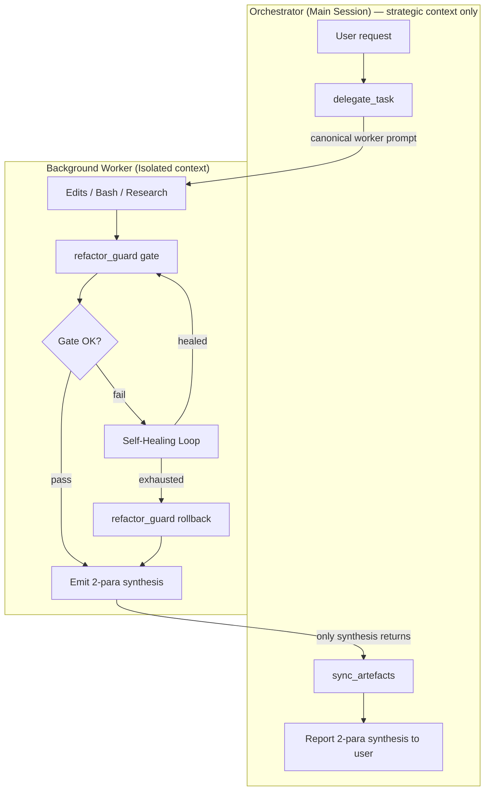
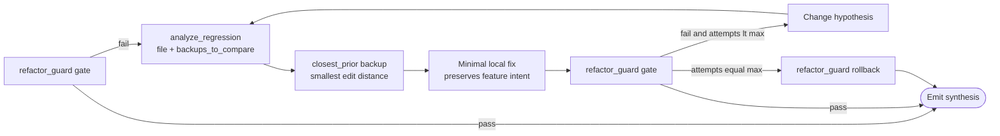
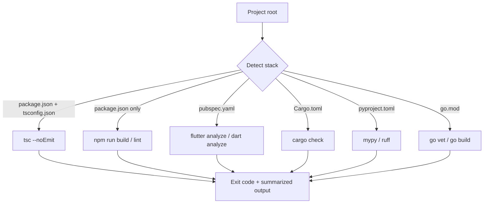
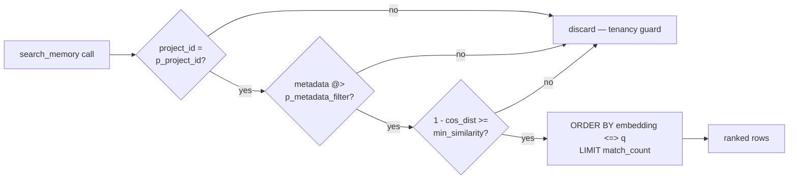
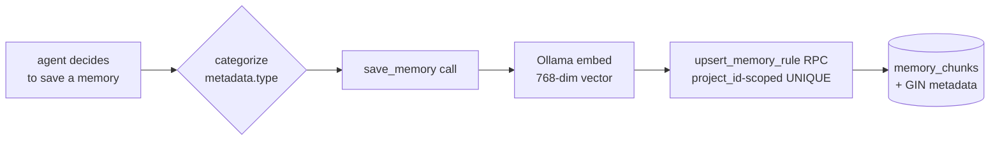
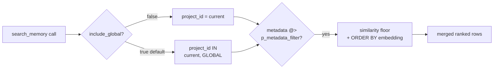

# Smart Claude Memory — System Architecture (v2.0.0-rc1)

**Developer:** [NABILNET.AI](https://nabilnet.ai)

> **Stable baseline:** v2.0.0-rc1 — bundles Architecture Guard + Automatic Session Handoff, the Typed Retrieval layer (Sovereign Taxonomy on `memory_chunks.metadata`, GIN-indexed metadata filter, strict project_id-first isolation), and the Global Knowledge Vault + Multi-IDE layer (reserved `'GLOBAL'` project_id with dual-scope retrieval, `init_project` Capabilities Header, `docs/IDE-INTEGRATION.md` for Cursor / Windsurf / Cline).
> This document is the single source of truth for the system's structure and control flow. The marker-bounded Mermaid block in §5 is refreshed automatically by `sync_artefacts` after every worker success; the other diagrams are hand-maintained.

*Master schematic — the definitive visual reference for the Smart Claude Memory v2.0.0-rc1 production baseline.*

---

## 1. The Sovereign Orchestrator Pattern

The **Orchestrator** (the main Claude session) never edits code, runs builds, or reads large files directly. Every unit of execution is delegated to a **Background Worker** — an Agent sub-process spawned via `delegate_task`, isolated in its own context window. The worker returns only a 2-paragraph synthesis. This keeps the Orchestrator's context lean and enforces a clean separation between strategic decisions and tactical execution.

### 1.1 Delegation flow

### 1.2 Context-hygiene contract
- Workers MUST NOT return raw file contents, full stack traces, or long logs to the Orchestrator.
- Each compiler error is summarized in ≤ 1 sentence (error code + symbol).
- Paragraph 2 of the synthesis records gate result (pass first-try / passed after N heals / rolled back) and any healing hypotheses tested.

---

## 2. Autonomous Self-Healing Loop (v1.1.0)

When the compile gate fails, the worker does **not** bounce the failure back to the Orchestrator. Instead, it diagnoses the regression against the nearest clean backup and applies a minimal local fix. Only if the loop exhausts (default 3 attempts) does it rollback and report surrender.

### 2.1 Primitives
| Primitive | Tool call | Purpose |
|---|---|---|
| Gate | `refactor_guard({ action: "gate" })` | Single source of compile truth — dispatches to the stack's native analyzer. |
| Analyze | `analyze_regression({ file, backups_to_compare })` | Diffs current file against recent backups; surfaces `closest_prior` to guide the minimal fix. |
| Rollback | `refactor_guard({ action: "rollback", file })` | Restores pre-edit backup. Last resort only. |

### 2.2 Healing constraints
- **Minimal fix, not wholesale restore** — the feature edit must survive; the fix only reintroduces what regressed.
- **No repeated hypotheses** — each attempt changes approach.
- **Strictly local** — never ask the Orchestrator for more context while attempts remain.

---

## 3. Multi-Stack Compiler Map

`refactor_guard` auto-detects the stack from project artifacts and dispatches to the native analyzer. This is what makes the gate stack-agnostic.

### 3.1 Cross-platform spawn (v1.1.0 fix)
Native tool launchers on Windows resolve to `.cmd` / `.bat` shims (`npx.cmd`, `flutter.bat`). Node's `child_process.spawn` without `shell: true` cannot invoke these — it throws `EINVAL`. The v1.1.0 `runBin` in `src/tools/refactor.ts` detects `process.platform === 'win32'` and sets `shell: true` so shim resolution works through `cmd.exe`. Args are internal-only (no user input), so shell-injection risk does not apply.

### 3.2 Version Single Source of Truth (v1.1.3)
The version string is owned by `package.json`. `src/version.ts` reads it once via `createRequire(import.meta.url)` and re-exports `VERSION`. All consumers — `src/index.ts` (McpServer registration), `src/tools/health.ts` (the `orchestrator.version` field on `HealthReport`, whose type was widened from the literal `"1.1.0"` to `string` to accept any future bump), and `src/tools/orchestrator.ts` (the `delegateTask` response envelope) — import that one constant. There are no hard-coded version literals in the source tree, so `check_system_health` always reports exactly what `package.json` says and a release bump propagates with a single edit.

### 3.3 Policy Hydration & Smart-Scout Onboarding (v1.1.3)
`batch_freeze_patterns` (in `src/tools/batch-freeze-patterns.ts`) hydrates the frozen-pattern cache from either glob `paths` or a markdown rule file. When `from_rule_file` is supplied, extraction is strict: it scans only the section under an exact `## Frozen Patterns` heading, strips backticks and list markers, and skips any line containing unescaped spaces. The shared loader at `src/tools/frozen-cache.ts` migrates legacy string entries to the `{ pattern, source, added_at }` schema on read, writes atomically via `<file>.tmp` + `rename`, and dedups on trimmed pattern equality (first-writer-wins). Every consumer — `list_frozen`, `freeze_file`, `unfreeze_file`, and `supabase.writeFrozenPatternsCache` — funnels through the same loader. The `source` field unlocks idempotent re-hydration and the suppression logic below.

`init_project` (in `src/tools/setup.ts`) closes the onboarding loop. Beyond the readiness checks, it does a quick local scan: if `.claude/rules/` exists, it peeks the first ~200 lines of each immediate-child `.md` for an exact `## Frozen Patterns` line. It then loads the project's frozen cache via `loadFrozenCache()` and drops any candidate already represented in `entry.source` (after path normalization — workspace-relative, forward slashes, lowercased on Win32). What survives is emitted as a structured `recommendations: [{ id: "hydrate_policies", tool: "batch_freeze_patterns", candidates, suggested_first_call: { from_rule_file, dry_run: true } }]` block. The key is omitted entirely when nothing is actionable, and the scout never mutates the cache — it surfaces a recommended `dry_run` call for the operator to consent to.

---

## 4. Sovereign Taxonomy (v2)

Every chunk in `memory_chunks` carries a `metadata jsonb` column whose contract is the **Sovereign Taxonomy**. Four categories cover everything the orchestrator stores; anything that does not fit is a session log.

| `metadata.type` | Captures | When to use |
|---|---|---|
| `DECISION` | Architectural choices + rationale | A trade-off was named and a path was picked |
| `PATTERN`  | Code standards + Rule 5–8 enforcement | A reusable convention or guardrail surfaced |
| `ERROR`    | Bug post-mortems + fixes | A defect was observed, root-caused, and resolved |
| `LOG`      | General session progress | Catch-all narrative useful for replay/audit |

Optional fields: `status` (free-form: `open`, `verified`, `superseded`, …), `context_id` (correlation key for multi-step work — e.g. a backlog id), plus arbitrary pass-through keys. The taxonomy is enforced in TypeScript (`save_memory`'s tool description prompts the agent; the SQL RPC accepts arbitrary jsonb), not via a CHECK constraint, so the contract can evolve without a migration.

### 4.1 Retrieval order — tenancy first, taxonomy second, vector third

Retrieval composes three predicates in fixed order, so cross-project leakage is structurally impossible:

The `metadata @>` predicate is index-driven: migration `007_metadata_typed_retrieval.sql` ships a GIN index using `jsonb_path_ops` (smaller and ~2–3× faster than the default `jsonb_ops` for containment), and the planner bitmap-ANDs it with the existing `(project_id)` btree. Cost on the Supabase Free Tier stays $0; no external metadata service is involved.

### 4.2 Write path

`save_memory` is the canonical write side: it embeds `content` via Ollama, then calls the `upsert_memory_rule(p_project_id, p_file_origin, p_chunk_index, p_content, p_embedding, p_metadata)` RPC. Its tool description prompts the calling agent to set `metadata.type` on every save. The legacy `update_rule` shape continues to work for policy hydration and migrations but is no longer the canonical write path.

### 4.3 Global vs Local Retrieval (v2.0.0-rc1 — migration 008)

A reserved `project_id` of literal `'GLOBAL'` is the **Knowledge Vault**: any chunk written there is visible to every project. Universal patterns, lessons-learned, and Rule 9 entries belong here. Routine project memories stay scoped to the slug derived from `process.cwd()`.

**Write side.** `save_memory({ ..., metadata: { ..., is_global: true } })` overrides the row's `project_id` to `'GLOBAL'` regardless of any explicit `project_id` argument; `is_global: true` is also persisted inside the metadata jsonb for audit. Only set this for cross-project truths — anything project-local should NOT be promoted to `'GLOBAL'`, or the vault loses signal.

**Read side.** `search_memory` is dual-scope by default: `match_memory_chunks(..., p_include_global := true)` evaluates rows where `project_id = p_project_id OR project_id = 'GLOBAL'`, then applies the same metadata + similarity predicates and ORDER BY. Pass `include_global: false` to restrict to the current project. The two scopes share the same GIN(metadata) and btree(project_id) indexes, so the planner bitmap-ANDs cleanly without a separate query.

The dual-scope union does NOT relax tenancy: every row remains tagged with its origin `project_id`, so caller code can still distinguish "from this project" vs "from the global vault". `'GLOBAL'` is reserved — `init_project` slugifies the cwd basename, which never produces this literal, so no project can accidentally write to the vault by being in a directory called "GLOBAL"; the only entry is the explicit `is_global: true` flag.

---

## 5. File Architecture (auto-generated)

The Mermaid block below is refreshed by `sync_artefacts` after every worker success. Do not edit content between the markers by hand.

```mermaid
%% Auto-generated. Do not edit between the MEMORY:ARCH markers.
flowchart TD
  n0["Claude-Memory/"]
  n1[".claude/"]
  n0 --> n1
  n2["docs/"]
  n0 --> n2
  n3["session-reports/"]
  n2 --> n3
  n4["SESSION-10-REPORT.md"]
  n3 --> n4
  n5["SESSION-11-REPORT.md"]
  n3 --> n5
  n6["IDE-INTEGRATION.md"]
  n2 --> n6
  n7["NEXT-SESSION-PROMPT.md"]
  n2 --> n7
  n8["hooks/"]
  n0 --> n8
  n9["md-policy.py"]
  n8 --> n9
  n10["README.md"]
  n8 --> n10
  n11["images/"]
  n0 --> n11
  n12["GPT SMC v2.0-rc1.png"]
  n11 --> n12
  n13["SCM-v2-Master-Schematic.png"]
  n11 --> n13
  n14["scripts/"]
  n0 --> n14
  n15["001_schema.sql"]
  n14 --> n15
  n16["002_multi_project.sql"]
  n14 --> n16
  n17["003_file_hash.sql"]
  n14 --> n17
  n18["004_backlog_frozen.sql"]
  n14 --> n18
  n19["005_archive_backlog.sql"]
  n14 --> n19
  n20["006_security_hardening.sql"]
  n14 --> n20
  n21["006_smoke.sql"]
  n14 --> n21
  n22["006_verify.sql"]
  n14 --> n22
  n23["007_metadata_typed_retrieval.sql"]
  n14 --> n23
  n24["008_global_scope.sql"]
  n14 --> n24
  n25["009_fix_rpc_dual_scope.sql"]
  n14 --> n25
  n26["apply-schema.ts"]
  n14 --> n26
  n27["backup-and-remove.ts"]
  n14 --> n27
  n28["e2e-incremental-test.ts"]
  n14 --> n28
  n29["e2e-isolation-test.ts"]
  n14 --> n29
  n30["e2e-test.ts"]
  n14 --> n30
  n31["purge-samia-rules.ts"]
  n14 --> n31
  n32["smoke-008.ts"]
  n14 --> n32
  n33["verify-007.ts"]
  n14 --> n33
  n34["verify-008.ts"]
  n14 --> n34
  n35["src/"]
  n0 --> n35
  n36["tools/"]
  n35 --> n36
  n37["backlog.ts"]
  n36 --> n37
  n38["batch-freeze-patterns.ts"]
  n36 --> n38
  n39["conflict.ts"]
  n36 --> n39
  n40["frozen-cache.ts"]
  n36 --> n40
  n41["health.ts"]
  n36 --> n41
  n42["hygiene.ts"]
  n36 --> n42
  n43["image.ts"]
  n36 --> n43
  n44["orchestrator.ts"]
  n36 --> n44
  n45["policy.ts"]
  n36 --> n45
  n46["refactor.ts"]
  n36 --> n46
  n47["save.ts"]
  n36 --> n47
  n48["search.ts"]
  n36 --> n48
  n49["setup.ts"]
  n36 --> n49
  n50["sovereign-constitution.ts"]
  n36 --> n50
  n51["summarize.ts"]
  n36 --> n51
  n52["sync.ts"]
  n36 --> n52
  n53["update-rule.ts"]
  n36 --> n53
  n54["verification.ts"]
  n36 --> n54
  n55["chunker.ts"]
  n35 --> n55
  n56["config.ts"]
  n35 --> n56
  n57["index.ts"]
  n35 --> n57
  n58["ollama.ts"]
  n35 --> n58
  n59["project-detect.ts"]
  n35 --> n59
  n60["project.ts"]
  n35 --> n60
  n61["supabase.ts"]
  n35 --> n61
  n62["verification-gate.ts"]
  n35 --> n62
  n63["version.ts"]
  n35 --> n63
  n64[".env.example"]
  n0 --> n64
  n65[".gitignore"]
  n0 --> n65
  n66["ARCHITECTURE.md"]
  n0 --> n66
  n67["CLAUDE.md"]
  n0 --> n67
  n68["LICENSE"]
  n0 --> n68
  n69["package-lock.json"]
  n0 --> n69
  n70["package.json"]
  n0 --> n70
  n71["project_file_architecture.md"]
  n0 --> n71
  n72["README.md"]
  n0 --> n72
  n73["tsconfig.json"]
  n0 --> n73
```

<!-- MEMORY:ARCH:START -->

<!-- MEMORY:ARCH:END -->

---

## 6. Version History

| Version | Summary |
|---|---|
| v0.8.0 | Production engine — ensureSchema, init_project, keep-alive, arch sync |
| v0.9.0 | Ultra-Enforcer — frozen cache, auto-freeze, backups, NL triggers |
| v0.9.1 | Legacy backup sweep + recovery discovery |
| v1.0.0 | God Mode — project detect, compiler gate, regression, binding session |
| **v1.1.0** | **Sovereign Orchestrator — delegation pattern + Autonomous Self-Healing + cross-platform spawn fix + ARCHITECTURE.md consolidation** |
| **v1.1.2** | **Master Schematic & Sovereign Baseline — definitive visual identity + version-locked production release** |
| **v1.1.3** | **Seamless Onboarding & Version SSOT — dynamic version SSOT, batch policy hydration, smart-scout init_project** |
| **v1.1.4** | **Architecture Guard + Automatic Session Handoff — Core 3 audit on init_project, session-end regenerates per-section diagrams, next_session_command_markdown handoff** |
| **v2.0.0-rc1** | **Release Candidate — bundles Typed Retrieval + Strict Project Isolation (Sovereign Taxonomy on memory_chunks.metadata, GIN(jsonb_path_ops) index, match_memory_chunks p_metadata_filter, save_memory tool with category-prompting description) AND Global Knowledge Vault + Multi-IDE (reserved 'GLOBAL' project_id, dual-scope match_memory_chunks p_include_global, save_memory metadata.is_global, init_project Capabilities Header, docs/IDE-INTEGRATION.md for Cursor/Windsurf/Cline). $0 — pure pgvector + JSONB + same Ollama infra. Originally tagged as a separate milestone but folded back into rc1 — release candidate semantics, not yet a stable major.** |
