# Smart Claude Memory — System Architecture (v2.3.2)

**Developer:** [NABILNET.AI](https://nabilnet.ai)

> **Stable baseline:** v2.2.1 — the cumulative production surface across Sessions 22–38. Bundles the v2.1.x foundations (Architecture Guard + Automatic Session Handoff, the Typed Retrieval layer with GIN-indexed JSONB `metadata_filter` on `memory_chunks.metadata`, the Global Knowledge Vault + Multi-IDE layer with dual-scope retrieval and `init_project.capabilities`, the GLOBAL Vault UX layer with browse-only `list_global_patterns`) AND the v2.2.0 Agentic OS expansion: **M3 Sleep Learning** (Orchestrator-curated stub promotion under Single Brain mandate); **M4 Transactional Workflows** (`workflow_checkpoints` + `terminal_committed_checkpoint` recursive-CTE + replay via M2 `get_trajectory_summary`); **M5 Autonomous Curriculum** (deterministic queuer daemon, atomic `apply_curriculum_task` auto-promote, NO generative AI in `src/curriculum/**`); **M6 Observability & Telemetry** (`daemon_telemetry` event-sourcing + `system_dashboard` 24h rollups + per-daemon derived health + 30-day retention pruner); **M7 Skill Graduation** (human-gated 3-state lifecycle, atomic `apply_graduation` clone-to-GLOBAL, Boundary Invariant #1 extension to `src/graduation/**`); **M8.1 Hybrid-RAG Knowledge Graph** (`kg_nodes` + `kg_edges` schema, deterministic `graph_extractor` daemon, 5 MCP tools, force-directed SVG Command Center verified at 60 nodes / 0 overlaps in Session 37 Visual QA); **M8.2 Modular GUI** (replaces 703-line `DASHBOARD_HTML` monolith with operator-authored `src/gui/public/{index.html,style.css,app.js}` served via zero-dep `serveStatic` + `import.meta.url`-resolved `PUBLIC_DIR` + `fs.cpSync` build copy + URI-decoded `path.relative` traversal guard + Google-Fonts-scoped CSP relaxation — promoted to GLOBAL Knowledge Vault as `SCM-S38-P1`). **v2.2.1 patches docs-only** — restores 1:1 alignment between the npm registry README and the v2.2.0 reality (Bootstrap anchor repair, migration count 18→21, comprehensive `## Usage` reference, 50-tool roster subtable, ARCH §4.10 + §4.11 added), removes two never-functional `smoke:m8-*` scripts, AND repairs the Living-Docs auto-sync bug (`ARCH_MAX_DEPTH` 3→5 + `updateLocalReadme` no longer early-returns on empty archive). **v2.2.2 ships the Agentic Resource Manager** (§4.12, SCM-S39-D1) — structurally-decoupled per-task and per-daemon budget surfaces (migration `021_agent_budgets.sql`), `src/budget/{types,store,gate}.ts` primitives, runtime gates at all four LLM-touching call sites (`delegate_task`, `compose_skill_candidate`, `compose_global_rationale`, `index_image`) and the `trajectory_compactor` daemon, 5 new MCP tools, GUI `/api/budget` route + `#tele-budget` ticker, and a foundation fix that scales the daemon grace window with cadence (`max(15min, interval_ms × 1.1)`). **v2.3.0 ships M8.3 Semantic Clustering** (§4.13, SCM-S41-D1…D7 + SCM-S42 carry-overs) — `scripts/023_kg_clustering.sql` (`kg_supernodes` + `kg_node_clusters`), pure-TS K-Means (`src/clustering/kmeans.ts`) + single-level Louvain (`src/clustering/louvain.ts`, no deps, seeded mulberry32), `src/clustering/daemon.ts` paged ARM-gated scanner, 3 new MCP tools (`list_supernodes`, `list_cluster_members`, `trigger_clustering`), `GET /api/graph/clusters?level=super|drill` route flowed through the `GuiHandlers` seam, dashboard Cluster View toggle with SUPER/COMMUNITY palette + drill-down, and `clustering_scanner` block in `check_system_health`. Plus governance v2.1.10 (agent-autonomy + user-explicit clauses on the context-window `session_end` gate, SCM-S41-D3/D6) and the GUI DX upgrade (deterministic per-project port + idempotent auto-start + project_id branding, SCM-S41-D4). **Surface:** 58 MCP tools · 23 schema migrations through `023_kg_clustering.sql` · 26 test files (Suite A 10/10 kmeans · Suite B 6/6 louvain · Suite C 8/8 daemon · Suite D 5/5 routes) · zero new runtime dependencies across the entire v2.0.1 → v2.3.0 arc.
> This document is the single source of truth for the system's structure and control flow. The marker-bounded Mermaid block in §5 is refreshed automatically by `manage_backlog({action:'session_end'})` (which now ALWAYS injects the file-tree regardless of archive state, post-Session 38 foundation fix) and by `sync_artefacts` after every worker success; the other diagrams are hand-maintained.


*Master schematic — the definitive visual reference for the Smart Claude Memory v2.3.x production baseline (v2.3.0 adds M8.3 Semantic Clustering — see §4.13; v2.2.2 added the Agentic Resource Manager — see §4.12; v2.3.1 surfaces the Active Backlog Kanban at the top of the dashboard via `/api/backlog`, adds the Epic G `file_watcher` KG auto-sync daemon + migration `024`, and canonicalizes the v2.1.11 Zero-Autonomy constitution; v2.3.2 closes every Supabase Security Advisor finding via migrations `025` + `026` — RLS-enable on `workflow_checkpoints` + `schema_migrations`, `security_invoker` on three views, pinned `search_path` on four functions, and explicit `REVOKE EXECUTE` from PUBLIC + anon + authenticated, leaving `service_role` as the sole RPC caller).*

---

## 1. The Sovereign Orchestrator Pattern — [SYSTEM_FLOW]

The **Orchestrator** (the main Claude session) never edits code, runs builds, or reads large files directly. Every unit of execution is delegated to a **Background Worker** — an Agent sub-process spawned via `delegate_task`, isolated in its own context window. The worker returns only a 2-paragraph synthesis. This keeps the Orchestrator's context lean and enforces a clean separation between strategic decisions and tactical execution.

### 1.1 Delegation flow

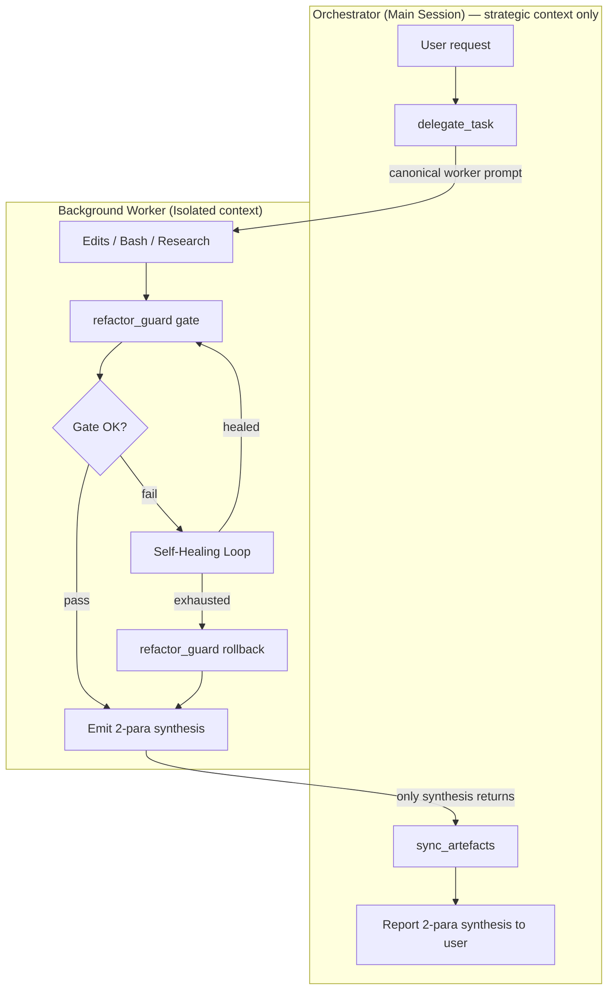

### 1.2 Context-hygiene contract
- Workers MUST NOT return raw file contents, full stack traces, or long logs to the Orchestrator.
- Each compiler error is summarized in ≤ 1 sentence (error code + symbol).
- Paragraph 2 of the synthesis records gate result (pass first-try / passed after N heals / rolled back) and any healing hypotheses tested.

---

## 2. Autonomous Self-Healing Loop (v1.1.0)

When the compile gate fails, the worker does **not** bounce the failure back to the Orchestrator. Instead, it diagnoses the regression against the nearest clean backup and applies a minimal local fix. Only if the loop exhausts (default 3 attempts) does it rollback and report surrender.


### 2.1 Primitives
| Primitive | Tool call | Purpose |
|---|---|---|
| Gate | `refactor_guard({ action: "gate" })` | Single source of compile truth — dispatches to the stack's native analyzer. |
| Analyze | `analyze_regression({ file, backups_to_compare })` | Diffs current file against recent backups; surfaces `closest_prior` to guide the minimal fix. |
| Rollback | `refactor_guard({ action: "rollback", file })` | Restores pre-edit backup. Last resort only. |

### 2.2 Healing constraints
- **Minimal fix, not wholesale restore** — the feature edit must survive; the fix only reintroduces what regressed.
- **No repeated hypotheses** — each attempt changes approach.
- **Strictly local** — never ask the Orchestrator for more context while attempts remain.

---

## 3. Multi-Stack Compiler Map — [TECH_STACK]

`refactor_guard` auto-detects the stack from project artifacts and dispatches to the native analyzer. This is what makes the gate stack-agnostic.

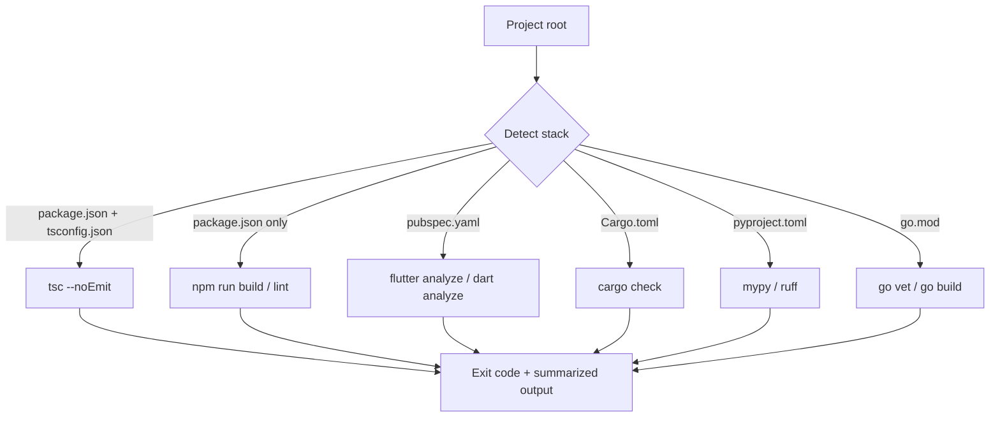

### 3.1 Cross-platform spawn (v1.1.0 fix)
Native tool launchers on Windows resolve to `.cmd` / `.bat` shims (`npx.cmd`, `flutter.bat`). Node's `child_process.spawn` without `shell: true` cannot invoke these — it throws `EINVAL`. The v1.1.0 `runBin` in `src/tools/refactor.ts` detects `process.platform === 'win32'` and sets `shell: true` so shim resolution works through `cmd.exe`. Args are internal-only (no user input), so shell-injection risk does not apply.

### 3.2 Version Single Source of Truth (v1.1.3)
The version string is owned by `package.json`. `src/version.ts` reads it once via `createRequire(import.meta.url)` and re-exports `VERSION`. All consumers — `src/index.ts` (McpServer registration), `src/tools/health.ts` (the `orchestrator.version` field on `HealthReport`, whose type was widened from the literal `"1.1.0"` to `string` to accept any future bump), and `src/tools/orchestrator.ts` (the `delegateTask` response envelope) — import that one constant. There are no hard-coded version literals in the source tree, so `check_system_health` always reports exactly what `package.json` says and a release bump propagates with a single edit.

### 3.3 Policy Hydration & Smart-Scout Onboarding (v1.1.3)
`batch_freeze_patterns` (in `src/tools/batch-freeze-patterns.ts`) hydrates the frozen-pattern cache from either glob `paths` or a markdown rule file. When `from_rule_file` is supplied, extraction is strict: it scans only the section under an exact `## Frozen Patterns` heading, strips backticks and list markers, and skips any line containing unescaped spaces. The shared loader at `src/tools/frozen-cache.ts` migrates legacy string entries to the `{ pattern, source, added_at }` schema on read, writes atomically via `<file>.tmp` + `rename`, and dedups on trimmed pattern equality (first-writer-wins). Every consumer — `list_frozen`, `freeze_file`, `unfreeze_file`, and `supabase.writeFrozenPatternsCache` — funnels through the same loader. The `source` field unlocks idempotent re-hydration and the suppression logic below.

`init_project` (in `src/tools/setup.ts`) closes the onboarding loop. Beyond the readiness checks, it does a quick local scan: if `.claude/rules/` exists, it peeks the first ~200 lines of each immediate-child `.md` for an exact `## Frozen Patterns` line. It then loads the project's frozen cache via `loadFrozenCache()` and drops any candidate already represented in `entry.source` (after path normalization — workspace-relative, forward slashes, lowercased on Win32). What survives is emitted as a structured `recommendations: [{ id: "hydrate_policies", tool: "batch_freeze_patterns", candidates, suggested_first_call: { from_rule_file, dry_run: true } }]` block. The key is omitted entirely when nothing is actionable, and the scout never mutates the cache — it surfaces a recommended `dry_run` call for the operator to consent to.

---

## 4. Sovereign Taxonomy (v2)

Every chunk in `memory_chunks` carries a `metadata jsonb` column whose contract is the **Sovereign Taxonomy**. Four categories cover everything the orchestrator stores; anything that does not fit is a session log.

| `metadata.type` | Captures | When to use |
|---|---|---|
| `DECISION` | Architectural choices + rationale | A trade-off was named and a path was picked |
| `PATTERN`  | Code standards + Rule 5–8 enforcement | A reusable convention or guardrail surfaced |
| `ERROR`    | Bug post-mortems + fixes | A defect was observed, root-caused, and resolved |
| `LOG`      | General session progress | Catch-all narrative useful for replay/audit |

Optional fields: `status` (free-form: `open`, `verified`, `superseded`, …), `context_id` (correlation key for multi-step work — e.g. a backlog id), plus arbitrary pass-through keys. The taxonomy is enforced in TypeScript (`save_memory`'s tool description prompts the agent; the SQL RPC accepts arbitrary jsonb), not via a CHECK constraint, so the contract can evolve without a migration.

### 4.1 Retrieval order — tenancy first, taxonomy second, vector third

Retrieval composes three predicates in fixed order, so cross-project leakage is structurally impossible:

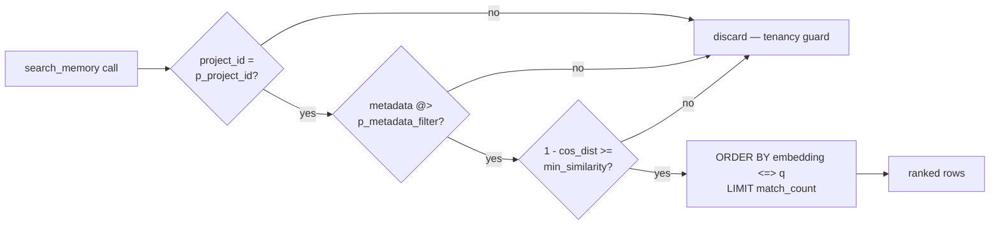

The `metadata @>` predicate is index-driven: migration `007_metadata_typed_retrieval.sql` ships a GIN index using `jsonb_path_ops` (smaller and ~2–3× faster than the default `jsonb_ops` for containment), and the planner bitmap-ANDs it with the existing `(project_id)` btree. Cost on the Supabase Free Tier stays $0; no external metadata service is involved.

### 4.2 Write path

`save_memory` is the canonical and only write side: it embeds `content` via Ollama, then calls the `upsert_memory_rule(p_project_id, p_file_origin, p_chunk_index, p_content, p_embedding, p_metadata)` RPC. Its tool description prompts the calling agent to set `metadata.type` on every save.

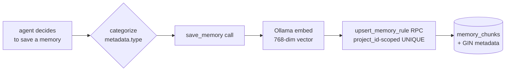

### 4.2.1 prune_memory — orphan reaping with explicit-paths gate (SCM-S31-D1)

`prune_memory` is the deletion counterpart to `sync_local_memory`'s `orphan_files` reporting. It accepts a **required**, non-empty `explicit_paths: string[]` — no wildcards, no implicit scans — and for each path verifies (a) absence on disk and (b) presence in `memory_chunks` under the caller's `project_id` before any row leaves the database. The SQL goes through the pre-existing `deleteChunksForFile(project_id, file_origin)` helper, which is already pinned on both keys, so cross-project bleed is structurally impossible.

Three hard guards protect against silent loss:

1. **`inline:*` filter.** Synthetic `inline:<sha256>` origins emitted by `save_memory` have no on-disk counterpart; a naive absence check would flag them as orphans and wipe every inline-saved memory in the project. They are skipped before any DELETE, even with `confirm:true`.
2. **GLOBAL refused.** `project_id='GLOBAL'` is rejected synchronously — those rows are all inline saves.
3. **Dry-run default.** `confirm:false` (the default) returns a classified preview without touching the database.

Every confirmed delete writes a JSON manifest to `~/.claude-memory/prune-backups/<ISO-stamp>-<project>/manifest.json` with `{project_id, prune_at, items: [{file_origin, chunk_count, was_orphan: true}]}`. The manifest is the archive — full reversal is a re-sync. This reconciles with the Constitution's "Archive, never delete" rule (SCM-S17-D1, SCM-S18-D1): that rule bans **content mutation** of immutable HNSW-indexed rows, not row-lifecycle reaping of rows whose source file is gone. FK CASCADE at §4.5 and the telemetry pruner's hard-DELETE at §4.8 already establish row-lifecycle deletion as in-doctrine when the deleted data is provably unobservable elsewhere.

### 4.3 Global vs Local Retrieval (v2.0.0-rc1 — migration 008)

A reserved `project_id` of literal `'GLOBAL'` is the **Knowledge Vault**: any chunk written there is visible to every project. Universal patterns, lessons-learned, and Rule 9 entries belong here. Routine project memories stay scoped to the slug derived from `process.cwd()`.

**Write side.** `save_memory({ ..., metadata: { ..., is_global: true } })` overrides the row's `project_id` to `'GLOBAL'` regardless of any explicit `project_id` argument; `is_global: true` is also persisted inside the metadata jsonb for audit. Only set this for cross-project truths — anything project-local should NOT be promoted to `'GLOBAL'`, or the vault loses signal.

**Read side.** `search_memory` is dual-scope by default: `match_memory_chunks(..., p_include_global := true)` evaluates rows where `project_id = p_project_id OR project_id = 'GLOBAL'`, then applies the same metadata + similarity predicates and ORDER BY. Pass `include_global: false` to restrict to the current project. The two scopes share the same GIN(metadata) and btree(project_id) indexes, so the planner bitmap-ANDs cleanly without a separate query.

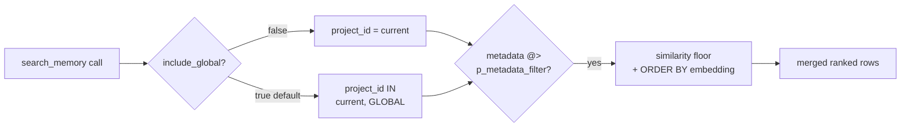

The dual-scope union does NOT relax tenancy: every row remains tagged with its origin `project_id`, so caller code can still distinguish "from this project" vs "from the global vault". `'GLOBAL'` is reserved — `init_project` slugifies the cwd basename, which never produces this literal, so no project can accidentally write to the vault by being in a directory called "GLOBAL"; the only entry is the explicit `is_global: true` flag.

### 4.3.1 GLOBAL Vault UX (v2.1.0 — `list_global_patterns`)

The Global Vault is **discoverable** as well as searchable. `search_memory({ include_global: true })` is the semantic side ("find by meaning"); v2.1.0 adds **`list_global_patterns`** for the deterministic side ("enumerate by attribute"). Two tools, one vault, crisp boundary: the browse path never calls Ollama, never spends embedding budget.

**Assumptions (locked).**

- Tool shape: `list_global_patterns({ metadata_filter?, limit?=10, offset?=0, include_content?=false })`. Browse-only — no `query` arg.
- Output is **tiered**: default returns `{ id, type, global_rationale, created_at, content_preview ≤120 chars, file_origin }`. `include_content:true` inflates each row with the full `content` field. Honors the [Tokens are Currency] imperative.
- `metadata_filter` shape **matches `search_memory`** (JSONB containment via `@>`, reuses the existing GIN(`jsonb_path_ops`) index on `memory_chunks.metadata`). Zero new API surface, zero new index.
- Scope is hardcoded to `project_id = 'GLOBAL'`. Any caller-supplied `project_id` is ignored — the name *is* the scope.
- Sort: `ORDER BY created_at DESC, id DESC` (id as stable tiebreaker). Offset/limit pagination; `limit` clamped to 50 (mirrors `search_memory.limit.maximum`).

**Acceptance criteria.**

1. `list_global_patterns()` returns the 10 newest GLOBAL chunks, preview-only.
2. `list_global_patterns({ metadata_filter: { type: 'PATTERN' } })` filters via the existing GIN index.
3. `list_global_patterns({ metadata_filter: { type: 'ERROR', status: 'fixed' } })` composes multi-key filters via the same index.
4. `include_content:true` inflates each row with full content; otherwise `content` is omitted from the response.
5. `limit:100` is clamped to 50.
6. Empty result returns `{ project_id: 'GLOBAL', count: 0, results: [], summary: 'GLOBAL vault is empty.' }`.
7. `init_project.capabilities.protocol === 'smart-claude-memory/v2.1.0'`.
8. `init_project.capabilities.global_scope` is extended to `{ available, project_id, browse_tool: 'list_global_patterns', browse_args: ['metadata_filter','limit','offset','include_content'] }`.
9. `capabilities.context_gathering_hints` contains a new entry exactly matching `"Browse GLOBAL: list_global_patterns({ metadata_filter: { type: 'PATTERN' }, limit: 10 })"` (mirroring the style of existing hints like `"On boot: search_memory({ query: 'Active Backlog' })"`).
10. README + ARCHITECTURE document the tool; the Sovereign Memory Protocol block in CLAUDE.md is unchanged (read-only UX, no rule shift).

**[TECH_STACK] addendum.**

- New tool handler: `src/tools/listGlobalPatterns.ts` (sibling to `list_frozen`, `list_curriculum_tasks`, `list_skill_candidates`). Zod arg schema co-located. Registered in the existing MCP tool dispatch table.
- DB read: pure SQL — `SELECT id, content, metadata, file_origin, created_at FROM memory_chunks WHERE project_id = 'GLOBAL' AND metadata @> $filter ORDER BY created_at DESC, id DESC OFFSET $offset LIMIT $limit`. Uses the existing `pg` pool and the existing GIN(`jsonb_path_ops`) index. **No Ollama call.**
- `init_project` capabilities builder: bump the `PROTOCOL` constant to `'smart-claude-memory/v2.1.0'`; extend the `global_scope` block; append one entry to `context_gathering_hints`.
- Docs: README (capabilities header table + tool row) and this ARCHITECTURE.md addendum. CLAUDE.md untouched.
- **Zero new dependencies. Zero new indexes. Zero new migrations.**

**[SYSTEM_FLOW] — boot discovery.**

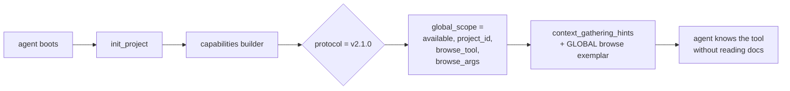

**[SYSTEM_FLOW] — browse call (no embedding cost).**

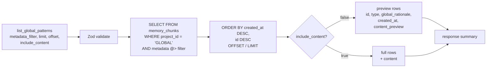

**Foundation-First commit sequence.** No entangled commits — six isolated, revertable steps:

| # | Commit | Scope | Why isolated |
|---|---|---|---|
| 1 | `chore: bump SCM protocol constant to v2.1.0` | One-line constant + version header | Declares the protocol contract before any consumer ships against it |
| 2 | `feat(capabilities): extend global_scope schema with browse_tool + browse_args (null)` | `init_project` capabilities builder shape only — `browse_tool` value left as `null` | Schema change visible without committing to the tool name yet; reverts cleanly if the discovery flow has issues |
| 3 | `feat(tool): register list_global_patterns handler (stub)` | New file + Zod schema; handler returns a hardcoded empty `{ ..., summary }` | MCP wiring validated before logic exists |
| 4 | `feat(tool): implement list_global_patterns SELECT + tiered output` | Real SQL + filter passthrough + preview/full toggle | Pure logic — no plumbing change |
| 5 | `feat(capabilities): populate browse_tool='list_global_patterns' + new context hint` | Wire the now-real tool into capabilities; add the hint exemplar | Closes the discovery loop |
| 6 | `docs: README + ARCHITECTURE document v2.1.0 GLOBAL Vault UX` | Pure docs | Never bundled with feature commits |

Each commit ships only after `npm run build` is zero-error and the Core 3 audit (`init_project.core3.in_sync`) stays green.

### 4.4 JIT Skill Vault (Agentic OS 2026 — Mission 1, proposed)

**Goal.** Support thousands of procedural skills (multi-step recipes the agent can execute) without prompt bloat. Skills are stored at rest, retrieved on demand by semantic similarity to the current task, and Just-In-Time injected into context only for the turn that needs them. Zero-Bloat RAG.

**Storage decision: dedicated `agent_skills` table — DO NOT extend `memory_chunks` with `metadata.type='SKILL'`.**

Rationale (single decisive reason): skill telemetry (`frequency_used`, `last_invoked_at`, `success_rate`) is high-churn mutable state. Co-locating it with the immutable `memory_chunks` HNSW index would dirty vector pages on every skill invocation and degrade recall latency for every other retrieval path (DECISION, PATTERN, ERROR, LOG). Skills also need richer relational structure (UNIQUE skill name, FK to `archive_backlog` for Sleep-Learning provenance, `text[]` trigger keywords) that does not fit JSONB cleanly.

**Proposed schema** (migration `010_agent_skills.sql`, to land in M1):

| Column | Type | Purpose |
|---|---|---|
| `id` | `bigserial PK` | Stable handle |
| `project_id` | `text NOT NULL` | Tenancy; `'GLOBAL'` permitted for universal skills |
| `name` | `text NOT NULL` | Human-readable slug (e.g. `commit-with-heredoc`) |
| `version` | `int NOT NULL DEFAULT 1` | Monotonic; bumps on `package_skill` re-write |
| `description` | `text NOT NULL` | Short trigger summary — gets embedded |
| `steps` | `jsonb NOT NULL` | Ordered procedural steps (the actual recipe payload) |
| `trigger_keywords` | `text[] DEFAULT '{}'` | GIN-indexed literal triggers |
| `embedding` | `vector(768)` | Ollama `nomic-embed-text` of `description` |
| `frequency_used` | `int NOT NULL DEFAULT 0` | Incremented by `request_skill` |
| `success_rate` | `real NOT NULL DEFAULT 1.0` | Updated by post-invocation telemetry |
| `last_invoked_at` | `timestamptz` | Recency signal for ranking |
| `packaged_from_archive_id` | `bigint` | FK → `archive_backlog.id` (Sleep-Learning provenance, nullable) |
| `created_at` / `updated_at` | `timestamptz` | Audit |

Indexes: HNSW on `embedding` (cosine), GIN on `trigger_keywords`, btree on `(project_id, name)` UNIQUE, btree on `last_invoked_at DESC` for recency tie-breaks. RLS reuses the `006_security_hardening` `deny_anon_authenticated` policy verbatim — service-role only.

**Tool surface (new in M1):**

- `package_skill({ name, description, steps, trigger_keywords?, is_global?, packaged_from_archive_id? })` — embeds `description` via Ollama, upserts the row (version bumps on conflict), returns `{ id, version, scope }`. `is_global: true` routes to `project_id='GLOBAL'` exactly like `save_memory` does.
- `request_skill({ query, k?, min_similarity?, include_global? })` — embeds `query`, runs `match_agent_skills(query_embedding, p_project_id, match_count, min_similarity, p_include_global)` RPC, increments `frequency_used` and sets `last_invoked_at` on the chosen hit, returns the **full `steps` payload** for the top-k matches. This is the JIT injection point: only matched skills enter context.

**Workflow — package_skill (write path):**

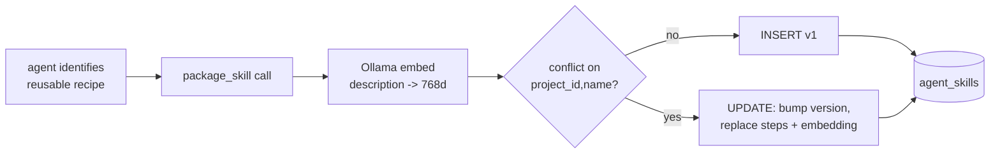

**Workflow — request_skill (JIT read path):**

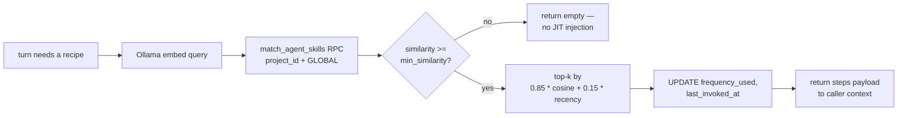

**Zero-Bloat invariant.** Skills are NEVER preloaded into the orchestrator's system prompt. The only path from `agent_skills` into context is an explicit `request_skill` call, and the response carries only the matched `steps` rows. A vault of 10 000 skills costs zero context until one is invoked.

**Forward links to later missions:**
- **M3 (Sleep Learning):** the idle daemon mines `archive_backlog` for repeated successful sequences and calls `package_skill` autonomously, setting `packaged_from_archive_id` for provenance.
- **M2 (Trajectory Compression):** compressed operational summaries that prove to be reusable become skill candidates fed to M3.
- **M4 (Transactional Workflows):** multi-step skills retrieved via `request_skill` are the natural unit for checkpoint/rollback boundaries.

---

### 4.5 Trajectory Compression — AgentDiet (Agentic OS 2026 — Mission 2, proposed)

**Goal.** Save context tokens *during* a mission, not just at session end. Long ops logs (raw tool output, stack traces, verbose JSON) that accumulate in `memory_chunks` are compressed into ~50-token semantic summaries by a background daemon. The read path **substitutes** the compressed summary into search results in place of the bloated original, so every future `search_memory` call returns dense content.

**Storage decision: dedicated `trajectory_summaries` table — DO NOT mutate `memory_chunks` rows in place.**

Rationale (single decisive reason): `memory_chunks` is an immutable HNSW-indexed vault. Rewriting `content` would dirty vector pages, invalidate the embedding (which was computed on the original text), and violate the Constitution's "Archive, never delete" rule. Compression is a *derived view*: the raw row stays addressable for forensics (and for M3 Sleep Learning to mine reusable patterns), while a separate table holds the dense summary that the read path projects in.

**Proposed schema** (migration `011_trajectory_compaction.sql`, lands in M2):

| Column | Type | Purpose |
|---|---|---|
| `id` | `bigserial PK` | Stable handle |
| `project_id` | `text NOT NULL` | Tenancy; `'GLOBAL'` permitted |
| `source_chunk_id` | `bigint NOT NULL` | FK → `memory_chunks.id` (raw provenance, ON DELETE CASCADE) |
| `summary` | `text NOT NULL` | Compressed ~50-token semantic summary |
| `summary_embedding` | `vector(768)` | Ollama embed of summary (downstream M3 mining) |
| `source_tokens` | `int NOT NULL` | Pre-compression token estimate |
| `summary_tokens` | `int NOT NULL` | Post-compression token estimate |
| `compression_ratio` | `real GENERATED ALWAYS AS (summary_tokens::real / NULLIF(source_tokens,0)) STORED` | Self-audit |
| `strategy` | `text NOT NULL` | `'heuristic+llm'` (extensible) |
| `model` | `text NOT NULL` | e.g. `gemma3:e2b` (audit trail) |
| `created_at` | `timestamptz NOT NULL DEFAULT now()` | When compaction ran |

Indexes: UNIQUE `(project_id, source_chunk_id)`, btree `created_at DESC`, HNSW on `summary_embedding` (cosine). RLS reuses `006_security_hardening` `deny_anon_authenticated` verbatim — service-role only.

**Tool surface (new in M2):**

- `compact_trajectory({ chunk_id?, dry_run? })` — manual entry into the same pipeline the daemon runs. Returns `{ source_tokens, summary_tokens, compression_ratio, summary }`. Used for testing and one-off admin compaction.
- `get_trajectory_summary({ chunk_id })` — read-back helper. Returns the compressed summary if present, else the raw row. Used by the read-path hint so the agent can drill down when truly needed.
- The compactor daemon itself is **NOT** an MCP tool. It registers at server boot beside `startKeepAlive()` in `src/supabase.ts`, runs every 10 min, and is `.unref()`'d so it never blocks process exit.

**Workflow — compactor daemon (write path):**

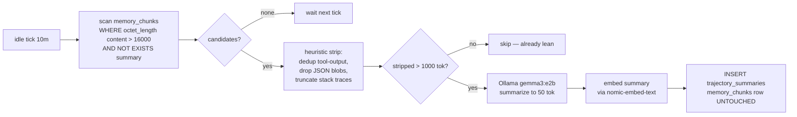

**Workflow — search_memory read path (substitution):**

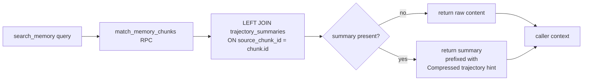

**Read-path invariant.** The HNSW index and `memory_chunks` rows are never mutated by M2. The substitution is a SQL projection: ranking still happens against the original embedding (high recall preserved), but the returned `content` field is swapped to the dense summary when one exists. Raw text is *one tool call away* (`get_trajectory_summary`) but stays out of context unless explicitly requested. A 4 000-token raw trajectory becomes a 50-token line in the agent's window — an 80× context saving per compressed row, compounding over thousands of past sessions.

**Forward links to later missions:**
- **M3 (Sleep Learning):** the idle daemon mines `trajectory_summaries` JOIN `archive_backlog` for repeated successful sequences and proposes them as `skill_candidates` for curated promotion (auto-promotion off by default) — compressed summaries are dramatically cheaper to scan than raw logs. See §4.6.
- **M4 (Transactional Workflows):** per-step trajectory summaries become checkpoint deltas, enabling resume-from-step without replaying raw operational logs.

---

### 4.6 Sleep Learning — Idle Skill Mining (Agentic OS 2026 — Mission 3)

**Goal.** During idle cycles, mine the archive of completed successful tasks for recurring patterns and propose them as reusable skills. The agent stays the *curator*: candidates are surfaced for human review, never silently merged into the M1 retrieval surface.

**Storage decision:** new table `skill_candidates`, NOT a column on `agent_skills`. Rationale: candidates are unpromoted, high-churn mining state with provenance arrays back to source summaries / archive rows; `agent_skills` is the clean, promoted, JIT-retrieval surface. Mixing them would pollute M1 recall.

**Proposed schema (`scripts/012_sleep_learning.sql`):**

| Column                | Type           | Purpose                                    |
|-----------------------|----------------|--------------------------------------------|
| id                    | bigserial PK   |                                            |
| project_id            | text NOT NULL  | Tenancy (GLOBAL permitted on promotion)    |
| pattern_hash          | text NOT NULL  | n-gram + cluster-id hash (idempotency key) |
| source_summary_ids    | bigint[]       | FK → `trajectory_summaries` (provenance)   |
| source_backlog_ids    | bigint[]       | FK → `archive_backlog` (provenance)        |
| frequency             | int            | How many times the pattern appeared        |
| success_count         | int            | Of those, how many were `status='success'` |
| candidate_embedding   | vector(768)    | HNSW recall for dedupe                     |
| proposed_name         | text           | LLM-generated skill name                   |
| proposed_steps        | jsonb          | LLM-generated step list                    |
| promoted_skill_id     | bigint NULL    | FK → `agent_skills` (after promotion)      |
| state                 | text           | `mined` / `promoted` / `rejected`          |
| model, strategy       | text           | Audit                                      |
| created_at, updated_at| timestamptz    |                                            |

Indexes: UNIQUE(`project_id`, `pattern_hash`); HNSW on `candidate_embedding` (cosine); btree on (`state`, `frequency DESC`).
RLS: `deny_anon_authenticated` (mirrors `006_security_hardening`).
RPCs: `match_skill_candidates`, `upsert_skill_candidate`, `promote_candidate_to_skill` — all `SECURITY DEFINER` with `search_path` including `'extensions'` (ERROR-11507 lesson).

**Tool surface (`src/tools/sleep.ts`):**

- `list_skill_candidates({ state?, limit? })` — review queue.
- `promote_skill_candidate({ candidate_id })` — manual approve → writes to `agent_skills` (wraps M1's `package_skill`).
- `reject_skill_candidate({ candidate_id, reason })` — soft-reject, kept for audit.

**Daemon (`src/sleep/`):**

- `miner.ts` — pure clustering over `trajectory_summaries` INNER JOIN `archive_backlog WHERE status='success'` (cosine ≥ 0.85 + 3-gram hash).
- `proposer.ts` — Ollama `gemma4:e2b` → JSON `{ name, steps }`. Mirrors `src/trajectory/summarizer.ts` defensive-parse pattern.
- `daemon.ts` — `startSleepLearner()` / `stopSleepLearner()` / `getSleepLearnerStatus()` / `runMiningOnce()` / `mineOneCluster()`. `setInterval(...).unref()`; module-level re-entrancy guard; per-cluster try/catch.

Env knobs: `SLEEP_LEARNER_INTERVAL_MS=3600000` (1 h, off-peak), `SLEEP_LEARNER_BATCH=10`, `SLEEP_LEARNER_MIN_FREQ=3`, `SLEEP_LEARNER_AUTO_PROMOTE=false`.

Health: `check_system_health` gains a `sleep_learner` block (`{ enabled, interval_ms, last_run_at, last_run_mined, last_run_promoted, last_run_skipped, last_run_errored, last_run_duration_ms, candidates_mined_total, candidates_promoted_total }`), mirroring `trajectory_compactor`.

**Write path (mining loop):**

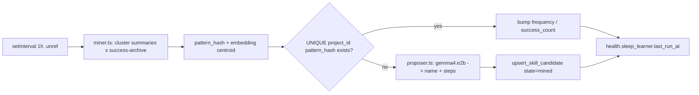

**Read path (curated promotion):**

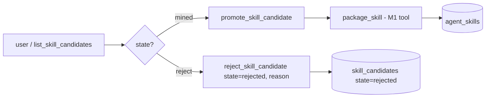

**Curator invariant (SCM-S22-D1).** The Sleep daemon mines stubs only — `proposed_name`, `proposed_steps`, and `model` are persisted NULL. Generative naming and step extraction are exclusively the Orchestrator's domain via `compose_skill_candidate`. Node-side promotion has been removed entirely (no `SLEEP_LEARNER_AUTO_PROMOTE` env var, no daemon flag). Promotion to the JIT skill vault (M1 `agent_skills`) flows through one of exactly two Orchestrator-mediated paths: (a) manual `compose_skill_candidate → promote_skill_candidate`, or (b) M5's atomic `apply_curriculum_task` SQL transaction (which itself requires the Orchestrator to have called `compose_skill_candidate` first — see §4.7).

**Forward links.** M4 (Transactional Workflows) supplies success-checkpoint chains as additional mining input. M5 (Autonomous Curriculum) is the only path that fires `promote_candidate_to_skill` atomically alongside task verification.

---

## M4 — Transactional Workflows (Checkpoints)

**Mission.** Multi-step agent tasks can fail mid-flight. M4 makes them transactional: each step is wrapped in a checkpoint that either commits (pinning a `trajectory_summaries` delta as its replay anchor) or rolls back (restoring the agent to the last committed step and feeding the failure to the M3 miner). NO snapshot engine — restoration replays `trajectory_summaries` by `source_chunk_id`.

**Unified invariant.** `checkpoint = { skill_boundary (M1), trajectory_delta (M2), learner_signal (M3) }`. M4 ships the binding, not a parallel snapshot engine. There is NO separate `workflow_steps` table — `trajectory_summaries` IS the per-step delta store. The checkpoint row carries the pointer (`source_chunk_id`), not the payload.

**Lifecycle (write + restore path):**

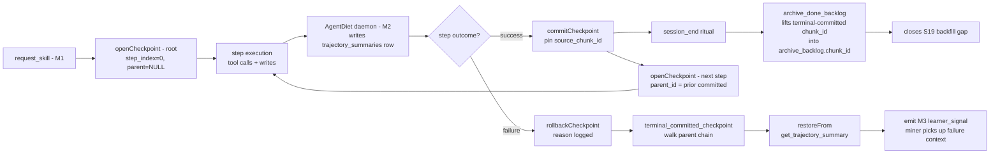

**New components (Phase A lays foundation; B exposes surface):**

| Component | Kind | Phase | Purpose |
|---|---|---|---|
| `workflow_checkpoints` | table | A | Per-step checkpoint rows: skill_id (M1), parent_id chain, source_chunk_id (M2 anchor), status. |
| `terminal_committed_checkpoint` | SQL fn | A | Recursive CTE: returns source_chunk_id of deepest committed descendant. Shared by restore + archive. |
| `archive_done_backlog` (patched) | SQL fn | A | CREATE OR REPLACE inside 014 (NEVER edits 005). Now populates `archive_backlog.chunk_id` from the terminal committed checkpoint per task. Legacy non-skill rows still archive with NULL chunk_id. |
| `openCheckpoint` / `commitCheckpoint` / `rollbackCheckpoint` / `listCheckpoints` / `restoreFrom` | TS service | A | Pure functions in `src/transactions/checkpoint.ts`. No MCP surface yet. |
| `checkpoint_create` / `_commit` / `_rollback` / `_list` | MCP tools | B | 4 Phase B tools wrapping the service for orchestrator use. **Production-validated Session 30** — `tests/checkpoint.test.ts` 12/12 pass against live Supabase; `scripts/smoke-m4.ts` (npm run smoke:m4) green; full suite 91/91, tsc gate clean. |
| `backfillArchiveChunkIds()` | one-shot | B | Closes S19: populates `archive_backlog.chunk_id` for the legacy 7523-row corpus where a checkpoint chain exists. |
| miner rollback-signal extension | M3 patch | B | Extends `src/sleep/miner.ts` to LEFT JOIN `workflow_checkpoints` so rolled-back checkpoint chains feed negative-example mining. |

**Restoration contract.** `restoreFrom(checkpointId)` does NOT replay a snapshot — it looks up the checkpoint's `source_chunk_id` and calls the existing M2 `get_trajectory_summary` RPC. The returned ~50-token compressed summary IS the replay surface: the agent re-reads its own compressed delta, not a heavy state blob. This is the M4 / M2 binding made concrete.

**S19 closure.** Migration 013 added `archive_backlog.chunk_id` (nullable, FK SET NULL) but left it unpopulated. 014's `archive_done_backlog` patch is the first writer: when a task's archived row links to a checkpoint chain, the deepest committed checkpoint's `source_chunk_id` is lifted in. Forward compat: tasks with no checkpoint chain (legacy, non-skill-mediated) still archive with `chunk_id = NULL`. The Phase-B `backfillArchiveChunkIds()` one-shot retro-fills historic rows.

---

### 4.7 Autonomous Curriculum — Single-Brain Closure (Agentic OS 2026 — Mission 5)

**Goal.** Close the Agentic OS 2026 loop. A deterministic, idle-time daemon enqueues curriculum candidates (test gaps, refactor hotspots, stale skill candidates) as **raw stubs only**. The Orchestrator (Claude) is the **sole executor**: pulls a stub, writes code under an M4 checkpoint, clears the verification gate, and on success atomically promotes any linked M3 candidate into the M1 skill vault. After SCM-S22-D1 the `SLEEP_LEARNER_AUTO_PROMOTE` env var was deleted entirely — auto-promotion now lives **only** inside the atomic `apply_curriculum_task` SQL transaction, never as a daemon-level flag.

**Three architectural mandates (immutable — hook-asserted in Phase A):**

1. **Single Brain Boundary.** The curriculum daemon contains **zero generative AI**. Pure heuristics + `nomic-embed-text` embeddings only. No `gemma`, no Ollama generation, no LLM HTTP client. The daemon classifies and queues; it never proposes code, prose, or skill content. *Resolved SCM-S22-D1:* the forward note about M3's `src/sleep/proposer.ts` (`gemma4:e2b → JSON{name,steps}`) has been closed — `src/sleep/proposer.ts` is **deleted**, the Sleep daemon now mines stubs with NULL name/steps, and the generative step is owned by the Orchestrator's `compose_skill_candidate` tool. Both `src/sleep/**` and `src/curriculum/**` are now generative-AI-free (CI lint fence backlog item #117 will statically enforce this).
2. **Orchestrator as Sole Executor.** All code/test/refactor writing flows through the main Claude session. The daemon writes only to `curriculum_tasks` rows. Claude pulls via `pull_curriculum_task`, opens an M4 checkpoint, performs the write, raises `verification-pending.json` on any `main`-touching change, and commits **only after** `confirm_verification({success:true})` clears. The daemon never invokes Write/Edit/Bash.
3. **M5 Auto-Promote Privilege (revised SCM-S22-D1).** Auto-promote lives **exclusively** inside the atomic `apply_curriculum_task` SQL transaction. When a verified curriculum task carries `linked_candidate_id`, the same transaction calls `promote_candidate_to_skill` (M3's existing RPC verbatim). There is **no env var**, **no daemon-flag flip**, no global toggle, no out-of-band promotion path. The verified curriculum cycle **is** the curation. ⚠ **Crash-catch mandate.** Because the Sleep daemon now stubs candidates with NULL `proposed_name` / `proposed_steps`, and `promote_candidate_to_skill` enforces NOT-NULL on both, the Orchestrator **MUST** call `compose_skill_candidate(candidate_id, proposed_name, proposed_steps)` **BEFORE** `apply_curriculum_task` whenever the task has `linked_candidate_id IS NOT NULL`. Skipping compose causes the atomic transaction to abort and rolls back the entire apply (task stays `pulled`, no promotion, no verification flip).

**Schema (`scripts/015_curriculum_tasks.sql`):**

| Column | Type | Purpose |
|---|---|---|
| id | bigserial PK | |
| project_id | text NOT NULL | Tenancy (GLOBAL forbidden) |
| kind | text CHECK IN ('test_gap','refactor','rollback_repro') | Heuristic class |
| target_path | text NOT NULL | File/module the task targets |
| rationale | text NOT NULL | Deterministic signal description (e.g. `coverage 12%, 340 LOC`) |
| signal_source | jsonb NOT NULL | `{coverage_pct?, rollback_count?, candidate_id?, embedding_centroid?}` |
| linked_candidate_id | bigint NULL | FK → `skill_candidates(id)` — triggers M3 auto-promote on verify |
| linked_checkpoint_id | bigint NULL | FK → `workflow_checkpoints(id)` (M4 binding) |
| status | text CHECK IN ('queued','pulled','attempted','verified','rejected','expired') | |
| pulled_by_session_id | text NULL | Audit |
| pulled_at, verified_at, expires_at | timestamptz NULL | TTL window |
| created_at, updated_at | timestamptz NOT NULL | |

Indexes: `UNIQUE(project_id, target_path, kind) WHERE status='queued'` (idempotency); `btree(status, created_at)`; `btree(linked_candidate_id) WHERE linked_candidate_id IS NOT NULL`.
RLS: `deny_anon_authenticated` (mirrors `006_security_hardening`). Service-role only.
RPCs (`SECURITY DEFINER`, `search_path` including `'extensions'` — ERROR-11507 lesson):
- `enqueue_curriculum_task(...)` — idempotent insert keyed by the UNIQUE WHERE-clause.
- `pull_next_curriculum_task(p_project_id, p_kind?)` — `FOR UPDATE SKIP LOCKED`, sets `status='pulled'` + stamps `pulled_by_session_id`, `pulled_at`. Atomic claim.
- `apply_curriculum_task(p_task_id, p_success, p_checkpoint_id)` — atomic: asserts `workflow_checkpoints.status='committed'`; on success sets `status='verified'`, `linked_checkpoint_id`, `verified_at`; **if** `linked_candidate_id IS NOT NULL`, calls `promote_candidate_to_skill(linked_candidate_id)` in the same transaction. On failure sets `status='rejected'`. Single SQL transaction — no out-of-band promotion possible. ⚠ **Caller precondition (SCM-S22-D1):** when `linked_candidate_id IS NOT NULL`, the Orchestrator **MUST** have already called `compose_skill_candidate` on that candidate — `promote_candidate_to_skill` raises on NULL `proposed_name`/`proposed_steps` and the whole transaction aborts.

**Daemon (`src/curriculum/` — deterministic queuer, NO LLM):**

- `scanner.ts` — three pure signal sources:
  - **`test_gap`**: reads `coverage-summary.json` if present; enqueues files with `pct < 50 AND lines > 100`.
  - **`rollback_repro`**: SQL aggregate over `workflow_checkpoints WHERE status='rolledback'` grouped by `target_path` (taken directly from `workflow_checkpoints.step_label` — the orchestrator's free-text anchor; see `src/curriculum/scanner.ts:195-198` for the rationale: no LLM interpretation of `agent_skills.steps[]` needed). Threshold ≥ 3 rollbacks in 30 days. Production-validated Session 30 (`tests/curriculum-scanner.test.ts` 7/7, `npm run smoke:m5-rollback` green).
  - **`refactor` (stale-candidate)**: `skill_candidates WHERE state='mined' AND frequency ≥ cfg.minFreq AND age(created_at) > cfg.staleCandidateMinAgeDays`. Daemon defaults: `minFreq=3` (env `CURRICULUM_MIN_FREQ`, this section's "≥5" is an operational recommendation, not a hardcoded floor), `staleCandidateMinAgeDays=7` (env `CURRICULUM_STALE_CANDIDATE_MIN_AGE_DAYS`). Sets `linked_candidate_id` — this is the M3 auto-promote trigger. `EnqueueResult.source = 'stale_candidate'` (the curriculum_tasks row is kind='refactor'). `target_path = \`skill_candidate:${pattern_hash}\`` — scanner refuses to invent filesystem paths; the deterministic stable identifier is the candidate's `pattern_hash` prefixed (see `src/curriculum/scanner.ts:295-298`). `proposed_name` lands in `signal_source.proposed_name` JSONB, not target_path. Production-validated Session 30 (`tests/curriculum-scanner.test.ts` 6/6, `npm run smoke:m5-stale` green).
- `daemon.ts` — `startCurriculumDaemon()` / `stopCurriculumDaemon()` / `getCurriculumStatus()` / `runScanOnce()`. Mirrors `sleep_learner` shape: `setInterval(...).unref()`, module-level re-entrancy guard, per-source try/catch. **No `proposer.ts`. No Ollama client import.**

Env knobs: `CURRICULUM_INTERVAL_MS=3600000` (1 h, staggered +30 min after sleep_learner), `CURRICULUM_BATCH=10`, `CURRICULUM_MIN_FREQ=3`, `CURRICULUM_TTL_DAYS=14`. Deliberately omitted: any `_MODEL` / `_PROPOSER` / `_GENERATE` knob — there is no generation surface to configure.

Health: `check_system_health` gains a `curriculum_scanner` block — `{ enabled, interval_ms, last_run_at, last_run_queued, last_run_skipped, last_run_errored, last_run_duration_ms, queued_total, verified_total, rejected_total, auto_promotions_total }`.

**Tool surface (`src/tools/curriculum.ts` — 4 MCP tools):**

- `list_curriculum_tasks({ status?, kind?, limit? })` — queue inspection.
- `pull_curriculum_task({ kind?, project_id? })` — orchestrator's entry point; atomic claim. Returns one task row or NULL.
- `apply_curriculum_task({ task_id, success, checkpoint_id })` — wraps the apply RPC; **server-side** asserts the checkpoint is committed and the verification gate cleared (server reads `~/.claude-memory/verification-pending.json` absence as the precondition). On success + linked candidate, M3 auto-promote fires inside the same transaction. ⚠ **Compose-before-apply mandate (SCM-S22-D1):** if the task has `linked_candidate_id`, call `compose_skill_candidate` first or the SQL transaction will abort on NOT-NULL.
- `reject_curriculum_task({ task_id, reason })` — manual veto (status→rejected).

**Lifecycle — [SYSTEM_FLOW] (daemon = queue ; orchestrator = brain):**

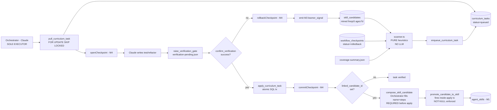

**[TECH_STACK] additions:** `scripts/015_curriculum_tasks.sql`, `src/curriculum/{scanner,daemon}.ts`, `src/tools/curriculum.ts`, `src/healthcheck.ts` (+ block), `src/index.ts` (+ daemon start in MCP boot). No new runtime dependency. Reuses: `pg` (existing pool), `setInterval/unref` (M3 pattern), M4 checkpoint service, M3 `promote_candidate_to_skill` RPC.

**Boundary invariants (CI-enforceable):**

1. Static lint asserts `src/curriculum/**` contains no import from `ollama`, `@anthropic-ai/*`, `openai`, or any fetch call to an `*/generate`/`*/chat`/`*/completions` URL. The daemon is a deterministic queuer; the lint fence is its proof.
2. The auto-promote path lives **only** inside `verify_curriculum_task` SQL — there is no TS-level promotion shortcut. Auditable by `grep promote_candidate_to_skill src/` returning **one** call site (the SQL RPC) plus M3's manual `promote_skill_candidate` tool (unchanged).
3. `pull_curriculum_task` MUST use `FOR UPDATE SKIP LOCKED` to prevent two concurrent sessions claiming the same task. PG advisory locks are not used — the row-level claim suffices and is testable in the smoke run.

**Closure of Agentic OS 2026.** M5 is the convergence point:
- **M1 ← M5**: verified curriculum tasks become new `agent_skills` rows via M3's RPC.
- **M2 ← M5**: every M5 attempt produces a `trajectory_summaries` row through the existing AgentDiet daemon.
- **M3 ← M5**: M5 is the **only** legitimate trigger for auto-promote. M3's curator invariant remains intact for all other paths.
- **M4 ← M5**: every M5 attempt is wrapped in `workflow_checkpoints`; rollback emits the M3 learner signal, closing the negative-example loop.

The daemon proposes nothing. The Orchestrator executes everything. The promotion is atomic. The loop is closed.

---

### 4.8 Observability & Telemetry (Agentic OS 2026 — Mission 6)

The four background daemons (`sleep_learner`, `curriculum_scanner`, `trajectory_compactor`, `telemetry_pruner`) persist every lifecycle event and every orchestrator-initiated state mutation to an append-only `daemon_telemetry` table (migration `scripts/016_daemon_telemetry.sql`, service-role grants in `scripts/017`, daemon-enum extension to admit the pruner in `scripts/018_telemetry_retention.sql`). The persisted history is consumed by two decoupled read paths — the `system_dashboard` MCP tool (24h rollups, compressed Markdown output) and `check_system_health`'s derived per-daemon status (1h window, env-driven thresholds). In-memory `get*Status()` snapshots remain the fast path for live state; the table is the durable source of truth for rates, staleness, and overall health.

**Event taxonomy** (`daemon_telemetry.event_type` CHECK constraint):

| Event | Source | Payload |
|---|---|---|
| `run_started` | daemon tick top, fire-and-forget | none |
| `run_ended` | daemon tick success path | `{compacted\|mined\|queued\|deleted, skipped, errored, duration_ms}` (per daemon — `telemetry_pruner` adds `retention_days`) |
| `run_errored` | daemon tick catch | `{error_message, duration_ms}` |
| `task_outcome` | orchestrator state mutations (`recordVerified` / `recordRejected` / auto-promote) | `{verified\|rejected\|auto_promoted: 1}` delta |

**The 4th daemon — `telemetry_pruner`** (Backlog #124, `src/telemetry/pruner.ts`). Rolling DELETE: every `TELEMETRY_PRUNER_INTERVAL_MS` (default 6h ⇒ 4 ticks/day, deliberately tighter than the 1h health window so cold-start never reads as `down`), removes rows from `daemon_telemetry` with `created_at` older than `TELEMETRY_PRUNER_RETENTION_DAYS` (default 30). The pruner emits its own telemetry, so its activity is observable via `system_dashboard` and `check_system_health` exactly like the other three daemons. Hard DELETE (not roll-up) is intentional: the read paths cap at 24h, so anything >30d is unobservable by definition — a roll-up table would have zero downstream consumer.

Daemon ticks and orchestrator state mutations are intentionally separated by event type. `run_ended` is reserved strictly for tick completion; mixing orchestrator-initiated mutations into the same enum would poison the daemon run-rate rollups.

**Fire-and-forget contract.** `src/telemetry/emit.ts` returns `Promise<void>` that ALWAYS resolves. Supabase errors are logged via `console.error` and swallowed. Daemons MUST survive a telemetry outage without crashing — the typed discriminated union in `src/telemetry/types.ts` is the only schema gate.

**Decoupled read paths.** `system_dashboard` and `check_system_health` each issue their own Supabase query against `daemon_telemetry` — they do not share state, do not import each other, and have independent latency and failure modes. This is deliberate: a slow dashboard rollup MUST NOT delay a health check, and a transient telemetry-query failure inside the health check MUST NOT degrade the dashboard's output. The dashboard caps at 2000 rows over 24h; the health check caps at 1000 rows over 1h.

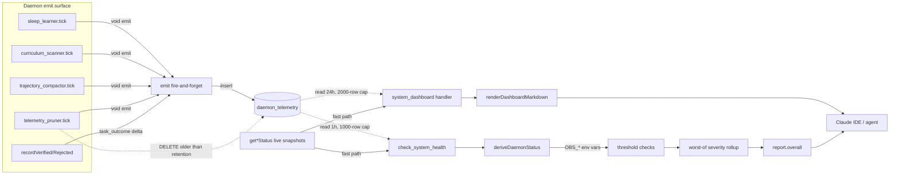

**Derivation rules** (in order — first match wins):

1. `enabled === false` → `healthy` with reason `"daemon disabled (out of scope)"`. A disabled daemon cannot be "down".
2. `last_run_ended === null` AND no `run_ended` rows in 1h → `down` (silent daemon).
3. Staleness: `now - last_run_ended > interval_ms × OBS_STALENESS_MULTIPLIER_DEFAULT` → `down`.
4. 1h error rate `> OBS_ERR_RATE_DOWN_DEFAULT` → `down`.
5. 1h error rate `> OBS_ERR_RATE_DEGRADED_DEFAULT` → `degraded`.
6. Else → `healthy`.

**Overall rollup.** `SEVERITY = {healthy:0, ok:0, degraded:1, down:2, unhealthy:2}`. The worst per-daemon derived status feeds `report.overall` only if it would WORSEN the value the existing Supabase + Ollama reachability checks already set — daemon derivation never improves overall.

**Configuration:**

| Environment variable | Default | Effect |
|---|---|---|
| `OBS_ERR_RATE_DEGRADED_DEFAULT` | `0.20` | Per-daemon → `degraded` when 1h error rate strictly exceeds this. |
| `OBS_ERR_RATE_DOWN_DEFAULT` | `0.50` | Per-daemon → `down` when 1h error rate strictly exceeds this. |
| `OBS_STALENESS_MULTIPLIER_DEFAULT` | `2.0` | Per-daemon → `down` when `now - last_run_ended > interval_ms × multiplier`. |
| `TELEMETRY_PRUNER_INTERVAL_MS` | `21_600_000` (6h) | `telemetry_pruner` tick cadence. |
| `TELEMETRY_PRUNER_RETENTION_DAYS` | `30` | `telemetry_pruner` deletes rows with `created_at < now() - retention_days`. |

Unparseable or missing env values fall back to the defaults; the helper never throws.

**Boundary Invariant #1 preservation.** `src/telemetry/emit.ts` imports only the Supabase admin singleton and the project-id resolver — no model SDKs, no network endpoints beyond Supabase. The `lint:boundaries` CI fence (SCM-S22) was extended to cover the new module's daemon-side imports; neither `src/sleep/**` nor `src/curriculum/**` reaches outside via telemetry. The only new daemon-side import is `../telemetry/emit.js` — a local relative path. The Single Brain Boundary still holds.

**Failure mode.** If Supabase is unreachable, `emit()` swallows the error locally and daemons continue ticking. `check_system_health`'s telemetry query also tolerates failure (silent fallback to empty rows + `console.error`); the top-level `supabase` reachability check is the canonical signal for "DB is broken", avoiding double-counting in the overall rollup.

**Token efficiency.** `renderDashboardMarkdown` compresses the raw 24h aggregate (~8KB JSON) into a single Markdown table (~2KB) — roughly 4× compression. The compressed form is what `system_dashboard` returns to the agent, keeping dashboard reads under the 10k-token CLAUDE.md ceiling even when all three daemons are noisy.

---

### 4.9 Skill Graduation to GLOBAL (Agentic OS 2026 — Mission 7 / SCM-S33-D1)

**Goal.** Audit production-validated local `agent_skills` (high `frequency_used`, high `success_rate`, sufficient age) and graduate the elite to `project_id='GLOBAL'` — *propose only, never auto-promote*. M3 mints local skills from raw trajectories; M7 graduates the local skills that have earned cross-project worth.

**Three immutable mandates.**

1. **No auto-promotion.** The path to `is_global=true` (i.e., `project_id='GLOBAL'`) is structurally human-gated. The `graduation_scanner` daemon's only write surface is `INSERT skill_graduations (state='proposed', ...)`. The compose handler can only write rationale text. Only `apply_graduation` SQL RPC mints a GLOBAL row, and the RPC is reachable only via the `confirm_promotion` MCP tool — which is human-driven. Three separate state transitions; no global flag flip.
2. **Single Brain Boundary #1.** `src/graduation/**` contains zero generative AI imports — no Ollama, no `@anthropic-ai`, no `openai`, no `@google`. The `lint:boundaries` CI fence (extended in commit 5f9d2b4) statically asserts this across `src/sleep/**`, `src/curriculum/**`, and `src/graduation/**`. The compose handler in `src/tools/graduation.ts` does NOT itself call an LLM either — the Orchestrator (Claude) is the LLM and feeds the compose output in as a typed payload (mirrors S22-D1 `compose_skill_candidate`).
3. **Atomic clone.** `apply_graduation` performs `INSERT agent_skills (project_id='GLOBAL', ...)` + `UPDATE skill_graduations SET state='approved', decided_at=now(), promoted_global_skill_id=...` in ONE PostgreSQL transaction. The `now()` value collapses across the two writes, so `new_skill.created_at === graduation.decided_at` to the microsecond. Suite C C4 (`tests/graduation-handlers.test.ts`) and the smoke script's stage 7 (`scripts/smoke-m7.ts`) characterize this — observed at `2026-05-18T11:05:25.101055+00:00` across both runs.

**Schema (`scripts/017_skill_graduations.sql`, additive only).**

| Column | Type | Notes |
|---|---|---|
| `id` | `bigserial PK` | |
| `project_id` | `text NOT NULL` | source skill's local project |
| `source_skill_id` | `bigint NOT NULL → agent_skills(id) ON DELETE CASCADE` | clone source |
| `state` | `text NOT NULL CHECK in ('proposed','composed','approved','rejected')` | lifecycle |
| `frequency_at_propose` | `int NOT NULL CHECK >=0` | frozen telemetry snapshot |
| `success_rate_at_propose` | `real NOT NULL CHECK 0..1` | frozen telemetry snapshot |
| `age_days_at_propose` | `int NOT NULL CHECK >=0` | frozen telemetry snapshot |
| `proposed_global_rationale` | `text NULL` | filled by `compose_global_rationale` (>=10 chars when verdict='pass') |
| `cross_project_verdict` | `text NULL CHECK in ('pass','fail')` | filled by compose |
| `cross_project_evidence` | `text NULL` | filled by compose |
| `model` | `text NULL` | compose model identifier (audit) |
| `composed_at` | `timestamptz NULL` | |
| `promoted_global_skill_id` | `bigint NULL → agent_skills(id) ON DELETE SET NULL` | the GLOBAL clone |
| `rejection_reason` | `text NULL` | |
| `decided_at` | `timestamptz NULL` | atomic-tx microsecond timestamp |
| `created_at` / `updated_at` | `timestamptz NOT NULL DEFAULT now()` | |

**Indexes:** partial `UNIQUE(project_id, source_skill_id) WHERE state IN ('proposed','composed')` — one active proposal per skill at a time; rejected/approved rows allow re-proposal. `btree(state, created_at DESC)`, `btree(source_skill_id)`. **RLS:** `deny_anon_authenticated` (mirrors 006/010/011/012/014/015/016). **Trigger:** `BEFORE UPDATE` auto-bumps `updated_at` unless caller set it explicitly (the RPC sets it to the atomic-tx microsecond, the trigger respects that). **RPCs:** `apply_graduation(p_graduation_id bigint) RETURNS jsonb` (the atomic clone-to-GLOBAL). `SECURITY DEFINER` with `search_path = public, extensions, pg_catalog`. **Grants:** service_role only.

**MCP tool surface (`src/tools/graduation.ts`, four handlers — registered in `src/index.ts` under banner "Agentic OS 2026 — M7 Skill Graduation (SCM-S33-D1)").**

- `list_graduation_candidates` — SELECT with optional `state` + `project_id` filters; default limit 10, hard cap 50. Read-only.
- `compose_global_rationale` — race-safe UPDATE `WHERE id=? AND state='proposed'` writing the Orchestrator-drafted `cross_project_verdict`, `cross_project_evidence`, `proposed_global_rationale`, `model`, `composed_at`. Server-side gates: evidence non-empty, model non-empty, verdict ∈ {pass, fail}, rationale >=10 chars when verdict='pass'. `verdict='fail'` coerces rationale to NULL.
- `confirm_promotion` — calls the `apply_graduation` RPC. Sole `is_global=true` mint path. Defense-in-depth: RPC re-validates state='composed' + rationale presence + source not already GLOBAL.
- `reject_graduation` — TS-only UPDATE `WHERE state IN ('proposed','composed')`. Diverges from M5's `reject_curriculum_task`: a second reject on an already-rejected row returns `ok:false` (reason='invalid_state_transition') instead of silently overwriting. Rationale: GLOBAL rejection reasons carry audit weight; overwrites would erase that history.

**Daemon (`src/graduation/daemon.ts`).** Mirrors `src/curriculum/daemon.ts` exactly: module-level state, `.unref()`'d 1h interval, re-entrancy guard, `try/finally` tick that NEVER throws. Each tick scans `currentProjectId`'s `agent_skills` via the pure-SQL `findGraduationCandidates` (in `src/graduation/scanner.ts`) and `INSERT`s each surfaced row at `state='proposed'` with frozen telemetry. Race INSERTs (caught by partial UNIQUE → 23505) increment the `skipped` counter; real DB errors increment `errored`.

**Env knobs (all `GRADUATION_*`).** `GRADUATION_INTERVAL_MS=3600000` · `GRADUATION_BATCH=10` · `GRADUATION_MIN_FREQUENCY=10` · `GRADUATION_MIN_SUCCESS_RATE=0.90` · `GRADUATION_MIN_AGE_DAYS=14`. Defaults locked 2026-05-18 (SCM-S33 user directive — elite-only floor).

**Health / dashboard impact.** `check_system_health` gains a `graduation_scanner` block mirroring the four pre-existing daemons (snapshot + derived `{status, reason, error_rate_1h, staleness_ms, last_run_ended_at}`; included in the worst-of `rollupOverall`). `system_dashboard` gains a `graduation_scanner` row in the table + Live + Recent sections; the `rollupFor` aggregator now sums the `proposed` payload field as part of `items_processed`. Migration `019_telemetry_graduation_daemon.sql` extends the `daemon_telemetry.daemon` CHECK allow-list with `'graduation_scanner'`.

**Write path (proposal — daemon-driven).**

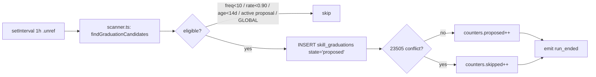

**Decision path (compose + confirm — Orchestrator + human).**

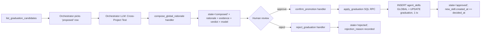

**Boundary Invariant #1 preservation.** `src/graduation/**` imports only `supabase`, `currentProjectId`, the scanner's `findGraduationCandidates`, and `../telemetry/emit.js` — all local relative paths, no model SDKs, no LLM endpoint strings. The lint fence now scans 6 files across the three boundary-protected subsystems; 0 violations.

**Failure modes.** Race on partial UNIQUE → daemon counts 'skipped', continues. Source skill deleted between compose and confirm → FK CASCADE drops the graduation, RPC reports `graduation_not_found` (the `source_skill_deleted` guard is defensive only under CASCADE). Telemetry insert failure → `console.error` swallowed, daemon continues. RPC failure → `confirm_promotion` returns `{ok:false, reason}`; no partial writes (single tx).

---

### 4.10 Hybrid-RAG Knowledge Graph & SVG Command Center (Agentic OS 2026 — Mission 8.1 / SCM-S36-D1)

**Goal.** Lift the typed memory corpus (`memory_chunks` with `metadata.type ∈ {DECISION, PATTERN, ERROR, LOG}` from §4 Sovereign Taxonomy) into an explicit graph layer — typed nodes + directed edges — so retrieval can fuse semantic vector similarity with graph-walk reasoning. Surface the graph through a force-directed SVG visualizer in the operator dashboard so the Orchestrator (and the human) can inspect knowledge density, find connector nodes, and trace decision lineage at a glance.

**Three architectural mandates.**

1. **Daemon-only extraction.** All node/edge creation flows through the `graph_extractor` daemon. Heuristic, deterministic, batched, idempotent — **no LLM inference inside the extraction path**. Mirrors the Single Brain Boundary already applied to `src/sleep/**` (M3), `src/curriculum/**` (M5), and `src/graduation/**` (M7). The CI `lint:boundaries` fence extension is tracked under Backlog #117; M8.1's source files (`src/graph/**`) join the boundary-protected set in v2.2.0.
2. **Cross-type edges are first-class.** Edges carry an explicit `type` (e.g., `DEPENDS_ON`, `MITIGATES`, `EVIDENCED_BY`, `REFERENCES`) plus a `confidence` score and a back-pointer (`source_chunk_id`) to the memory row that justified the inference. The graph never invents edges in a vacuum — every edge is grounded in a chunk the operator can re-read.
3. **Read-mostly, write-rare.** Read tools (`list_kg_nodes`, `list_kg_edges`, `kg_hybrid_search`) are deterministic SQL + GIN-indexed JSONB filters — zero embedding cost on retrieval. The two write tools (`kg_upsert_node`, `kg_upsert_edge`) are exposed as MCP surface for Orchestrator-curated upserts but are NOT the primary write path; the daemon is. Per-call latency on reads is bounded by the same `(project_id, type, label_prefix)` index pattern §4.9 uses for `skill_graduations` listings.

**Schema (`scripts/020_knowledge_graph.sql`).** Two tables and one hybrid-RAG RPC:

- `kg_nodes(id bigserial PK, project_id text NOT NULL, type text NOT NULL, label text NOT NULL, source_chunk_id bigint NULL → memory_chunks(id) ON DELETE SET NULL, properties jsonb DEFAULT '{}', created_at timestamptz DEFAULT now())`. Partial `UNIQUE(project_id, type, label) WHERE source_chunk_id IS NULL` deduplicates orchestrator-curated nodes; daemon-mined nodes can coexist via the `source_chunk_id` lineage. `btree(project_id, type)`, `gin(properties jsonb_path_ops)`.
- `kg_edges(id bigserial PK, project_id text NOT NULL, source_id bigint NOT NULL → kg_nodes(id) ON DELETE CASCADE, target_id bigint NOT NULL → kg_nodes(id) ON DELETE CASCADE, type text NOT NULL, confidence real CHECK 0..1, source_chunk_id bigint NULL → memory_chunks(id) ON DELETE SET NULL, properties jsonb DEFAULT '{}', created_at timestamptz DEFAULT now())`. `UNIQUE(project_id, source_id, target_id, type)`, `btree(source_id)`, `btree(target_id)`.
- `kg_hybrid_search(p_project_id, p_query_embedding, p_k, p_metadata_filter)` — `SECURITY DEFINER` RPC. Joins `memory_chunks` (vector similarity ANN scan via the existing HNSW index) against `kg_nodes.source_chunk_id` to surface both the semantic hits AND the nodes/edges anchored on the same chunks. Returns a discriminated union so the caller can render both surfaces side-by-side. **RLS:** `deny_anon_authenticated` (mirrors 006/010/011/012/014/015/016/017_skill_graduations).

**MCP tool surface (`src/tools/kg.ts`, 5 handlers — registered in `src/index.ts` under banner "Agentic OS 2026 — M8 Hybrid RAG Knowledge Graph (SCM-S36-D1)").**

- `list_kg_nodes({ project_id?, type?, label_prefix?, k?, offset? })` — read-only; default `k=60`, hard cap `200` (the SVG visualizer's design budget).
- `list_kg_edges({ project_id?, k?, offset? })` — read-only; default `k=120`, hard cap `500`. The GUI `/api/graph` route prunes cross-set edges client-side so a `?type=FILE` filter doesn't render dangling endpoints.
- `kg_upsert_node({ project_id, type, label, properties?, source_chunk_id? })` — idempotent on the partial UNIQUE; returns `{ok, id, created|updated}`.
- `kg_upsert_edge({ project_id, source_id, target_id, type, confidence?, properties?, source_chunk_id? })` — idempotent on the full UNIQUE; returns `{ok, id, created|updated}`.
- `kg_hybrid_search({ project_id, query, k?, metadata_filter? })` — embeds the query via Ollama (`nomic-embed-text`, 768d), then calls the SQL RPC. The hybrid result rows carry both the chunk vector score AND any anchored node/edge — letting the Orchestrator decide whether to follow the semantic hit or the graph relation.

**Daemon (`src/graph/{daemon,extractor}.ts`).** Mirrors `src/graduation/daemon.ts` shape: module-level state, `.unref()`'d interval (default `GRAPH_EXTRACTOR_INTERVAL_MS=120000` — 2 min, tighter than M5/M7's 1h because per-tick batch is small), re-entrancy guard, per-batch `try/finally`. Each tick:

1. Selects up to `GRAPH_EXTRACTOR_BATCH` (default 10) chunks where `metadata->>'type' IS NOT NULL` and `id` exceeds the daemon's last-processed cursor.
2. For each chunk, the extractor's heuristic rules emit candidate `{type, label, properties}` tuples per node-class + `{source_id, target_id, type, confidence}` per edge-class. Rules live in `src/graph/extractor.ts` — pure functions, no I/O, no LLM. Token-level signals are confidence-scaled.
3. Each candidate flows through `kg_upsert_node` / `kg_upsert_edge`; idempotency conflicts (`23505`) increment `skipped`; real DB errors increment `errored`.
4. Daemon emits standard `run_started` / `run_ended` / `run_errored` events into `daemon_telemetry` (§4.8 Observability) and gains a `graph_extractor` block in `check_system_health` + `system_dashboard`.

**SVG Command Center (`src/gui/server.ts` `/api/graph` route + `src/gui/public/app.js` renderer).** The GUI dashboard ships a force-directed graph view: requests `/api/graph?node_limit=60&edge_limit=120&type=…&label_prefix=…&project_id=…`, runs a simulated annealing pass client-side (`k_rep`, `k_attr`, `ideal`, `max_iter` tuned during Session 37 Visual QA — no chaos at 60 nodes, all inside the 1000×600 viewBox, min pairwise distance >2× radius), and renders each `<g class="node">` clickable into a detail drawer that shows the back-pointer `source_chunk_id`, type, properties JSONB, and the surrounding edge degree. The dashboard's force-directed parameters and node-radius scaling (`radiusForType`) are exercised by `tests/gui-graph.test.ts` and verified end-to-end in browser by SESSION-37-REPORT.md.

**Health / dashboard impact.** `graph_extractor` joins `sleep_learner`, `curriculum_scanner`, `trajectory_compactor`, `telemetry_pruner`, `graduation_scanner` as the 6th observed daemon. `check_system_health` derivation rules (§4.8) apply unchanged. `system_dashboard`'s `rollupFor` aggregator sums `nodes_created` + `edges_created` per tick into `items_processed`.

**Boundary Invariant #1 preservation.** `src/graph/**` imports only `supabase`, `currentProjectId`, the extractor's pure heuristic rules, and `../telemetry/emit.js`. No model SDKs, no LLM endpoint strings. When the CI `lint:boundaries` fence extension (Backlog #117) lands, `src/graph/**` joins the protected set with zero refactor cost.

**Failure modes.** Memory_chunks deleted between scan and upsert → FK CASCADE/SET NULL handles it cleanly (edges drop with their endpoint, nodes lose source lineage but persist). Cursor jump on cold start → daemon reads max-id checkpoint from telemetry; first-run cost is one full scan, amortized over subsequent ticks. RPC failure → handler returns `{ok:false, reason}`; daemon counts `errored`, continues.

---

### 4.11 Modular GUI Subsystem (Agentic OS 2026 — Mission 8.2 / SCM-S38-D1)

**Goal.** Replace the monolithic 703-line `DASHBOARD_HTML` template string at `src/gui/static.ts` (deleted in M8.2) with a modular static-asset surface (`src/gui/public/{index.html,style.css,app.js}`) served by a small, secure, dependency-free HTTP server. The dashboard's HTML/CSS/JS now diff cleanly file-by-file, ship with per-asset `Content-Type` headers, and survive operator-authored CSP reasoning per resource — without introducing a single new runtime dependency (no Express, no Koa, no `mime`, no `cpx`, no `fs-extra`).

**Structure (`src/gui/public/` — operator-authored, never compiled, never bundled).**

| File | Size | Purpose |
|---|---|---|
| `index.html` | 12.4 kB | Semantic markup for the Sovereign Command Center dashboard. Loads `style.css` + `app.js` as relative same-origin refs, plus the Google Fonts CSS for JetBrains Mono. Contains all dashboard panels: M7 graduation queue, M8.1 force-directed knowledge-graph SVG (`#graph-svg`), filter controls, detail drawer (`#graph-detail`). |
| `style.css` | 48.7 kB | Full visual surface — tokens, panels, drawers, tables, the M8.1 graph chrome, responsive breakpoints. Zero JS dependencies; pure CSS variables + grid. |
| `app.js` | 40.9 kB | Client-side rendering — fetches `/api/graduations` + `/api/graph`, renders the queue, runs the deterministic force-directed simulator (60 nodes, 0 overlaps target), wires the detail drawer, the type/label-prefix filters, and the compose/approve/reject mutations. Uses ES module syntax against the same-origin API only — no external endpoints. |

The build copy step is the single mechanism that propagates these assets into the published tarball — `scripts/copy-gui-public.ts` (40 lines, zero deps) mirrors `src/gui/public/` → `dist/gui/public/` via `fs.cpSync(src, dest, { recursive: true, force: true })` chained after `tsc` in the `npm run build` pipeline. The published v2.2.x npm tarball ships all three files at exactly the same bytes that the operator authored.

**Three architectural mandates.**

1. **Cross-mode `PUBLIC_DIR` resolution.** The asset root is resolved once at module-load via `path.resolve(path.dirname(fileURLToPath(import.meta.url)), "public")`. The same logical path resolves to `src/gui/public/` when `npm run gui` runs the source via `tsx`, AND to `dist/gui/public/` when `node dist/gui/server.js` runs the built ESM output. No `process.cwd()`, no `__dirname` CommonJS shim, no environment-variable plumbing. Promoted to the GLOBAL Knowledge Vault as SCM-S38-P1 (universal pattern for any Node ≥16.7 ESM service that ships static assets through a `tsc src→dist` build).
2. **Zero-dependency build mirror.** `tsc` does not copy non-`.ts` files. The build chain extends from `lint:boundaries && tsc` to `lint:boundaries && tsc && npm run copy:gui` where `copy:gui` runs [scripts/copy-gui-public.ts](scripts/copy-gui-public.ts) — a 40-line script using `fs.cpSync(src, dest, { recursive: true, force: true })` (Node-built-in ≥16.7) with idempotent `fs.rmSync` cleanup. No `cpx`, no `cpy`, no `fs-extra`, no shell `cp -r` (works on Windows + POSIX identically).
3. **Containment-grade static serving.** `serveStatic(res, reqPath)` enforces a strict sandbox: URI-decode → strip leading slashes → empty path coerces to `index.html` → resolve under `PUBLIC_DIR` → reject any resolved path where `path.relative(PUBLIC_DIR, abs).startsWith("..")` (catches `%2E%2E%2F` and other naive-prefix-bypass traversals) → `readFile` → set Content-Type from an explicit 16-entry MIME map → set Content-Length → end. `ENOENT`/`EISDIR` → JSON 404; other errors re-throw to the outer 500 handler.

**Routing surface (`src/gui/server.ts`).**

- `GET /` → `serveStatic("/index.html")`.
- `GET /api/health` → JSON `{ok, service:"scm-gui", version: GUI_VERSION}`.
- `GET /api/graduations[?project_id=&state=&k=&offset=]` → wraps `listGraduationCandidates`.
- `POST /api/graduations/:id/{compose,confirm,reject}` → wraps the three M7 mutation handlers.
- `GET /api/graph[?project_id=&node_limit=&edge_limit=&type=&label_prefix=]` → wraps `listKgNodes` + `listKgEdges`, prunes cross-set edges so a `?type=FILE` filter doesn't return dangling endpoints, returns a `{ok, project_id, params, nodes, edges, stats:{node_count, edge_count, type_breakdown}}` envelope.
- Static fall-through (`GET` not matching `/api/*`) → `serveStatic(path)`.
- All other → JSON 404.

**Defense-in-depth headers (every response).**

| Header | Value | Why |
|---|---|---|
| `X-Content-Type-Options` | `nosniff` | Block MIME-sniffing exploits. |
| `X-Frame-Options` | `DENY` | Block iframe embedding (no clickjacking surface). |
| `Referrer-Policy` | `no-referrer` | Don't leak the GUI URL to outbound links. |
| `Content-Security-Policy` | `default-src 'self'; script-src 'self' 'unsafe-inline'; style-src 'self' 'unsafe-inline' https://fonts.googleapis.com; font-src 'self' https://fonts.gstatic.com; img-src 'self' data:; connect-src 'self'` | Scoped, minimal — only the two Google Fonts hostnames the operator-authored `index.html` references are added beyond `'self'`. Everything else is same-origin. |

**Token-auth contract (`SCM_GUI_TOKEN` env, optional).** When configured, token is enforced **only on `/api/*` routes** (except `/api/health`, which stays open for liveness probes). The dashboard HTML and its static assets (CSS, JS, fonts, images) stay open — browsers cannot attach a custom header to a `<link rel="stylesheet">` request, so token-gating static assets would block the dashboard from loading entirely. The `tests/gui.test.ts` token suite locks this contract: `GET /` 200, `GET /style.css` 200, `GET /app.js` 200, `GET /api/health` 200, `GET /api/graduations` 401 without token, 200 with correct header.

**Cross-platform standalone entry-point (SCM-S37-P1).** The conditional `if (import.meta.url === pathToFileURL(process.argv[1])...)` idiom is broken on Windows in 3 independent ways (slash count, percent-encoded spaces, drive-letter casing). The guard at the bottom of `server.ts` instead compares `path.resolve(fileURLToPath(import.meta.url)) === path.resolve(process.argv[1])`. Verified through `npm run gui` on Windows + POSIX in Sessions 37 and 38.

**Test surface (246 cases across 21 files — full hermetic suite, no live infra).**

- `tests/gui.test.ts` — 5 suites: health + static, list route, mutation routes, failure surface, token auth. 5 dedicated static-serve tests landed in M8.2 (CSS MIME, JS MIME, missing-asset 404, `%2E%2E%2F` traversal blocked, static-stays-open-with-token).
- `tests/gui-graph.test.ts` — the M8.1 `/api/graph` route contract: param clamping, cross-set edge pruning, type-breakdown rollup, token gate, failure surface, plus a static-asset content-anchors test that reads `public/index.html` + `public/app.js` directly to assert the graph-panel + `loadGraph` symbols.

**Build verification.**

```
npm run build:
  [lint-boundaries] OK — scanned 6 file(s) under src/sleep, src/curriculum, src/graduation
  [tsc]             clean (no diagnostics)
  [copy-gui-public] 3 file(s) → dist\gui\public
```

**Files in the v2.2.0 published tarball** (relevant subset, total 144 files / 270.6 kB packed): `dist/gui/server.js` (17.4 kB), `dist/gui/public/index.html` (12.4 kB), `dist/gui/public/style.css` (48.7 kB), `dist/gui/public/app.js` (40.9 kB). The deleted `src/gui/static.ts` does NOT ship.

**Boundary preservation.** `src/gui/**` does not import any LLM SDK, does not call any LLM endpoint, and is not under the `lint:boundaries` protected set — the GUI is an orchestrator-driven surface, not a daemon, so the Single Brain Boundary applies upstream (at the handler-input layer) rather than at the import-graph layer. `serveStatic` itself touches only `node:fs/promises`, `node:path`, `node:url`, and the in-process MIME map.

**Failure modes.** Missing `dist/gui/public/` (forgot `npm run copy:gui`) → every `GET /style.css` etc. returns 404, dashboard loads with an unstyled HTML skeleton; immediately diagnosable via `ls dist/gui/public/`. URI-decoding failure on a malformed percent-encoding → falls back to the raw request path (no exception leaks to client). Symlink inside `public/` pointing outside the sandbox → `path.resolve` follows the symlink during `readFile`; the `path.relative` containment check runs on the symlink path itself, not the target — workaround: don't put symlinks inside `public/`. (Same trade-off as Express's `static()` default behavior.)

### 4.12 Agentic Resource Manager (Agentic OS 2026 — Mission 9 / SCM-S39-D1)

**Motivation.** Through Sessions 22–38 the codebase grew from one Orchestrator-only LLM call site to a fan-out of four (`delegate_task`, `compose_skill_candidate`, `compose_global_rationale`, `index_image`) plus the daemon-tier `summarizeTrajectory`. The Sovereign Constitution's *Tokens Are Currency* imperative was enforced only by prose. A recursive subagent loop or a misconfigured operator could silently burn the user's Anthropic quota — **silent financial loss is the worst failure mode** because the operator only sees it on the monthly bill, whereas a GUI freeze or a daemon spam fails loudly. v2.2.2 makes the imperative structural: every LLM-touching call site routes through `src/budget/gate.ts`, which can refuse the call before it happens.

**The two-surface decoupling.** Orchestrator tasks and `setInterval`-driven daemons have unrelated lifecycles. The original Step 4 design conflated them — daemons have no parent task, so gating them on a `task_id` would silently no-op during idle periods (when no Orchestrator session is attached) — exactly when daemons can drift loudest. The corrected design ships two storage sub-schemas in `scripts/021_agent_budgets.sql` that share nothing but a common decision shape and the off/warn/enforce mode switch:

```
┌─ Per-Task ─────────────────┐    ┌─ Per-Daemon ──────────────────┐
│ budget_tasks               │    │ daemon_budget_buckets         │
│   task_id (uuid)           │    │   (daemon, axis, hour_bucket) │
│   project_id               │    │     UNIQUE → atomic UPSERT    │
│   frozen_caps jsonb        │    │   count int                   │
│   *_used counters          │    │ daemon_budget_events          │
│ budget_task_events         │    │   append-only audit           │
│   append-only audit        │    │ v_daemon_budget_health        │
│ v_task_budget_health       │    │   (current hour only)         │
└────────────────────────────┘    └───────────────────────────────┘
```

The atomic `increment_daemon_bucket(daemon, axis, delta)` PL/pgSQL RPC does the daemon-side UPSERT-and-return in one round-trip — no race against concurrent ticks because the composite UNIQUE forces row-level serialization at the conflict path. Daemons that don't touch Ollama generate (sleep, curriculum, graduation, telemetry_pruner, keep_alive) are NOT gated — Boundary Invariant #1 already proves they're free.

**Gate API (src/budget/gate.ts).** Two disjoint entry points share the off/warn/enforce switch (`SCM_BUDGET_ENFORCEMENT_MODE`):

| Function | Surface | Throws on block? |
|---|---|---|
| `checkTaskBudget(task_id, axis, delta)` | Per-task — `anthropic_tokens`, `ollama_calls`, `subagent_depth` | YES (in enforce) — `BudgetExceededError` |
| `checkDaemonBudget(daemon, axis, delta)` | Per-daemon — `ollama_calls`, `embed_calls`, rolling-hour bucket | NEVER. Callers inspect `decision === 'block'` and return early. |

The asymmetric throw semantics are deliberate: Orchestrator code paths have exception-handling envelopes (try/catch in MCP tool handlers); daemon `setInterval` ticks do not — a thrown error inside `.unref()`'d ticks would orphan the process error handler. Daemons therefore consult the gate, emit `run_skipped_budget` telemetry on block, and exit the tick cleanly.

**Caps.** Resolved per-call so operators can retune without restart. Three-tier precedence: `SCM_<DAEMON>_CAP_<AXIS>_PER_HOUR` (specific override) → `SCM_DAEMON_CAP_<AXIS>_PER_HOUR` (global) → hard-coded fallback (`ollama_calls=50/hour`, `embed_calls=10000/hour`, task `anthropic_tokens=100000`, task `ollama_calls=50`, task `subagent_depth=2`). Caps for an active task are **frozen** at `start_task` time and stored in `budget_tasks.frozen_caps` — env retunes apply only to future tasks, so an in-flight task can't have its goalposts moved mid-execution.

**Warn band.** Burn ratio ≥ 80% triggers a `'warn'` decision (telemetry-only — never blocks). The GUI ticker (`#tele-budget` in `src/gui/public/index.html` + `loadBudget()` in `app.js`) renders worst-of daemon burn with the warn threshold mapped to the `.accent` color token (matches the violet `composed` lane) and 100%+ to `.err`.

**Telemetry pruner extension.** `src/telemetry/pruner.ts` now issues four parallel DELETEs on the same retention cutoff: the existing `daemon_telemetry` plus `budget_task_events`, `daemon_budget_events`, and `daemon_budget_buckets`. `budget_tasks` itself is intentionally NOT pruned — task rows are audit-grade and persistent, the same posture as `memory_chunks`.

**Files.** `scripts/021_agent_budgets.sql` (294 lines) + `scripts/verify-021.ts` (89 lines) + `src/budget/{types.ts (75), store.ts (175), gate.ts (180)}` + `src/tools/budget.ts` (200) + `tests/budget-gate.test.ts` (21 unit cases, all passing). Wiring touches: `src/tools/{orchestrator,sleep,graduation,image}.ts` (per-task gates), `src/trajectory/daemon.ts` (daemon gate + `run_skipped_budget` telemetry), `src/telemetry/{types.ts,pruner.ts}` (new event kind + 3-table retention sweep), `src/index.ts` (+5 tool registrations bringing total 50→55, plus `task_id?` on `delegate_task` schema), `src/gui/server.ts` (+`/api/budget`), `src/gui/public/{index.html, app.js}` (ticker + `loadBudget()`). Constitution v2.1.7 → v2.1.8 with a new **[Resource Manager — Budgets Are Structural]** Execution Imperative codifying the route-through-gate contract.

**Boundary preservation.** `src/budget/**` is NOT under the `lint:boundaries` protected set — the gate intentionally inspects LLM-call decisions, so importing LLM-cost types would be appropriate (none today; tokens are tracked as raw integers). The trajectory_compactor daemon is the only daemon under the budget contract today; future daemons that call Ollama generate will be added to the same gate surface as they ship.

---

## 5. File Architecture (auto-generated)

The Mermaid block below is refreshed by `sync_artefacts` after every worker success. Do not edit content between the markers by hand.

<!-- MEMORY:ARCH:START -->


<!-- MEMORY:ARCH:END -->

---

## 6. Version History

| Version | Summary |
|---|---|
| v0.8.0 | Production engine — ensureSchema, init_project, keep-alive, arch sync |
| v0.9.0 | Ultra-Enforcer — frozen cache, auto-freeze, backups, NL triggers |
| v0.9.1 | Legacy backup sweep + recovery discovery |
| v1.0.0 | God Mode — project detect, compiler gate, regression, binding session |
| **v1.1.0** | **Sovereign Orchestrator — delegation pattern + Autonomous Self-Healing + cross-platform spawn fix + ARCHITECTURE.md consolidation** |
| **v1.1.2** | **Master Schematic & Sovereign Baseline — definitive visual identity + version-locked production release** |
| **v1.1.3** | **Seamless Onboarding & Version SSOT — dynamic version SSOT, batch policy hydration, smart-scout init_project** |
| **v1.1.4** | **Architecture Guard + Automatic Session Handoff — Core 3 audit on init_project, session-end regenerates per-section diagrams, next_session_command_markdown handoff** |
| **v2.0.0-rc1** | **Release Candidate — bundles Typed Retrieval + Strict Project Isolation (Sovereign Taxonomy on memory_chunks.metadata, GIN(jsonb_path_ops) index, match_memory_chunks p_metadata_filter, save_memory tool with category-prompting description) AND Global Knowledge Vault + Multi-IDE (reserved 'GLOBAL' project_id, dual-scope match_memory_chunks p_include_global, save_memory metadata.is_global, init_project Capabilities Header, docs/IDE-INTEGRATION.md for Cursor/Windsurf/Cline). $0 — pure pgvector + JSONB + same Ollama infra. Originally tagged as a separate milestone but folded back into rc1 — release candidate semantics, not yet a stable major.** |
| **v2.1.0** | **GLOBAL Vault UX — browse-only `list_global_patterns` MCP tool (tiered output: preview default + `include_content:true` opt-in; full JSONB `metadata_filter` matching `search_memory`; offset/limit pagination defaulting to 10 with `created_at DESC, id DESC`; pure SQL — zero embedding cost). `init_project.capabilities` extended: `global_scope` gains `browse_tool` + `browse_args`, `context_gathering_hints` gains a GLOBAL-browse exemplar, `protocol` bumped to `smart-claude-memory/v2.1.0`. Zero new dependencies, zero new indexes, zero new migrations — reuses the existing GIN(jsonb_path_ops) index and `pg` pool.** |
| **v2.3.2** | **Security Compliance Sprint (Session 46, SCM-S46-F1 + SCM-S46-F2). Patch-level security release closing every finding in the Supabase Security Advisor report. Two forward-only, idempotent migrations: `scripts/025_security_advisor_compliance.sql` (RLS enabled on `workflow_checkpoints` + `schema_migrations`; `security_invoker=true` flipped on `kg_supernodes` + `v_daemon_budget_health` + `v_task_budget_health` — Postgres views default to `SECURITY DEFINER` which silently bypasses underlying-table RLS; `search_path = public, extensions, pg_catalog` pinned on `skill_graduations_touch_updated_at` + `match_chunks` + `kg_nodes_touch_updated_at` + `increment_daemon_bucket` to close the CVE-2018-1058 mutable-`search_path` attack surface; `REVOKE EXECUTE … FROM PUBLIC` on all 23 user-defined functions/procedures in `public` via signature-agnostic DO block enumerating `pg_proc.pg_get_function_identity_arguments`) and `scripts/026_revoke_anon_authenticated.sql` (follow-up DO block stripping the auto-applied PostgREST grants — Supabase auto-grants EXECUTE to `anon` + `authenticated` on `CREATE FUNCTION`, which the catch-all PUBLIC revoke did not touch; post-apply state 0/23 anon, 0/23 authenticated EXECUTE while `postgres` + `service_role` retain 23/23). Surface unchanged: still 58 MCP tools, test suite 292/292, zero new runtime dependencies; schema migrations now through `026` (was 024). Documented `service_role`-only call pattern preserved end-to-end via explicit role grants + BYPASSRLS. Plus new DECISION `SCM-S46-D1` — backup-script sweep verdict for `scripts/backup-and-remove.ts` retained as production tooling (memory id 22800), 4-condition retention rule encoded for future `init_project.legacy_sweep` candidates.** |
| **v2.3.1** | **Post-Mega-Sprint Roll-Up + Polish Sprint (Sessions 43 Part 2 + 44). Patch-level release surfacing the four post-v2.3.0 commits from Session 43 Part 2 (Epic F Active Backlog Kanban + `/api/backlog` HTTP route in `src/gui/server.ts` reusing the `GuiHandlers` seam · Epic G `file_watcher` KG auto-sync daemon in `src/sync/file-watcher.ts` with `fs.watch` debouncer + `MEMORY_ROOTS` hot-mirror + ARM-budget gate · tech-debt sweep tightening daemon stderr emits · v2.1.11 governance pivot stripping the prior `context_pct` self-report gate from `manage_backlog({action:'session_end'})` and replacing it with the explicit-human-command-only Zero-Autonomy Rule) plus Session 44 (Active Backlog Kanban relocated to the very top of the dashboard above M7 Graduations + Knowledge Graph; v2.1.11 constitution canonicalized in `src/tools/sovereign-constitution.ts` — `KNOWN_CANONICAL_HASHES["v2.1.11"]=6edf03a5a62b…`, `CANONICAL_CONSTITUTION_VERSION` bumped to `v2.1.11`, drift warning closed; `createRequire ESM Fix for Minified-Mangled Named Exports` packaged as a GLOBAL skill — id 1915 — distilling the glob@13 packaging foundation fix into a 7-step cross-project recovery procedure; Windows `nul` reserved-device leak blocked from `.gitignore` and `ARCH_IGNORE`). Surface unchanged: still 58 MCP tools, but schema migrations now through `024` (was 023) and test suite **292/292** across **66** suites (was 277 across 64 — +7 backlog tests + 8 file-watcher tests). Zero new runtime dependencies. Session 45 (2026-05-25) release-prep sweep adds `*.tgz` to `.gitignore` so packed releases can never be committed by accident, ships a `prepare` npm-lifecycle script wrapping `npm run build` so git-based installs (`npm install git+https://github.com/NABILNET-ORG/Smart-Claude-Memory.git`) auto-compile TypeScript → `dist/` on the consumer side and `npm pack` / `npm publish` always ship fresh builds, and expands npm `keywords` 7 → 17 (adds `claude`, `anthropic`, `model-context-protocol`, `long-term-memory`, `sovereign-memory`, `rag`, `vector-database`, `embeddings`, `knowledge-graph`, `llm`, `agent`) for public-registry discoverability — no code, schema, MCP, or test-surface change (commit `cd67204`).** |
| **v2.3.0** | **M8.3 Semantic Clustering (Mission 10, SCM-S41-D1…D7 + Session 42 carry-overs). Adds `scripts/023_kg_clustering.sql` (`kg_supernodes` + `kg_node_clusters`), pure-TS K-Means with k-means++ seeding (`src/clustering/kmeans.ts`, K=√N cap, duplicate-safe) and single-level Louvain (`src/clustering/louvain.ts`, no deps, seeded mulberry32), the `clustering_scanner` daemon (`src/clustering/daemon.ts`, paged fetch + per-supernode Louvain, ARM-gated, telemetry-emitting), 3 new MCP tools (`list_supernodes`, `list_cluster_members`, `trigger_clustering`), `GET /api/graph/clusters?level=super\|drill` flowed through the `GuiHandlers` seam (Session 42 prep refactor), dashboard Cluster View toggle with SUPER/COMMUNITY palette + log₂(node_count) sizing + drill-down + community-nested mode for supernodes >200 members, and `clustering_scanner` block in `check_system_health` with derived metrics. Plus governance v2.1.10 (agent-autonomy + user-explicit clauses on the context-window `session_end` gate, SCM-S41-D3/D6) and the GUI DX upgrade (deterministic per-project port via SHA-256 hash, idempotent auto-start with TCP probe + browser-fatigue protection, project_id branding chip in dashboard header, hardcoded `claude-memory` fallback removed, SCM-S41-D4). Test additions: Suite A 10/10 kmeans · Suite B 6/6 louvain · Suite C 8/8 daemon (live Supabase) · Suite D 5/5 HTTP routes. Surface growth: MCP tools 55 → **58** · SQL migrations through `023_kg_clustering.sql` · test files 22 → **26**. Zero new runtime dependencies.** |
| **v2.2.2** | **Agentic Resource Manager (SCM-S39-D1, Mission 9). Structurally enforces the Sovereign Constitution's *Tokens Are Currency* imperative at runtime. Adds `scripts/021_agent_budgets.sql` with two structurally-decoupled storage surfaces: per-task (`budget_tasks` + `budget_task_events` + `v_task_budget_health`) for Orchestrator LLM lifecycles and per-daemon (`daemon_budget_buckets` + `daemon_budget_events` + `v_daemon_budget_health`) with atomic `increment_daemon_bucket` PL/pgSQL UPSERT for rolling-hour caps on `setInterval`-driven daemons. New `src/budget/{types,store,gate}.ts` primitives expose `checkTaskBudget` (throws `BudgetExceededError` on enforce-mode block) and `checkDaemonBudget` (never throws — daemons emit `run_skipped_budget` telemetry and return early). All four LLM-touching call sites wired: `delegate_task` (subagent_depth), `compose_skill_candidate` + `compose_global_rationale` (anthropic_tokens), `index_image` (ollama_calls). `trajectory_compactor` daemon gated on `ollama_calls` per rolling hour. New event kind `run_skipped_budget` + `RunSkippedBudgetPayload`. 5 new MCP tools (`start_task`, `end_task`, `get_task_budget`, `get_daemon_budget`, `reset_daemon_budget`) bringing roster 50 → 55. GUI gains `/api/budget` route + `#tele-budget` ticker + `loadBudget()` polling with mode-aware color tier (green<80%, accent>=80%, err>=100%). `telemetry_pruner` extended to also DELETE `budget_task_events`, `daemon_budget_events`, `daemon_budget_buckets` on the same retention window. Foundation fix: `deriveDaemonStatus` cold-boot grace now scales with cadence (`max(15min, interval_ms × 1.1)`), closing the false-`down` edge case where `telemetry_pruner` (6h interval) poisoned `check_system_health.overall` on every fresh boot. Constitution bumped to v2.1.8 with a new **[Resource Manager — Budgets Are Structural]** Execution Imperative codifying the gate contract. Zero new runtime dependencies. Default mode `SCM_BUDGET_ENFORCEMENT_MODE=off` ships zero behavior change for legacy operators.** |
| **v2.2.1** | **Docs-only patch — restores 1:1 alignment between published docs and the v2.2.0 surface. README adds `## Bootstrap (3-step setup)` heading (fixes the dead `#bootstrap` anchor that previously pointed at `## Install (3 steps)`), the comprehensive `## Usage` section (CLI cheat sheet + MCP tool reference + daily workflow recipes + full env-var table + troubleshooting), the `Full tool roster — 50 MCP tools by domain` subtable. ARCHITECTURE adds §4.10 (Hybrid-RAG Knowledge Graph subsystem) and §4.11 (Modular GUI subsystem). CHANGELOG backfills entries for v2.1.0 / v2.1.1 / v2.2.0 / v2.2.1. `package.json` removes the two broken `smoke:m8-*` script references (target .ts files never existed on disk). No API change, no schema change, no MCP tool-surface change.** |
| **v2.2.0** | **Agentic OS 2026 production baseline — multi-mission bundle covering Sessions 22–38. Adds: M3 Sleep Learning (auto-mine + Orchestrator-curated promote via `compose_skill_candidate` / `promote_skill_candidate` — Single Brain mandate, `src/sleep/proposer.ts` deleted, NOT-NULL crash-catch); M4 Transactional Workflows (§ above — `workflow_checkpoints` + `terminal_committed_checkpoint` + replay-via-`trajectory_summaries`); M5 Autonomous Curriculum (§4.7 — deterministic queuer daemon, `apply_curriculum_task` atomic M3 auto-promote, NO generative AI in `src/curriculum/**`); M6 Observability (§4.8 — `daemon_telemetry` event-sourcing + `system_dashboard` 24h rollups + `check_system_health` derived per-daemon status + `telemetry_pruner` retention); M7 Skill Graduation (§4.9 — human-gated 3-state proposal lifecycle, atomic `apply_graduation` clone-to-GLOBAL, lint-fence Boundary Invariant #1 extension); M8.1 Hybrid-RAG Knowledge Graph (§4.10 — `kg_nodes`/`kg_edges` schema, deterministic `graph_extractor` daemon, 5 MCP tools, force-directed SVG Command Center verified at 60 nodes / 0 overlaps / drawer / filter end-to-end in Session 37 Visual QA); M8.2 Modular GUI (§4.11 — replaces 703-line `DASHBOARD_HTML` monolith with `src/gui/public/{index.html,style.css,app.js}` served via zero-dep `serveStatic` + `import.meta.url`-resolved `PUBLIC_DIR` + `fs.cpSync` build copy + URI-decoded path-traversal guard + Google-Fonts-scoped CSP relaxation, GLOBAL pattern SCM-S38-P1); cross-platform ESM standalone-entry-point fix (SCM-S37-P1, GLOBAL pattern). Surface growth: MCP tools 23 → **50** · SQL migrations through `020_knowledge_graph.sql` · npm scripts include the 3-step `build` chain (`lint:boundaries && tsc && copy:gui`) · test suite **246/246** across 21 files (was ~50). Zero new runtime dependencies across the entire arc.** |

---

## 7. Plugin Distribution

`smart-claude-memory` ships as a Claude Code Plugin via `.claude-plugin/plugin.json` (added in v2.0.0). The manifest auto-wires two surfaces on install:

1. **MCP server**: `mcpServers.smart-claude-memory` declares `command: "node"` with args `["${CLAUDE_PLUGIN_ROOT}/dist/index.js"]`. Claude Code's plugin loader resolves `${CLAUDE_PLUGIN_ROOT}` to the installed plugin directory at runtime. The 7 SCM env vars (`SUPABASE_URL`, `SUPABASE_SECRET_KEY`, `SUPABASE_POOLER_URL`, `OLLAMA_HOST`, `OLLAMA_EMBED_MODEL`, `MEMORY_ROOTS`, `EMBED_DIM`) pass through from the host shell, with sensible defaults on the three Ollama/embed knobs.

2. **PreToolUse hook**: `hooks.PreToolUse[].hooks[]` declares a single `python "${CLAUDE_PLUGIN_ROOT}/hooks/md-policy.py"` command matching `Write|Edit|Bash`. Plugin lifecycle = hook lifecycle; uninstalling the plugin removes the hook automatically.

### 7.1 First-run migration loop

On a freshly installed plugin against an empty Supabase project, the first `init_project()` call:

1. Runs the existing readiness checks (env, hook registration, MCP wiring, `dist/` build, Core 3 audit).
2. Opens a fresh `pg.Client` against `SUPABASE_POOLER_URL`, calls `applyPendingMigrations()` from `src/lib/migrations.ts`. The helper diffs `scripts/*.sql` against the `schema_migrations(filename PK, sha256, applied_at)` ledger and applies pending files transactionally — one `BEGIN/COMMIT` per migration, `ROLLBACK` on any failure.
3. Verifies that `moondream` and `nomic-embed-text` are pulled by querying `${OLLAMA_HOST}/api/tags`. Missing models surface a `partial` status with the actionable `Run: ollama pull <names>` command.
4. Returns a top-level `migrations: { applied, skipped, total }` block alongside the existing `checks[]` array. Failures convert to `not_ready` without crashing the MCP server.

### 7.2 Health: pending state + grace window

The `check_system_health` derivation includes a `"pending"` state (added in v2.0.0). Daemons within a 15-minute grace window after MCP boot — and without any `run_ended` events yet — report `pending` rather than `down`. Past the grace window, behavior reverts to staleness-based derivation. `pending` ranks below `degraded` in the SEVERITY map, so `overall` is never falsely promoted to `down` on cold boot.
