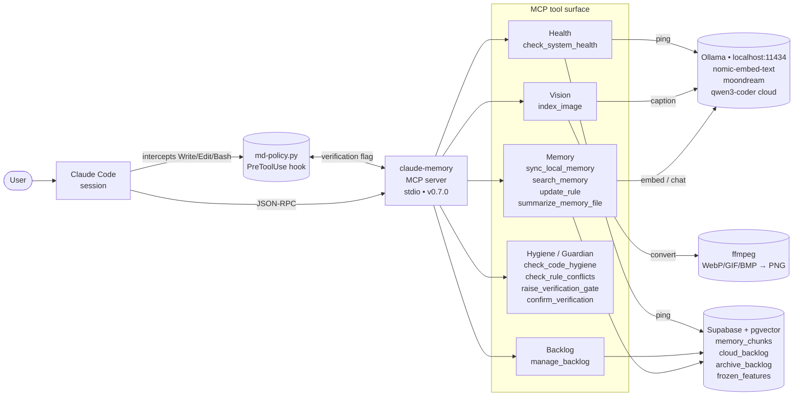

# Architecture

## Request flow

## Planes

| Plane | Runs | Purpose | Failure mode |
|---|---|---|---|
| **Local compute** | Ollama (localhost:11434) | Embeddings and captioning — nothing leaves the machine before it's a vector | Health check reports `ollama: down`. Pipelines raise immediately; no partial writes. |
| **Cloud storage** | Supabase (pgvector, HNSW cosine) | Durable per-project memory + backlog + archive. Strict `project_id` isolation at the SQL layer. | Transient REST blips recover on retry. Persistent outage → all memory reads/writes fail fast. |
| **Policy layer** | `hooks/md-policy.py` (PreToolUse) | Enforces Zero-Local-MD, 750-line ceiling, frozen-feature patterns, and the Manual Test Gate via a shared flag file. | Without the hook installed, all policies degrade to advisory text. |

## Data model

### `memory_chunks`

Primary vector store. Every row is one embedded chunk. Uniqueness: `(project_id, file_origin, chunk_index)`. Per-file hash in `file_hash` powers the incremental sync skip gate. See [scripts/001_schema.sql](scripts/001_schema.sql), [scripts/002_multi_project.sql](scripts/002_multi_project.sql), [scripts/003_file_hash.sql](scripts/003_file_hash.sql).

### `cloud_backlog` + `archive_backlog`

Active task list and its persistent archive. `archive_done_backlog(project_id)` is a PL/pgSQL function that moves rows atomically via `CTE DELETE … RETURNING → INSERT`. See [scripts/004_backlog_frozen.sql](scripts/004_backlog_frozen.sql), [scripts/005_archive_backlog.sql](scripts/005_archive_backlog.sql).

### `frozen_features`

Per-project glob patterns marking files that must only be modified surgically (`Edit`, never `Write`). Referenced by `md-policy.py`.

## Key invariants

1. **Project isolation is SQL-enforced, not just client-enforced.** `match_memory_chunks(query_embedding, p_project_id, ...)` has `WHERE m.project_id = p_project_id` baked in — the server cannot accidentally return cross-project results even with a buggy client.
2. **Archive is atomic.** `archive_done_backlog` cannot produce duplicates or losses. Either the whole batch moves or none of it.
3. **Incremental sync is a strict no-op on unchanged files.** `file_hash` is consulted before any Ollama call; skipped files cost one SELECT and zero embeds.
4. **Verification gate is a file.** The MCP server and the hook coordinate via `~/.claude-memory/verification-pending.json` — the MCP server writes it, the hook reads it, `confirm_verification` deletes it. Enforcement requires the hook to be installed.
