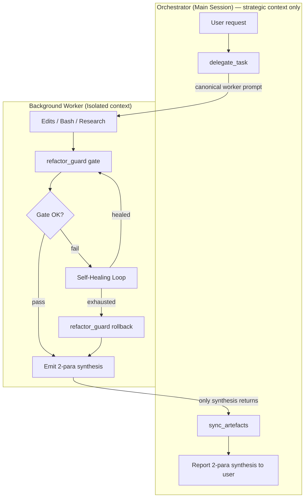
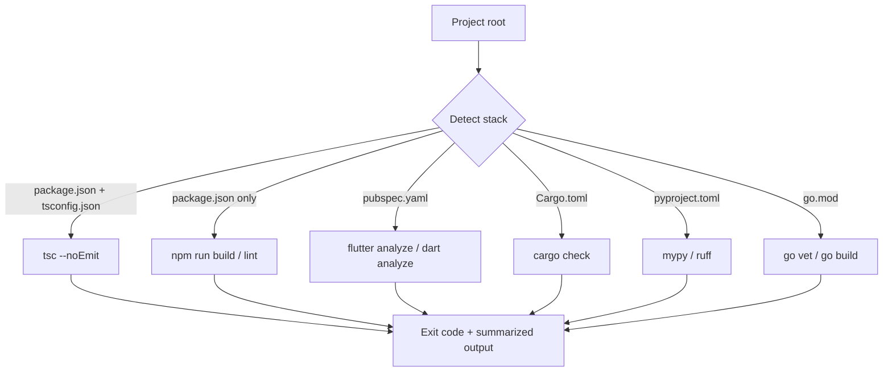

# Smart Claude Memory — System Architecture (v1.1.0)

> **Stable baseline:** v1.1.0 — Sovereign Orchestrator with Autonomous Self-Healing.
> This document is the single source of truth for the system's structure and control flow. The marker-bounded Mermaid block in §4 is refreshed automatically by `sync_artefacts` after every worker success; the other diagrams are hand-maintained.

---

## 1. The Sovereign Orchestrator Pattern

The **Orchestrator** (the main Claude session) never edits code, runs builds, or reads large files directly. Every unit of execution is delegated to a **Background Worker** — an Agent sub-process spawned via `delegate_task`, isolated in its own context window. The worker returns only a 2-paragraph synthesis. This keeps the Orchestrator's context lean and enforces a clean separation between strategic decisions and tactical execution.

### 1.1 Delegation flow

### 1.2 Context-hygiene contract
- Workers MUST NOT return raw file contents, full stack traces, or long logs to the Orchestrator.
- Each compiler error is summarized in ≤ 1 sentence (error code + symbol).
- Paragraph 2 of the synthesis records gate result (pass first-try / passed after N heals / rolled back) and any healing hypotheses tested.

---

## 2. Autonomous Self-Healing Loop (v1.1.0)

When the compile gate fails, the worker does **not** bounce the failure back to the Orchestrator. Instead, it diagnoses the regression against the nearest clean backup and applies a minimal local fix. Only if the loop exhausts (default 3 attempts) does it rollback and report surrender.

### 2.1 Primitives
| Primitive | Tool call | Purpose |
|---|---|---|
| Gate | `refactor_guard({ action: "gate" })` | Single source of compile truth — dispatches to the stack's native analyzer. |
| Analyze | `analyze_regression({ file, backups_to_compare })` | Diffs current file against recent backups; surfaces `closest_prior` to guide the minimal fix. |
| Rollback | `refactor_guard({ action: "rollback", file })` | Restores pre-edit backup. Last resort only. |

### 2.2 Healing constraints
- **Minimal fix, not wholesale restore** — the feature edit must survive; the fix only reintroduces what regressed.
- **No repeated hypotheses** — each attempt changes approach.
- **Strictly local** — never ask the Orchestrator for more context while attempts remain.

---

## 3. Multi-Stack Compiler Map

`refactor_guard` auto-detects the stack from project artifacts and dispatches to the native analyzer. This is what makes the gate stack-agnostic.

### 3.1 Cross-platform spawn (v1.1.0 fix)
Native tool launchers on Windows resolve to `.cmd` / `.bat` shims (`npx.cmd`, `flutter.bat`). Node's `child_process.spawn` without `shell: true` cannot invoke these — it throws `EINVAL`. The v1.1.0 `runBin` in `src/tools/refactor.ts` detects `process.platform === 'win32'` and sets `shell: true` so shim resolution works through `cmd.exe`. Args are internal-only (no user input), so shell-injection risk does not apply.

---

## 4. File Architecture (auto-generated)

The Mermaid block below is refreshed by `sync_artefacts` after every worker success. Do not edit content between the markers by hand.

```mermaid
%% Auto-generated. Do not edit between the MEMORY:ARCH markers.
flowchart TD
  n0["Claude-Memory/"]
  n1["hooks/"]
  n0 --> n1
  n2["md-policy.py"]
  n1 --> n2
  n3["README.md"]
  n1 --> n3
  n4["scripts/"]
  n0 --> n4
  n5["001_schema.sql"]
  n4 --> n5
  n6["002_multi_project.sql"]
  n4 --> n6
  n7["003_file_hash.sql"]
  n4 --> n7
  n8["004_backlog_frozen.sql"]
  n4 --> n8
  n9["005_archive_backlog.sql"]
  n4 --> n9
  n10["apply-schema.ts"]
  n4 --> n10
  n11["backup-and-remove.ts"]
  n4 --> n11
  n12["e2e-incremental-test.ts"]
  n4 --> n12
  n13["e2e-isolation-test.ts"]
  n4 --> n13
  n14["e2e-test.ts"]
  n4 --> n14
  n15["purge-samia-rules.ts"]
  n4 --> n15
  n16["src/"]
  n0 --> n16
  n17["tools/"]
  n16 --> n17
  n18["backlog.ts"]
  n17 --> n18
  n19["conflict.ts"]
  n17 --> n19
  n20["health.ts"]
  n17 --> n20
  n21["hygiene.ts"]
  n17 --> n21
  n22["image.ts"]
  n17 --> n22
  n23["orchestrator.ts"]
  n17 --> n23
  n24["policy.ts"]
  n17 --> n24
  n25["refactor.ts"]
  n17 --> n25
  n26["search.ts"]
  n17 --> n26
  n27["setup.ts"]
  n17 --> n27
  n28["summarize.ts"]
  n17 --> n28
  n29["sync.ts"]
  n17 --> n29
  n30["update-rule.ts"]
  n17 --> n30
  n31["verification.ts"]
  n17 --> n31
  n32["chunker.ts"]
  n16 --> n32
  n33["config.ts"]
  n16 --> n33
  n34["index.ts"]
  n16 --> n34
  n35["ollama.ts"]
  n16 --> n35
  n36["project-detect.ts"]
  n16 --> n36
  n37["project.ts"]
  n16 --> n37
  n38["supabase.ts"]
  n16 --> n38
  n39["verification-gate.ts"]
  n16 --> n39
  n40[".env.example"]
  n0 --> n40
  n41[".gitignore"]
  n0 --> n41
  n42["ARCHITECTURE.md"]
  n0 --> n42
  n43["LICENSE"]
  n0 --> n43
  n44["package-lock.json"]
  n0 --> n44
  n45["package.json"]
  n0 --> n45
  n46["README.md"]
  n0 --> n46
  n47["tsconfig.json"]
  n0 --> n47
```

<!-- MEMORY:ARCH:START -->

<!-- MEMORY:ARCH:END -->

---

## 5. Version History

| Version | Summary |
|---|---|
| v0.8.0 | Production engine — ensureSchema, init_project, keep-alive, arch sync |
| v0.9.0 | Ultra-Enforcer — frozen cache, auto-freeze, backups, NL triggers |
| v0.9.1 | Legacy backup sweep + recovery discovery |
| v1.0.0 | God Mode — project detect, compiler gate, regression, binding session |
| **v1.1.0** | **Sovereign Orchestrator — delegation pattern + Autonomous Self-Healing + cross-platform spawn fix + ARCHITECTURE.md consolidation** |
