# Smart Claude Memory — System Architecture (v2.1.0)

**Developer:** [NABILNET.AI](https://nabilnet.ai)

> **Stable baseline:** v2.1.0 — bundles Architecture Guard + Automatic Session Handoff, the Typed Retrieval layer (Sovereign Taxonomy on `memory_chunks.metadata`, GIN-indexed metadata filter, strict project_id-first isolation), the Global Knowledge Vault + Multi-IDE layer (reserved `'GLOBAL'` project_id with dual-scope retrieval, `init_project` Capabilities Header, `docs/IDE-INTEGRATION.md` for Cursor / Windsurf / Cline), and the GLOBAL Vault UX layer (browse-only `list_global_patterns` MCP tool with tiered output, full JSONB `metadata_filter`, offset/limit pagination, zero embedding cost; `init_project.capabilities.global_scope` extended with `browse_tool` + `browse_args`).
> This document is the single source of truth for the system's structure and control flow. The marker-bounded Mermaid block in §5 is refreshed automatically by `sync_artefacts` after every worker success; the other diagrams are hand-maintained.

*Master schematic — the definitive visual reference for the Smart Claude Memory v2.1.0 production baseline.*

---

## 1. The Sovereign Orchestrator Pattern — [SYSTEM_FLOW]

The **Orchestrator** (the main Claude session) never edits code, runs builds, or reads large files directly. Every unit of execution is delegated to a **Background Worker** — an Agent sub-process spawned via `delegate_task`, isolated in its own context window. The worker returns only a 2-paragraph synthesis. This keeps the Orchestrator's context lean and enforces a clean separation between strategic decisions and tactical execution.

### 1.1 Delegation flow

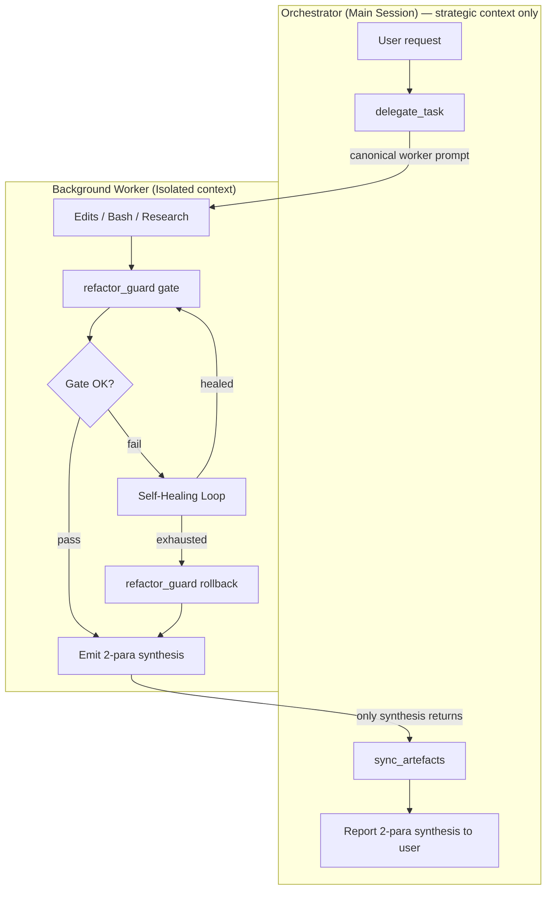

### 1.2 Context-hygiene contract
- Workers MUST NOT return raw file contents, full stack traces, or long logs to the Orchestrator.
- Each compiler error is summarized in ≤ 1 sentence (error code + symbol).
- Paragraph 2 of the synthesis records gate result (pass first-try / passed after N heals / rolled back) and any healing hypotheses tested.

---

## 2. Autonomous Self-Healing Loop (v1.1.0)

When the compile gate fails, the worker does **not** bounce the failure back to the Orchestrator. Instead, it diagnoses the regression against the nearest clean backup and applies a minimal local fix. Only if the loop exhausts (default 3 attempts) does it rollback and report surrender.

### 2.1 Primitives
| Primitive | Tool call | Purpose |
|---|---|---|
| Gate | `refactor_guard({ action: "gate" })` | Single source of compile truth — dispatches to the stack's native analyzer. |
| Analyze | `analyze_regression({ file, backups_to_compare })` | Diffs current file against recent backups; surfaces `closest_prior` to guide the minimal fix. |
| Rollback | `refactor_guard({ action: "rollback", file })` | Restores pre-edit backup. Last resort only. |

### 2.2 Healing constraints
- **Minimal fix, not wholesale restore** — the feature edit must survive; the fix only reintroduces what regressed.
- **No repeated hypotheses** — each attempt changes approach.
- **Strictly local** — never ask the Orchestrator for more context while attempts remain.

---

## 3. Multi-Stack Compiler Map — [TECH_STACK]

`refactor_guard` auto-detects the stack from project artifacts and dispatches to the native analyzer. This is what makes the gate stack-agnostic.

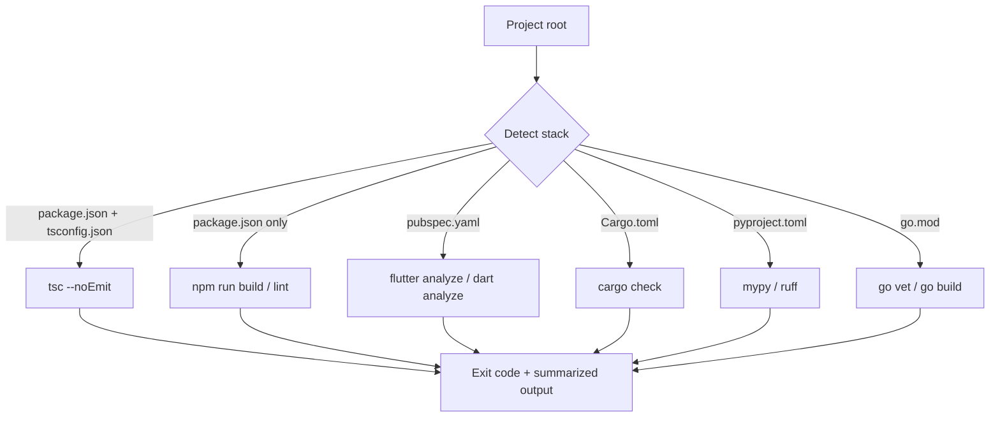

### 3.1 Cross-platform spawn (v1.1.0 fix)
Native tool launchers on Windows resolve to `.cmd` / `.bat` shims (`npx.cmd`, `flutter.bat`). Node's `child_process.spawn` without `shell: true` cannot invoke these — it throws `EINVAL`. The v1.1.0 `runBin` in `src/tools/refactor.ts` detects `process.platform === 'win32'` and sets `shell: true` so shim resolution works through `cmd.exe`. Args are internal-only (no user input), so shell-injection risk does not apply.

### 3.2 Version Single Source of Truth (v1.1.3)
The version string is owned by `package.json`. `src/version.ts` reads it once via `createRequire(import.meta.url)` and re-exports `VERSION`. All consumers — `src/index.ts` (McpServer registration), `src/tools/health.ts` (the `orchestrator.version` field on `HealthReport`, whose type was widened from the literal `"1.1.0"` to `string` to accept any future bump), and `src/tools/orchestrator.ts` (the `delegateTask` response envelope) — import that one constant. There are no hard-coded version literals in the source tree, so `check_system_health` always reports exactly what `package.json` says and a release bump propagates with a single edit.

### 3.3 Policy Hydration & Smart-Scout Onboarding (v1.1.3)
`batch_freeze_patterns` (in `src/tools/batch-freeze-patterns.ts`) hydrates the frozen-pattern cache from either glob `paths` or a markdown rule file. When `from_rule_file` is supplied, extraction is strict: it scans only the section under an exact `## Frozen Patterns` heading, strips backticks and list markers, and skips any line containing unescaped spaces. The shared loader at `src/tools/frozen-cache.ts` migrates legacy string entries to the `{ pattern, source, added_at }` schema on read, writes atomically via `<file>.tmp` + `rename`, and dedups on trimmed pattern equality (first-writer-wins). Every consumer — `list_frozen`, `freeze_file`, `unfreeze_file`, and `supabase.writeFrozenPatternsCache` — funnels through the same loader. The `source` field unlocks idempotent re-hydration and the suppression logic below.

`init_project` (in `src/tools/setup.ts`) closes the onboarding loop. Beyond the readiness checks, it does a quick local scan: if `.claude/rules/` exists, it peeks the first ~200 lines of each immediate-child `.md` for an exact `## Frozen Patterns` line. It then loads the project's frozen cache via `loadFrozenCache()` and drops any candidate already represented in `entry.source` (after path normalization — workspace-relative, forward slashes, lowercased on Win32). What survives is emitted as a structured `recommendations: [{ id: "hydrate_policies", tool: "batch_freeze_patterns", candidates, suggested_first_call: { from_rule_file, dry_run: true } }]` block. The key is omitted entirely when nothing is actionable, and the scout never mutates the cache — it surfaces a recommended `dry_run` call for the operator to consent to.

---

## 4. Sovereign Taxonomy (v2)

Every chunk in `memory_chunks` carries a `metadata jsonb` column whose contract is the **Sovereign Taxonomy**. Four categories cover everything the orchestrator stores; anything that does not fit is a session log.

| `metadata.type` | Captures | When to use |
|---|---|---|
| `DECISION` | Architectural choices + rationale | A trade-off was named and a path was picked |
| `PATTERN`  | Code standards + Rule 5–8 enforcement | A reusable convention or guardrail surfaced |
| `ERROR`    | Bug post-mortems + fixes | A defect was observed, root-caused, and resolved |
| `LOG`      | General session progress | Catch-all narrative useful for replay/audit |

Optional fields: `status` (free-form: `open`, `verified`, `superseded`, …), `context_id` (correlation key for multi-step work — e.g. a backlog id), plus arbitrary pass-through keys. The taxonomy is enforced in TypeScript (`save_memory`'s tool description prompts the agent; the SQL RPC accepts arbitrary jsonb), not via a CHECK constraint, so the contract can evolve without a migration.

### 4.1 Retrieval order — tenancy first, taxonomy second, vector third

Retrieval composes three predicates in fixed order, so cross-project leakage is structurally impossible:

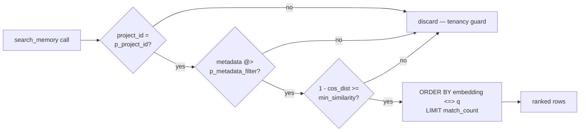

The `metadata @>` predicate is index-driven: migration `007_metadata_typed_retrieval.sql` ships a GIN index using `jsonb_path_ops` (smaller and ~2–3× faster than the default `jsonb_ops` for containment), and the planner bitmap-ANDs it with the existing `(project_id)` btree. Cost on the Supabase Free Tier stays $0; no external metadata service is involved.

### 4.2 Write path

`save_memory` is the canonical and only write side: it embeds `content` via Ollama, then calls the `upsert_memory_rule(p_project_id, p_file_origin, p_chunk_index, p_content, p_embedding, p_metadata)` RPC. Its tool description prompts the calling agent to set `metadata.type` on every save.

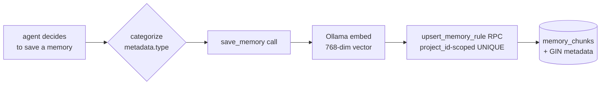

### 4.3 Global vs Local Retrieval (v2.0.0-rc1 — migration 008)

A reserved `project_id` of literal `'GLOBAL'` is the **Knowledge Vault**: any chunk written there is visible to every project. Universal patterns, lessons-learned, and Rule 9 entries belong here. Routine project memories stay scoped to the slug derived from `process.cwd()`.

**Write side.** `save_memory({ ..., metadata: { ..., is_global: true } })` overrides the row's `project_id` to `'GLOBAL'` regardless of any explicit `project_id` argument; `is_global: true` is also persisted inside the metadata jsonb for audit. Only set this for cross-project truths — anything project-local should NOT be promoted to `'GLOBAL'`, or the vault loses signal.

**Read side.** `search_memory` is dual-scope by default: `match_memory_chunks(..., p_include_global := true)` evaluates rows where `project_id = p_project_id OR project_id = 'GLOBAL'`, then applies the same metadata + similarity predicates and ORDER BY. Pass `include_global: false` to restrict to the current project. The two scopes share the same GIN(metadata) and btree(project_id) indexes, so the planner bitmap-ANDs cleanly without a separate query.

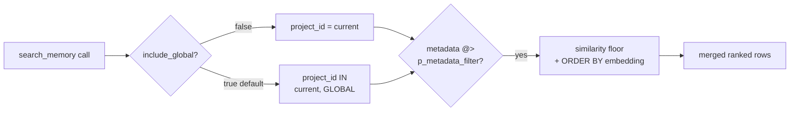

The dual-scope union does NOT relax tenancy: every row remains tagged with its origin `project_id`, so caller code can still distinguish "from this project" vs "from the global vault". `'GLOBAL'` is reserved — `init_project` slugifies the cwd basename, which never produces this literal, so no project can accidentally write to the vault by being in a directory called "GLOBAL"; the only entry is the explicit `is_global: true` flag.

### 4.3.1 GLOBAL Vault UX (v2.1.0 — `list_global_patterns`)

The Global Vault is **discoverable** as well as searchable. `search_memory({ include_global: true })` is the semantic side ("find by meaning"); v2.1.0 adds **`list_global_patterns`** for the deterministic side ("enumerate by attribute"). Two tools, one vault, crisp boundary: the browse path never calls Ollama, never spends embedding budget.

**Assumptions (locked).**

- Tool shape: `list_global_patterns({ metadata_filter?, limit?=10, offset?=0, include_content?=false })`. Browse-only — no `query` arg.
- Output is **tiered**: default returns `{ id, type, global_rationale, created_at, content_preview ≤120 chars, file_origin }`. `include_content:true` inflates each row with the full `content` field. Honors the [Tokens are Currency] imperative.
- `metadata_filter` shape **matches `search_memory`** (JSONB containment via `@>`, reuses the existing GIN(`jsonb_path_ops`) index on `memory_chunks.metadata`). Zero new API surface, zero new index.
- Scope is hardcoded to `project_id = 'GLOBAL'`. Any caller-supplied `project_id` is ignored — the name *is* the scope.
- Sort: `ORDER BY created_at DESC, id DESC` (id as stable tiebreaker). Offset/limit pagination; `limit` clamped to 50 (mirrors `search_memory.limit.maximum`).

**Acceptance criteria.**

1. `list_global_patterns()` returns the 10 newest GLOBAL chunks, preview-only.
2. `list_global_patterns({ metadata_filter: { type: 'PATTERN' } })` filters via the existing GIN index.
3. `list_global_patterns({ metadata_filter: { type: 'ERROR', status: 'fixed' } })` composes multi-key filters via the same index.
4. `include_content:true` inflates each row with full content; otherwise `content` is omitted from the response.
5. `limit:100` is clamped to 50.
6. Empty result returns `{ project_id: 'GLOBAL', count: 0, results: [], summary: 'GLOBAL vault is empty.' }`.
7. `init_project.capabilities.protocol === 'smart-claude-memory/v2.1.0'`.
8. `init_project.capabilities.global_scope` is extended to `{ available, project_id, browse_tool: 'list_global_patterns', browse_args: ['metadata_filter','limit','offset','include_content'] }`.
9. `capabilities.context_gathering_hints` contains a new entry exactly matching `"Browse GLOBAL: list_global_patterns({ metadata_filter: { type: 'PATTERN' }, limit: 10 })"` (mirroring the style of existing hints like `"On boot: search_memory({ query: 'Active Backlog' })"`).
10. README + ARCHITECTURE document the tool; the Sovereign Memory Protocol block in CLAUDE.md is unchanged (read-only UX, no rule shift).

**[TECH_STACK] addendum.**

- New tool handler: `src/tools/listGlobalPatterns.ts` (sibling to `list_frozen`, `list_curriculum_tasks`, `list_skill_candidates`). Zod arg schema co-located. Registered in the existing MCP tool dispatch table.
- DB read: pure SQL — `SELECT id, content, metadata, file_origin, created_at FROM memory_chunks WHERE project_id = 'GLOBAL' AND metadata @> $filter ORDER BY created_at DESC, id DESC OFFSET $offset LIMIT $limit`. Uses the existing `pg` pool and the existing GIN(`jsonb_path_ops`) index. **No Ollama call.**
- `init_project` capabilities builder: bump the `PROTOCOL` constant to `'smart-claude-memory/v2.1.0'`; extend the `global_scope` block; append one entry to `context_gathering_hints`.
- Docs: README (capabilities header table + tool row) and this ARCHITECTURE.md addendum. CLAUDE.md untouched.
- **Zero new dependencies. Zero new indexes. Zero new migrations.**

**[SYSTEM_FLOW] — boot discovery.**

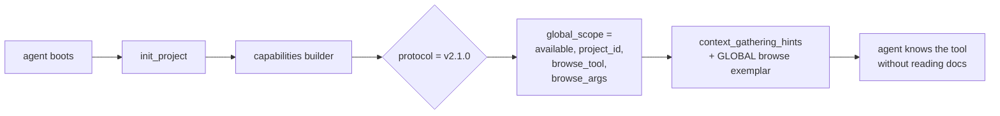

**[SYSTEM_FLOW] — browse call (no embedding cost).**

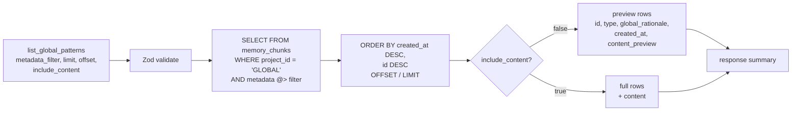

**Foundation-First commit sequence.** No entangled commits — six isolated, revertable steps:

| # | Commit | Scope | Why isolated |
|---|---|---|---|
| 1 | `chore: bump SCM protocol constant to v2.1.0` | One-line constant + version header | Declares the protocol contract before any consumer ships against it |
| 2 | `feat(capabilities): extend global_scope schema with browse_tool + browse_args (null)` | `init_project` capabilities builder shape only — `browse_tool` value left as `null` | Schema change visible without committing to the tool name yet; reverts cleanly if the discovery flow has issues |
| 3 | `feat(tool): register list_global_patterns handler (stub)` | New file + Zod schema; handler returns a hardcoded empty `{ ..., summary }` | MCP wiring validated before logic exists |
| 4 | `feat(tool): implement list_global_patterns SELECT + tiered output` | Real SQL + filter passthrough + preview/full toggle | Pure logic — no plumbing change |
| 5 | `feat(capabilities): populate browse_tool='list_global_patterns' + new context hint` | Wire the now-real tool into capabilities; add the hint exemplar | Closes the discovery loop |
| 6 | `docs: README + ARCHITECTURE document v2.1.0 GLOBAL Vault UX` | Pure docs | Never bundled with feature commits |

Each commit ships only after `npm run build` is zero-error and the Core 3 audit (`init_project.core3.in_sync`) stays green.

### 4.4 JIT Skill Vault (Agentic OS 2026 — Mission 1, proposed)

**Goal.** Support thousands of procedural skills (multi-step recipes the agent can execute) without prompt bloat. Skills are stored at rest, retrieved on demand by semantic similarity to the current task, and Just-In-Time injected into context only for the turn that needs them. Zero-Bloat RAG.

**Storage decision: dedicated `agent_skills` table — DO NOT extend `memory_chunks` with `metadata.type='SKILL'`.**

Rationale (single decisive reason): skill telemetry (`frequency_used`, `last_invoked_at`, `success_rate`) is high-churn mutable state. Co-locating it with the immutable `memory_chunks` HNSW index would dirty vector pages on every skill invocation and degrade recall latency for every other retrieval path (DECISION, PATTERN, ERROR, LOG). Skills also need richer relational structure (UNIQUE skill name, FK to `archive_backlog` for Sleep-Learning provenance, `text[]` trigger keywords) that does not fit JSONB cleanly.

**Proposed schema** (migration `010_agent_skills.sql`, to land in M1):

| Column | Type | Purpose |
|---|---|---|
| `id` | `bigserial PK` | Stable handle |
| `project_id` | `text NOT NULL` | Tenancy; `'GLOBAL'` permitted for universal skills |
| `name` | `text NOT NULL` | Human-readable slug (e.g. `commit-with-heredoc`) |
| `version` | `int NOT NULL DEFAULT 1` | Monotonic; bumps on `package_skill` re-write |
| `description` | `text NOT NULL` | Short trigger summary — gets embedded |
| `steps` | `jsonb NOT NULL` | Ordered procedural steps (the actual recipe payload) |
| `trigger_keywords` | `text[] DEFAULT '{}'` | GIN-indexed literal triggers |
| `embedding` | `vector(768)` | Ollama `nomic-embed-text` of `description` |
| `frequency_used` | `int NOT NULL DEFAULT 0` | Incremented by `request_skill` |
| `success_rate` | `real NOT NULL DEFAULT 1.0` | Updated by post-invocation telemetry |
| `last_invoked_at` | `timestamptz` | Recency signal for ranking |
| `packaged_from_archive_id` | `bigint` | FK → `archive_backlog.id` (Sleep-Learning provenance, nullable) |
| `created_at` / `updated_at` | `timestamptz` | Audit |

Indexes: HNSW on `embedding` (cosine), GIN on `trigger_keywords`, btree on `(project_id, name)` UNIQUE, btree on `last_invoked_at DESC` for recency tie-breaks. RLS reuses the `006_security_hardening` `deny_anon_authenticated` policy verbatim — service-role only.

**Tool surface (new in M1):**

- `package_skill({ name, description, steps, trigger_keywords?, is_global?, packaged_from_archive_id? })` — embeds `description` via Ollama, upserts the row (version bumps on conflict), returns `{ id, version, scope }`. `is_global: true` routes to `project_id='GLOBAL'` exactly like `save_memory` does.
- `request_skill({ query, k?, min_similarity?, include_global? })` — embeds `query`, runs `match_agent_skills(query_embedding, p_project_id, match_count, min_similarity, p_include_global)` RPC, increments `frequency_used` and sets `last_invoked_at` on the chosen hit, returns the **full `steps` payload** for the top-k matches. This is the JIT injection point: only matched skills enter context.

**Workflow — package_skill (write path):**

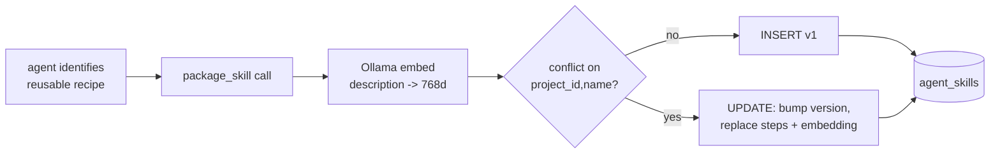

**Workflow — request_skill (JIT read path):**

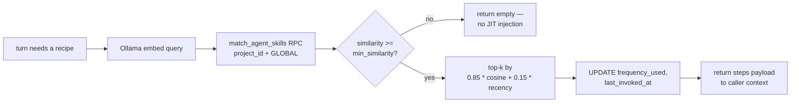

**Zero-Bloat invariant.** Skills are NEVER preloaded into the orchestrator's system prompt. The only path from `agent_skills` into context is an explicit `request_skill` call, and the response carries only the matched `steps` rows. A vault of 10 000 skills costs zero context until one is invoked.

**Forward links to later missions:**
- **M3 (Sleep Learning):** the idle daemon mines `archive_backlog` for repeated successful sequences and calls `package_skill` autonomously, setting `packaged_from_archive_id` for provenance.
- **M2 (Trajectory Compression):** compressed operational summaries that prove to be reusable become skill candidates fed to M3.
- **M4 (Transactional Workflows):** multi-step skills retrieved via `request_skill` are the natural unit for checkpoint/rollback boundaries.

---

### 4.5 Trajectory Compression — AgentDiet (Agentic OS 2026 — Mission 2, proposed)

**Goal.** Save context tokens *during* a mission, not just at session end. Long ops logs (raw tool output, stack traces, verbose JSON) that accumulate in `memory_chunks` are compressed into ~50-token semantic summaries by a background daemon. The read path **substitutes** the compressed summary into search results in place of the bloated original, so every future `search_memory` call returns dense content.

**Storage decision: dedicated `trajectory_summaries` table — DO NOT mutate `memory_chunks` rows in place.**

Rationale (single decisive reason): `memory_chunks` is an immutable HNSW-indexed vault. Rewriting `content` would dirty vector pages, invalidate the embedding (which was computed on the original text), and violate the Constitution's "Archive, never delete" rule. Compression is a *derived view*: the raw row stays addressable for forensics (and for M3 Sleep Learning to mine reusable patterns), while a separate table holds the dense summary that the read path projects in.

**Proposed schema** (migration `011_trajectory_compaction.sql`, lands in M2):

| Column | Type | Purpose |
|---|---|---|
| `id` | `bigserial PK` | Stable handle |
| `project_id` | `text NOT NULL` | Tenancy; `'GLOBAL'` permitted |
| `source_chunk_id` | `bigint NOT NULL` | FK → `memory_chunks.id` (raw provenance, ON DELETE CASCADE) |
| `summary` | `text NOT NULL` | Compressed ~50-token semantic summary |
| `summary_embedding` | `vector(768)` | Ollama embed of summary (downstream M3 mining) |
| `source_tokens` | `int NOT NULL` | Pre-compression token estimate |
| `summary_tokens` | `int NOT NULL` | Post-compression token estimate |
| `compression_ratio` | `real GENERATED ALWAYS AS (summary_tokens::real / NULLIF(source_tokens,0)) STORED` | Self-audit |
| `strategy` | `text NOT NULL` | `'heuristic+llm'` (extensible) |
| `model` | `text NOT NULL` | e.g. `gemma3:e2b` (audit trail) |
| `created_at` | `timestamptz NOT NULL DEFAULT now()` | When compaction ran |

Indexes: UNIQUE `(project_id, source_chunk_id)`, btree `created_at DESC`, HNSW on `summary_embedding` (cosine). RLS reuses `006_security_hardening` `deny_anon_authenticated` verbatim — service-role only.

**Tool surface (new in M2):**

- `compact_trajectory({ chunk_id?, dry_run? })` — manual entry into the same pipeline the daemon runs. Returns `{ source_tokens, summary_tokens, compression_ratio, summary }`. Used for testing and one-off admin compaction.
- `get_trajectory_summary({ chunk_id })` — read-back helper. Returns the compressed summary if present, else the raw row. Used by the read-path hint so the agent can drill down when truly needed.
- The compactor daemon itself is **NOT** an MCP tool. It registers at server boot beside `startKeepAlive()` in `src/supabase.ts`, runs every 10 min, and is `.unref()`'d so it never blocks process exit.

**Workflow — compactor daemon (write path):**

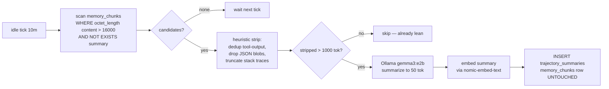

**Workflow — search_memory read path (substitution):**

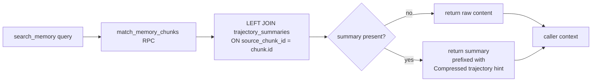

**Read-path invariant.** The HNSW index and `memory_chunks` rows are never mutated by M2. The substitution is a SQL projection: ranking still happens against the original embedding (high recall preserved), but the returned `content` field is swapped to the dense summary when one exists. Raw text is *one tool call away* (`get_trajectory_summary`) but stays out of context unless explicitly requested. A 4 000-token raw trajectory becomes a 50-token line in the agent's window — an 80× context saving per compressed row, compounding over thousands of past sessions.

**Forward links to later missions:**
- **M3 (Sleep Learning):** the idle daemon mines `trajectory_summaries` JOIN `archive_backlog` for repeated successful sequences and proposes them as `skill_candidates` for curated promotion (auto-promotion off by default) — compressed summaries are dramatically cheaper to scan than raw logs. See §4.6.
- **M4 (Transactional Workflows):** per-step trajectory summaries become checkpoint deltas, enabling resume-from-step without replaying raw operational logs.

---

### 4.6 Sleep Learning — Idle Skill Mining (Agentic OS 2026 — Mission 3)

**Goal.** During idle cycles, mine the archive of completed successful tasks for recurring patterns and propose them as reusable skills. The agent stays the *curator*: candidates are surfaced for human review, never silently merged into the M1 retrieval surface.

**Storage decision:** new table `skill_candidates`, NOT a column on `agent_skills`. Rationale: candidates are unpromoted, high-churn mining state with provenance arrays back to source summaries / archive rows; `agent_skills` is the clean, promoted, JIT-retrieval surface. Mixing them would pollute M1 recall.

**Proposed schema (`scripts/012_sleep_learning.sql`):**

| Column                | Type           | Purpose                                    |
|-----------------------|----------------|--------------------------------------------|
| id                    | bigserial PK   |                                            |
| project_id            | text NOT NULL  | Tenancy (GLOBAL permitted on promotion)    |
| pattern_hash          | text NOT NULL  | n-gram + cluster-id hash (idempotency key) |
| source_summary_ids    | bigint[]       | FK → `trajectory_summaries` (provenance)   |
| source_backlog_ids    | bigint[]       | FK → `archive_backlog` (provenance)        |
| frequency             | int            | How many times the pattern appeared        |
| success_count         | int            | Of those, how many were `status='success'` |
| candidate_embedding   | vector(768)    | HNSW recall for dedupe                     |
| proposed_name         | text           | LLM-generated skill name                   |
| proposed_steps        | jsonb          | LLM-generated step list                    |
| promoted_skill_id     | bigint NULL    | FK → `agent_skills` (after promotion)      |
| state                 | text           | `mined` / `promoted` / `rejected`          |
| model, strategy       | text           | Audit                                      |
| created_at, updated_at| timestamptz    |                                            |

Indexes: UNIQUE(`project_id`, `pattern_hash`); HNSW on `candidate_embedding` (cosine); btree on (`state`, `frequency DESC`).
RLS: `deny_anon_authenticated` (mirrors `006_security_hardening`).
RPCs: `match_skill_candidates`, `upsert_skill_candidate`, `promote_candidate_to_skill` — all `SECURITY DEFINER` with `search_path` including `'extensions'` (ERROR-11507 lesson).

**Tool surface (`src/tools/sleep.ts`):**

- `list_skill_candidates({ state?, limit? })` — review queue.
- `promote_skill_candidate({ candidate_id })` — manual approve → writes to `agent_skills` (wraps M1's `package_skill`).
- `reject_skill_candidate({ candidate_id, reason })` — soft-reject, kept for audit.

**Daemon (`src/sleep/`):**

- `miner.ts` — pure clustering over `trajectory_summaries` INNER JOIN `archive_backlog WHERE status='success'` (cosine ≥ 0.85 + 3-gram hash).
- `proposer.ts` — Ollama `gemma4:e2b` → JSON `{ name, steps }`. Mirrors `src/trajectory/summarizer.ts` defensive-parse pattern.
- `daemon.ts` — `startSleepLearner()` / `stopSleepLearner()` / `getSleepLearnerStatus()` / `runMiningOnce()` / `mineOneCluster()`. `setInterval(...).unref()`; module-level re-entrancy guard; per-cluster try/catch.

Env knobs: `SLEEP_LEARNER_INTERVAL_MS=3600000` (1 h, off-peak), `SLEEP_LEARNER_BATCH=10`, `SLEEP_LEARNER_MIN_FREQ=3`, `SLEEP_LEARNER_AUTO_PROMOTE=false`.

Health: `check_system_health` gains a `sleep_learner` block (`{ enabled, interval_ms, last_run_at, last_run_mined, last_run_promoted, last_run_skipped, last_run_errored, last_run_duration_ms, candidates_mined_total, candidates_promoted_total }`), mirroring `trajectory_compactor`.

**Write path (mining loop):**

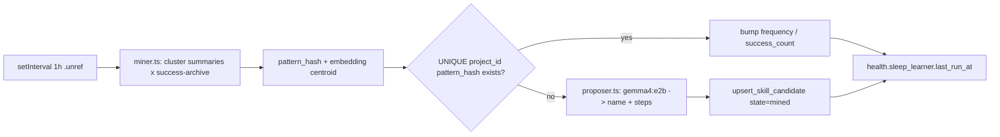

**Read path (curated promotion):**

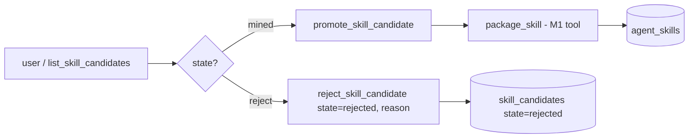

**Curator invariant (SCM-S22-D1).** The Sleep daemon mines stubs only — `proposed_name`, `proposed_steps`, and `model` are persisted NULL. Generative naming and step extraction are exclusively the Orchestrator's domain via `compose_skill_candidate`. Node-side promotion has been removed entirely (no `SLEEP_LEARNER_AUTO_PROMOTE` env var, no daemon flag). Promotion to the JIT skill vault (M1 `agent_skills`) flows through one of exactly two Orchestrator-mediated paths: (a) manual `compose_skill_candidate → promote_skill_candidate`, or (b) M5's atomic `apply_curriculum_task` SQL transaction (which itself requires the Orchestrator to have called `compose_skill_candidate` first — see §4.7).

**Forward links.** M4 (Transactional Workflows) supplies success-checkpoint chains as additional mining input. M5 (Autonomous Curriculum) is the only path that fires `promote_candidate_to_skill` atomically alongside task verification.

---

## M4 — Transactional Workflows (Checkpoints)

**Mission.** Multi-step agent tasks can fail mid-flight. M4 makes them transactional: each step is wrapped in a checkpoint that either commits (pinning a `trajectory_summaries` delta as its replay anchor) or rolls back (restoring the agent to the last committed step and feeding the failure to the M3 miner). NO snapshot engine — restoration replays `trajectory_summaries` by `source_chunk_id`.

**Unified invariant.** `checkpoint = { skill_boundary (M1), trajectory_delta (M2), learner_signal (M3) }`. M4 ships the binding, not a parallel snapshot engine. There is NO separate `workflow_steps` table — `trajectory_summaries` IS the per-step delta store. The checkpoint row carries the pointer (`source_chunk_id`), not the payload.

**Lifecycle (write + restore path):**

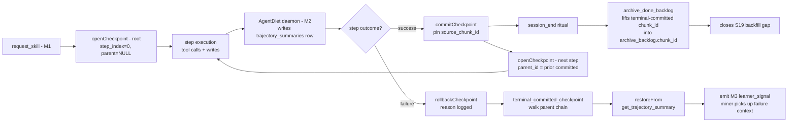

**New components (Phase A lays foundation; B exposes surface):**

| Component | Kind | Phase | Purpose |
|---|---|---|---|
| `workflow_checkpoints` | table | A | Per-step checkpoint rows: skill_id (M1), parent_id chain, source_chunk_id (M2 anchor), status. |
| `terminal_committed_checkpoint` | SQL fn | A | Recursive CTE: returns source_chunk_id of deepest committed descendant. Shared by restore + archive. |
| `archive_done_backlog` (patched) | SQL fn | A | CREATE OR REPLACE inside 014 (NEVER edits 005). Now populates `archive_backlog.chunk_id` from the terminal committed checkpoint per task. Legacy non-skill rows still archive with NULL chunk_id. |
| `openCheckpoint` / `commitCheckpoint` / `rollbackCheckpoint` / `listCheckpoints` / `restoreFrom` | TS service | A | Pure functions in `src/transactions/checkpoint.ts`. No MCP surface yet. |
| `checkpoint_create` / `_commit` / `_rollback` / `_list` | MCP tools | B | 4 Phase B tools wrapping the service for orchestrator use. **Production-validated Session 30** — `tests/checkpoint.test.ts` 12/12 pass against live Supabase; `scripts/smoke-m4.ts` (npm run smoke:m4) green; full suite 91/91, tsc gate clean. |
| `backfillArchiveChunkIds()` | one-shot | B | Closes S19: populates `archive_backlog.chunk_id` for the legacy 7523-row corpus where a checkpoint chain exists. |
| miner rollback-signal extension | M3 patch | B | Extends `src/sleep/miner.ts` to LEFT JOIN `workflow_checkpoints` so rolled-back checkpoint chains feed negative-example mining. |

**Restoration contract.** `restoreFrom(checkpointId)` does NOT replay a snapshot — it looks up the checkpoint's `source_chunk_id` and calls the existing M2 `get_trajectory_summary` RPC. The returned ~50-token compressed summary IS the replay surface: the agent re-reads its own compressed delta, not a heavy state blob. This is the M4 / M2 binding made concrete.

**S19 closure.** Migration 013 added `archive_backlog.chunk_id` (nullable, FK SET NULL) but left it unpopulated. 014's `archive_done_backlog` patch is the first writer: when a task's archived row links to a checkpoint chain, the deepest committed checkpoint's `source_chunk_id` is lifted in. Forward compat: tasks with no checkpoint chain (legacy, non-skill-mediated) still archive with `chunk_id = NULL`. The Phase-B `backfillArchiveChunkIds()` one-shot retro-fills historic rows.

---

### 4.7 Autonomous Curriculum — Single-Brain Closure (Agentic OS 2026 — Mission 5)

**Goal.** Close the Agentic OS 2026 loop. A deterministic, idle-time daemon enqueues curriculum candidates (test gaps, refactor hotspots, stale skill candidates) as **raw stubs only**. The Orchestrator (Claude) is the **sole executor**: pulls a stub, writes code under an M4 checkpoint, clears the verification gate, and on success atomically promotes any linked M3 candidate into the M1 skill vault. After SCM-S22-D1 the `SLEEP_LEARNER_AUTO_PROMOTE` env var was deleted entirely — auto-promotion now lives **only** inside the atomic `apply_curriculum_task` SQL transaction, never as a daemon-level flag.

**Three architectural mandates (immutable — hook-asserted in Phase A):**

1. **Single Brain Boundary.** The curriculum daemon contains **zero generative AI**. Pure heuristics + `nomic-embed-text` embeddings only. No `gemma`, no Ollama generation, no LLM HTTP client. The daemon classifies and queues; it never proposes code, prose, or skill content. *Resolved SCM-S22-D1:* the forward note about M3's `src/sleep/proposer.ts` (`gemma4:e2b → JSON{name,steps}`) has been closed — `src/sleep/proposer.ts` is **deleted**, the Sleep daemon now mines stubs with NULL name/steps, and the generative step is owned by the Orchestrator's `compose_skill_candidate` tool. Both `src/sleep/**` and `src/curriculum/**` are now generative-AI-free (CI lint fence backlog item #117 will statically enforce this).
2. **Orchestrator as Sole Executor.** All code/test/refactor writing flows through the main Claude session. The daemon writes only to `curriculum_tasks` rows. Claude pulls via `pull_curriculum_task`, opens an M4 checkpoint, performs the write, raises `verification-pending.json` on any `main`-touching change, and commits **only after** `confirm_verification({success:true})` clears. The daemon never invokes Write/Edit/Bash.
3. **M5 Auto-Promote Privilege (revised SCM-S22-D1).** Auto-promote lives **exclusively** inside the atomic `apply_curriculum_task` SQL transaction. When a verified curriculum task carries `linked_candidate_id`, the same transaction calls `promote_candidate_to_skill` (M3's existing RPC verbatim). There is **no env var**, **no daemon-flag flip**, no global toggle, no out-of-band promotion path. The verified curriculum cycle **is** the curation. ⚠ **Crash-catch mandate.** Because the Sleep daemon now stubs candidates with NULL `proposed_name` / `proposed_steps`, and `promote_candidate_to_skill` enforces NOT-NULL on both, the Orchestrator **MUST** call `compose_skill_candidate(candidate_id, proposed_name, proposed_steps)` **BEFORE** `apply_curriculum_task` whenever the task has `linked_candidate_id IS NOT NULL`. Skipping compose causes the atomic transaction to abort and rolls back the entire apply (task stays `pulled`, no promotion, no verification flip).

**Schema (`scripts/015_curriculum_tasks.sql`):**

| Column | Type | Purpose |
|---|---|---|
| id | bigserial PK | |
| project_id | text NOT NULL | Tenancy (GLOBAL forbidden) |
| kind | text CHECK IN ('test_gap','refactor','rollback_repro') | Heuristic class |
| target_path | text NOT NULL | File/module the task targets |
| rationale | text NOT NULL | Deterministic signal description (e.g. `coverage 12%, 340 LOC`) |
| signal_source | jsonb NOT NULL | `{coverage_pct?, rollback_count?, candidate_id?, embedding_centroid?}` |
| linked_candidate_id | bigint NULL | FK → `skill_candidates(id)` — triggers M3 auto-promote on verify |
| linked_checkpoint_id | bigint NULL | FK → `workflow_checkpoints(id)` (M4 binding) |
| status | text CHECK IN ('queued','pulled','attempted','verified','rejected','expired') | |
| pulled_by_session_id | text NULL | Audit |
| pulled_at, verified_at, expires_at | timestamptz NULL | TTL window |
| created_at, updated_at | timestamptz NOT NULL | |

Indexes: `UNIQUE(project_id, target_path, kind) WHERE status='queued'` (idempotency); `btree(status, created_at)`; `btree(linked_candidate_id) WHERE linked_candidate_id IS NOT NULL`.
RLS: `deny_anon_authenticated` (mirrors `006_security_hardening`). Service-role only.
RPCs (`SECURITY DEFINER`, `search_path` including `'extensions'` — ERROR-11507 lesson):
- `enqueue_curriculum_task(...)` — idempotent insert keyed by the UNIQUE WHERE-clause.
- `pull_next_curriculum_task(p_project_id, p_kind?)` — `FOR UPDATE SKIP LOCKED`, sets `status='pulled'` + stamps `pulled_by_session_id`, `pulled_at`. Atomic claim.
- `apply_curriculum_task(p_task_id, p_success, p_checkpoint_id)` — atomic: asserts `workflow_checkpoints.status='committed'`; on success sets `status='verified'`, `linked_checkpoint_id`, `verified_at`; **if** `linked_candidate_id IS NOT NULL`, calls `promote_candidate_to_skill(linked_candidate_id)` in the same transaction. On failure sets `status='rejected'`. Single SQL transaction — no out-of-band promotion possible. ⚠ **Caller precondition (SCM-S22-D1):** when `linked_candidate_id IS NOT NULL`, the Orchestrator **MUST** have already called `compose_skill_candidate` on that candidate — `promote_candidate_to_skill` raises on NULL `proposed_name`/`proposed_steps` and the whole transaction aborts.

**Daemon (`src/curriculum/` — deterministic queuer, NO LLM):**

- `scanner.ts` — three pure signal sources:
  - **`test_gap`**: reads `coverage-summary.json` if present; enqueues files with `pct < 50 AND lines > 100`.
  - **`rollback_repro`**: SQL aggregate over `workflow_checkpoints WHERE status='rolledback'` grouped by `target_path` (taken directly from `workflow_checkpoints.step_label` — the orchestrator's free-text anchor; see `src/curriculum/scanner.ts:195-198` for the rationale: no LLM interpretation of `agent_skills.steps[]` needed). Threshold ≥ 3 rollbacks in 30 days. Production-validated Session 30 (`tests/curriculum-scanner.test.ts` 7/7, `npm run smoke:m5-rollback` green).
  - **`refactor` (stale-candidate)**: `skill_candidates WHERE state='mined' AND frequency ≥ 5 AND age(created_at) > 7 days`. Sets `linked_candidate_id` — this is the M3 auto-promote trigger.
- `daemon.ts` — `startCurriculumDaemon()` / `stopCurriculumDaemon()` / `getCurriculumStatus()` / `runScanOnce()`. Mirrors `sleep_learner` shape: `setInterval(...).unref()`, module-level re-entrancy guard, per-source try/catch. **No `proposer.ts`. No Ollama client import.**

Env knobs: `CURRICULUM_INTERVAL_MS=3600000` (1 h, staggered +30 min after sleep_learner), `CURRICULUM_BATCH=10`, `CURRICULUM_MIN_FREQ=3`, `CURRICULUM_TTL_DAYS=14`. Deliberately omitted: any `_MODEL` / `_PROPOSER` / `_GENERATE` knob — there is no generation surface to configure.

Health: `check_system_health` gains a `curriculum_scanner` block — `{ enabled, interval_ms, last_run_at, last_run_queued, last_run_skipped, last_run_errored, last_run_duration_ms, queued_total, verified_total, rejected_total, auto_promotions_total }`.

**Tool surface (`src/tools/curriculum.ts` — 4 MCP tools):**

- `list_curriculum_tasks({ status?, kind?, limit? })` — queue inspection.
- `pull_curriculum_task({ kind?, project_id? })` — orchestrator's entry point; atomic claim. Returns one task row or NULL.
- `apply_curriculum_task({ task_id, success, checkpoint_id })` — wraps the apply RPC; **server-side** asserts the checkpoint is committed and the verification gate cleared (server reads `~/.claude-memory/verification-pending.json` absence as the precondition). On success + linked candidate, M3 auto-promote fires inside the same transaction. ⚠ **Compose-before-apply mandate (SCM-S22-D1):** if the task has `linked_candidate_id`, call `compose_skill_candidate` first or the SQL transaction will abort on NOT-NULL.
- `reject_curriculum_task({ task_id, reason })` — manual veto (status→rejected).

**Lifecycle — [SYSTEM_FLOW] (daemon = queue ; orchestrator = brain):**

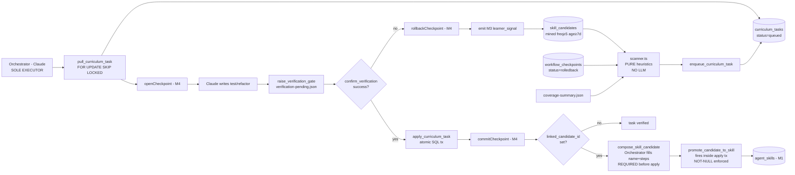

**[TECH_STACK] additions:** `scripts/015_curriculum_tasks.sql`, `src/curriculum/{scanner,daemon}.ts`, `src/tools/curriculum.ts`, `src/healthcheck.ts` (+ block), `src/index.ts` (+ daemon start in MCP boot). No new runtime dependency. Reuses: `pg` (existing pool), `setInterval/unref` (M3 pattern), M4 checkpoint service, M3 `promote_candidate_to_skill` RPC.

**Boundary invariants (CI-enforceable):**

1. Static lint asserts `src/curriculum/**` contains no import from `ollama`, `@anthropic-ai/*`, `openai`, or any fetch call to an `*/generate`/`*/chat`/`*/completions` URL. The daemon is a deterministic queuer; the lint fence is its proof.
2. The auto-promote path lives **only** inside `verify_curriculum_task` SQL — there is no TS-level promotion shortcut. Auditable by `grep promote_candidate_to_skill src/` returning **one** call site (the SQL RPC) plus M3's manual `promote_skill_candidate` tool (unchanged).
3. `pull_curriculum_task` MUST use `FOR UPDATE SKIP LOCKED` to prevent two concurrent sessions claiming the same task. PG advisory locks are not used — the row-level claim suffices and is testable in the smoke run.

**Closure of Agentic OS 2026.** M5 is the convergence point:
- **M1 ← M5**: verified curriculum tasks become new `agent_skills` rows via M3's RPC.
- **M2 ← M5**: every M5 attempt produces a `trajectory_summaries` row through the existing AgentDiet daemon.
- **M3 ← M5**: M5 is the **only** legitimate trigger for auto-promote. M3's curator invariant remains intact for all other paths.
- **M4 ← M5**: every M5 attempt is wrapped in `workflow_checkpoints`; rollback emits the M3 learner signal, closing the negative-example loop.

The daemon proposes nothing. The Orchestrator executes everything. The promotion is atomic. The loop is closed.

---

### 4.8 Observability & Telemetry (Agentic OS 2026 — Mission 6)

The four background daemons (`sleep_learner`, `curriculum_scanner`, `trajectory_compactor`, `telemetry_pruner`) persist every lifecycle event and every orchestrator-initiated state mutation to an append-only `daemon_telemetry` table (migration `scripts/016_daemon_telemetry.sql`, service-role grants in `scripts/017`, daemon-enum extension to admit the pruner in `scripts/018_telemetry_retention.sql`). The persisted history is consumed by two decoupled read paths — the `system_dashboard` MCP tool (24h rollups, compressed Markdown output) and `check_system_health`'s derived per-daemon status (1h window, env-driven thresholds). In-memory `get*Status()` snapshots remain the fast path for live state; the table is the durable source of truth for rates, staleness, and overall health.

**Event taxonomy** (`daemon_telemetry.event_type` CHECK constraint):

| Event | Source | Payload |
|---|---|---|
| `run_started` | daemon tick top, fire-and-forget | none |
| `run_ended` | daemon tick success path | `{compacted\|mined\|queued\|deleted, skipped, errored, duration_ms}` (per daemon — `telemetry_pruner` adds `retention_days`) |
| `run_errored` | daemon tick catch | `{error_message, duration_ms}` |
| `task_outcome` | orchestrator state mutations (`recordVerified` / `recordRejected` / auto-promote) | `{verified\|rejected\|auto_promoted: 1}` delta |

**The 4th daemon — `telemetry_pruner`** (Backlog #124, `src/telemetry/pruner.ts`). Rolling DELETE: every `TELEMETRY_PRUNER_INTERVAL_MS` (default 6h ⇒ 4 ticks/day, deliberately tighter than the 1h health window so cold-start never reads as `down`), removes rows from `daemon_telemetry` with `created_at` older than `TELEMETRY_PRUNER_RETENTION_DAYS` (default 30). The pruner emits its own telemetry, so its activity is observable via `system_dashboard` and `check_system_health` exactly like the other three daemons. Hard DELETE (not roll-up) is intentional: the read paths cap at 24h, so anything >30d is unobservable by definition — a roll-up table would have zero downstream consumer.

Daemon ticks and orchestrator state mutations are intentionally separated by event type. `run_ended` is reserved strictly for tick completion; mixing orchestrator-initiated mutations into the same enum would poison the daemon run-rate rollups.

**Fire-and-forget contract.** `src/telemetry/emit.ts` returns `Promise<void>` that ALWAYS resolves. Supabase errors are logged via `console.error` and swallowed. Daemons MUST survive a telemetry outage without crashing — the typed discriminated union in `src/telemetry/types.ts` is the only schema gate.

**Decoupled read paths.** `system_dashboard` and `check_system_health` each issue their own Supabase query against `daemon_telemetry` — they do not share state, do not import each other, and have independent latency and failure modes. This is deliberate: a slow dashboard rollup MUST NOT delay a health check, and a transient telemetry-query failure inside the health check MUST NOT degrade the dashboard's output. The dashboard caps at 2000 rows over 24h; the health check caps at 1000 rows over 1h.

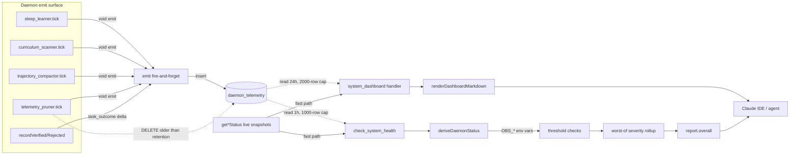

**Derivation rules** (in order — first match wins):

1. `enabled === false` → `healthy` with reason `"daemon disabled (out of scope)"`. A disabled daemon cannot be "down".
2. `last_run_ended === null` AND no `run_ended` rows in 1h → `down` (silent daemon).
3. Staleness: `now - last_run_ended > interval_ms × OBS_STALENESS_MULTIPLIER_DEFAULT` → `down`.
4. 1h error rate `> OBS_ERR_RATE_DOWN_DEFAULT` → `down`.
5. 1h error rate `> OBS_ERR_RATE_DEGRADED_DEFAULT` → `degraded`.
6. Else → `healthy`.

**Overall rollup.** `SEVERITY = {healthy:0, ok:0, degraded:1, down:2, unhealthy:2}`. The worst per-daemon derived status feeds `report.overall` only if it would WORSEN the value the existing Supabase + Ollama reachability checks already set — daemon derivation never improves overall.

**Configuration:**

| Environment variable | Default | Effect |
|---|---|---|
| `OBS_ERR_RATE_DEGRADED_DEFAULT` | `0.20` | Per-daemon → `degraded` when 1h error rate strictly exceeds this. |
| `OBS_ERR_RATE_DOWN_DEFAULT` | `0.50` | Per-daemon → `down` when 1h error rate strictly exceeds this. |
| `OBS_STALENESS_MULTIPLIER_DEFAULT` | `2.0` | Per-daemon → `down` when `now - last_run_ended > interval_ms × multiplier`. |
| `TELEMETRY_PRUNER_INTERVAL_MS` | `21_600_000` (6h) | `telemetry_pruner` tick cadence. |
| `TELEMETRY_PRUNER_RETENTION_DAYS` | `30` | `telemetry_pruner` deletes rows with `created_at < now() - retention_days`. |

Unparseable or missing env values fall back to the defaults; the helper never throws.

**Boundary Invariant #1 preservation.** `src/telemetry/emit.ts` imports only the Supabase admin singleton and the project-id resolver — no model SDKs, no network endpoints beyond Supabase. The `lint:boundaries` CI fence (SCM-S22) was extended to cover the new module's daemon-side imports; neither `src/sleep/**` nor `src/curriculum/**` reaches outside via telemetry. The only new daemon-side import is `../telemetry/emit.js` — a local relative path. The Single Brain Boundary still holds.

**Failure mode.** If Supabase is unreachable, `emit()` swallows the error locally and daemons continue ticking. `check_system_health`'s telemetry query also tolerates failure (silent fallback to empty rows + `console.error`); the top-level `supabase` reachability check is the canonical signal for "DB is broken", avoiding double-counting in the overall rollup.

**Token efficiency.** `renderDashboardMarkdown` compresses the raw 24h aggregate (~8KB JSON) into a single Markdown table (~2KB) — roughly 4× compression. The compressed form is what `system_dashboard` returns to the agent, keeping dashboard reads under the 10k-token CLAUDE.md ceiling even when all three daemons are noisy.

---

## 5. File Architecture (auto-generated)

The Mermaid block below is refreshed by `sync_artefacts` after every worker success. Do not edit content between the markers by hand.

<!-- MEMORY:ARCH:START -->

<!-- MEMORY:ARCH:END -->

---

## 6. Version History

| Version | Summary |
|---|---|
| v0.8.0 | Production engine — ensureSchema, init_project, keep-alive, arch sync |
| v0.9.0 | Ultra-Enforcer — frozen cache, auto-freeze, backups, NL triggers |
| v0.9.1 | Legacy backup sweep + recovery discovery |
| v1.0.0 | God Mode — project detect, compiler gate, regression, binding session |
| **v1.1.0** | **Sovereign Orchestrator — delegation pattern + Autonomous Self-Healing + cross-platform spawn fix + ARCHITECTURE.md consolidation** |
| **v1.1.2** | **Master Schematic & Sovereign Baseline — definitive visual identity + version-locked production release** |
| **v1.1.3** | **Seamless Onboarding & Version SSOT — dynamic version SSOT, batch policy hydration, smart-scout init_project** |
| **v1.1.4** | **Architecture Guard + Automatic Session Handoff — Core 3 audit on init_project, session-end regenerates per-section diagrams, next_session_command_markdown handoff** |
| **v2.0.0-rc1** | **Release Candidate — bundles Typed Retrieval + Strict Project Isolation (Sovereign Taxonomy on memory_chunks.metadata, GIN(jsonb_path_ops) index, match_memory_chunks p_metadata_filter, save_memory tool with category-prompting description) AND Global Knowledge Vault + Multi-IDE (reserved 'GLOBAL' project_id, dual-scope match_memory_chunks p_include_global, save_memory metadata.is_global, init_project Capabilities Header, docs/IDE-INTEGRATION.md for Cursor/Windsurf/Cline). $0 — pure pgvector + JSONB + same Ollama infra. Originally tagged as a separate milestone but folded back into rc1 — release candidate semantics, not yet a stable major.** |
| **v2.1.0** | **GLOBAL Vault UX — browse-only `list_global_patterns` MCP tool (tiered output: preview default + `include_content:true` opt-in; full JSONB `metadata_filter` matching `search_memory`; offset/limit pagination defaulting to 10 with `created_at DESC, id DESC`; pure SQL — zero embedding cost). `init_project.capabilities` extended: `global_scope` gains `browse_tool` + `browse_args`, `context_gathering_hints` gains a GLOBAL-browse exemplar, `protocol` bumped to `smart-claude-memory/v2.1.0`. Zero new dependencies, zero new indexes, zero new migrations — reuses the existing GIN(jsonb_path_ops) index and `pg` pool.** |

---

## 7. Plugin Distribution

`smart-claude-memory` ships as a Claude Code Plugin via `.claude-plugin/plugin.json` (added in v2.0.0). The manifest auto-wires two surfaces on install:

1. **MCP server**: `mcpServers.smart-claude-memory` declares `command: "node"` with args `["${CLAUDE_PLUGIN_ROOT}/dist/index.js"]`. Claude Code's plugin loader resolves `${CLAUDE_PLUGIN_ROOT}` to the installed plugin directory at runtime. The 7 SCM env vars (`SUPABASE_URL`, `SUPABASE_SECRET_KEY`, `SUPABASE_POOLER_URL`, `OLLAMA_HOST`, `OLLAMA_EMBED_MODEL`, `MEMORY_ROOTS`, `EMBED_DIM`) pass through from the host shell, with sensible defaults on the three Ollama/embed knobs.

2. **PreToolUse hook**: `hooks.PreToolUse[].hooks[]` declares a single `python "${CLAUDE_PLUGIN_ROOT}/hooks/md-policy.py"` command matching `Write|Edit|Bash`. Plugin lifecycle = hook lifecycle; uninstalling the plugin removes the hook automatically.

### 7.1 First-run migration loop

On a freshly installed plugin against an empty Supabase project, the first `init_project()` call:

1. Runs the existing readiness checks (env, hook registration, MCP wiring, `dist/` build, Core 3 audit).
2. Opens a fresh `pg.Client` against `SUPABASE_POOLER_URL`, calls `applyPendingMigrations()` from `src/lib/migrations.ts`. The helper diffs `scripts/*.sql` against the `schema_migrations(filename PK, sha256, applied_at)` ledger and applies pending files transactionally — one `BEGIN/COMMIT` per migration, `ROLLBACK` on any failure.
3. Verifies that `moondream` and `nomic-embed-text` are pulled by querying `${OLLAMA_HOST}/api/tags`. Missing models surface a `partial` status with the actionable `Run: ollama pull <names>` command.
4. Returns a top-level `migrations: { applied, skipped, total }` block alongside the existing `checks[]` array. Failures convert to `not_ready` without crashing the MCP server.

### 7.2 Health: pending state + grace window

The `check_system_health` derivation includes a `"pending"` state (added in v2.0.0). Daemons within a 15-minute grace window after MCP boot — and without any `run_ended` events yet — report `pending` rather than `down`. Past the grace window, behavior reverts to staleness-based derivation. `pending` ranks below `degraded` in the SEVERITY map, so `overall` is never falsely promoted to `down` on cold boot.
