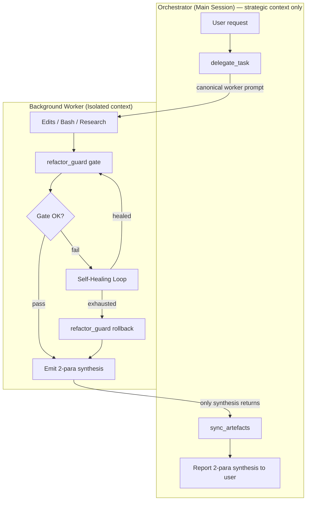
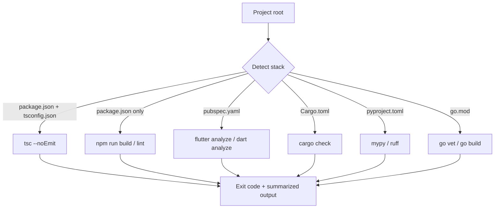
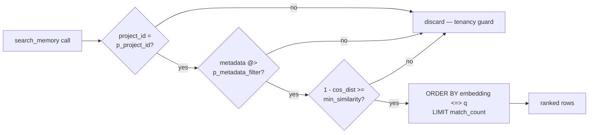
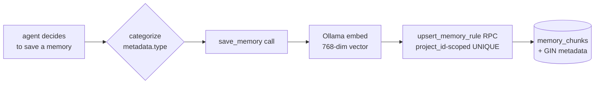
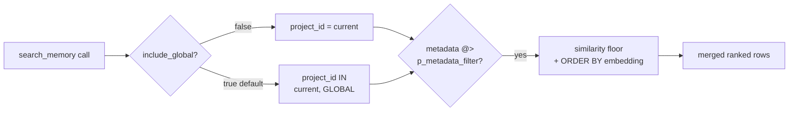
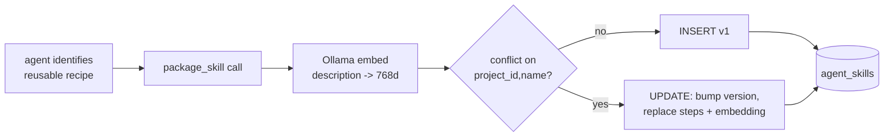
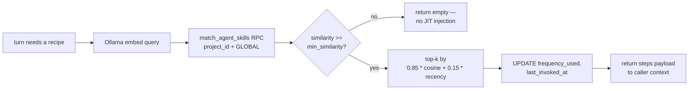
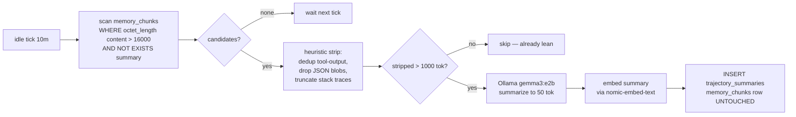
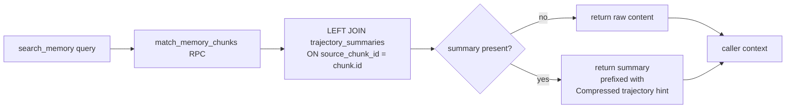

# Smart Claude Memory — System Architecture (v2.0.0-rc1)

**Developer:** [NABILNET.AI](https://nabilnet.ai)

> **Stable baseline:** v2.0.0-rc1 — bundles Architecture Guard + Automatic Session Handoff, the Typed Retrieval layer (Sovereign Taxonomy on `memory_chunks.metadata`, GIN-indexed metadata filter, strict project_id-first isolation), and the Global Knowledge Vault + Multi-IDE layer (reserved `'GLOBAL'` project_id with dual-scope retrieval, `init_project` Capabilities Header, `docs/IDE-INTEGRATION.md` for Cursor / Windsurf / Cline).
> This document is the single source of truth for the system's structure and control flow. The marker-bounded Mermaid block in §5 is refreshed automatically by `sync_artefacts` after every worker success; the other diagrams are hand-maintained.

*Master schematic — the definitive visual reference for the Smart Claude Memory v2.1.0 production baseline.*

---

## 1. The Sovereign Orchestrator Pattern — [SYSTEM_FLOW]

The **Orchestrator** (the main Claude session) never edits code, runs builds, or reads large files directly. Every unit of execution is delegated to a **Background Worker** — an Agent sub-process spawned via `delegate_task`, isolated in its own context window. The worker returns only a 2-paragraph synthesis. This keeps the Orchestrator's context lean and enforces a clean separation between strategic decisions and tactical execution.

### 1.1 Delegation flow

### 1.2 Context-hygiene contract
- Workers MUST NOT return raw file contents, full stack traces, or long logs to the Orchestrator.
- Each compiler error is summarized in ≤ 1 sentence (error code + symbol).
- Paragraph 2 of the synthesis records gate result (pass first-try / passed after N heals / rolled back) and any healing hypotheses tested.

---

## 2. Autonomous Self-Healing Loop (v1.1.0)

When the compile gate fails, the worker does **not** bounce the failure back to the Orchestrator. Instead, it diagnoses the regression against the nearest clean backup and applies a minimal local fix. Only if the loop exhausts (default 3 attempts) does it rollback and report surrender.

### 2.1 Primitives
| Primitive | Tool call | Purpose |
|---|---|---|
| Gate | `refactor_guard({ action: "gate" })` | Single source of compile truth — dispatches to the stack's native analyzer. |
| Analyze | `analyze_regression({ file, backups_to_compare })` | Diffs current file against recent backups; surfaces `closest_prior` to guide the minimal fix. |
| Rollback | `refactor_guard({ action: "rollback", file })` | Restores pre-edit backup. Last resort only. |

### 2.2 Healing constraints
- **Minimal fix, not wholesale restore** — the feature edit must survive; the fix only reintroduces what regressed.
- **No repeated hypotheses** — each attempt changes approach.
- **Strictly local** — never ask the Orchestrator for more context while attempts remain.

---

## 3. Multi-Stack Compiler Map — [TECH_STACK]

`refactor_guard` auto-detects the stack from project artifacts and dispatches to the native analyzer. This is what makes the gate stack-agnostic.

### 3.1 Cross-platform spawn (v1.1.0 fix)
Native tool launchers on Windows resolve to `.cmd` / `.bat` shims (`npx.cmd`, `flutter.bat`). Node's `child_process.spawn` without `shell: true` cannot invoke these — it throws `EINVAL`. The v1.1.0 `runBin` in `src/tools/refactor.ts` detects `process.platform === 'win32'` and sets `shell: true` so shim resolution works through `cmd.exe`. Args are internal-only (no user input), so shell-injection risk does not apply.

### 3.2 Version Single Source of Truth (v1.1.3)
The version string is owned by `package.json`. `src/version.ts` reads it once via `createRequire(import.meta.url)` and re-exports `VERSION`. All consumers — `src/index.ts` (McpServer registration), `src/tools/health.ts` (the `orchestrator.version` field on `HealthReport`, whose type was widened from the literal `"1.1.0"` to `string` to accept any future bump), and `src/tools/orchestrator.ts` (the `delegateTask` response envelope) — import that one constant. There are no hard-coded version literals in the source tree, so `check_system_health` always reports exactly what `package.json` says and a release bump propagates with a single edit.

### 3.3 Policy Hydration & Smart-Scout Onboarding (v1.1.3)
`batch_freeze_patterns` (in `src/tools/batch-freeze-patterns.ts`) hydrates the frozen-pattern cache from either glob `paths` or a markdown rule file. When `from_rule_file` is supplied, extraction is strict: it scans only the section under an exact `## Frozen Patterns` heading, strips backticks and list markers, and skips any line containing unescaped spaces. The shared loader at `src/tools/frozen-cache.ts` migrates legacy string entries to the `{ pattern, source, added_at }` schema on read, writes atomically via `<file>.tmp` + `rename`, and dedups on trimmed pattern equality (first-writer-wins). Every consumer — `list_frozen`, `freeze_file`, `unfreeze_file`, and `supabase.writeFrozenPatternsCache` — funnels through the same loader. The `source` field unlocks idempotent re-hydration and the suppression logic below.

`init_project` (in `src/tools/setup.ts`) closes the onboarding loop. Beyond the readiness checks, it does a quick local scan: if `.claude/rules/` exists, it peeks the first ~200 lines of each immediate-child `.md` for an exact `## Frozen Patterns` line. It then loads the project's frozen cache via `loadFrozenCache()` and drops any candidate already represented in `entry.source` (after path normalization — workspace-relative, forward slashes, lowercased on Win32). What survives is emitted as a structured `recommendations: [{ id: "hydrate_policies", tool: "batch_freeze_patterns", candidates, suggested_first_call: { from_rule_file, dry_run: true } }]` block. The key is omitted entirely when nothing is actionable, and the scout never mutates the cache — it surfaces a recommended `dry_run` call for the operator to consent to.

---

## 4. Sovereign Taxonomy (v2)

Every chunk in `memory_chunks` carries a `metadata jsonb` column whose contract is the **Sovereign Taxonomy**. Four categories cover everything the orchestrator stores; anything that does not fit is a session log.

| `metadata.type` | Captures | When to use |
|---|---|---|
| `DECISION` | Architectural choices + rationale | A trade-off was named and a path was picked |
| `PATTERN`  | Code standards + Rule 5–8 enforcement | A reusable convention or guardrail surfaced |
| `ERROR`    | Bug post-mortems + fixes | A defect was observed, root-caused, and resolved |
| `LOG`      | General session progress | Catch-all narrative useful for replay/audit |

Optional fields: `status` (free-form: `open`, `verified`, `superseded`, …), `context_id` (correlation key for multi-step work — e.g. a backlog id), plus arbitrary pass-through keys. The taxonomy is enforced in TypeScript (`save_memory`'s tool description prompts the agent; the SQL RPC accepts arbitrary jsonb), not via a CHECK constraint, so the contract can evolve without a migration.

### 4.1 Retrieval order — tenancy first, taxonomy second, vector third

Retrieval composes three predicates in fixed order, so cross-project leakage is structurally impossible:

The `metadata @>` predicate is index-driven: migration `007_metadata_typed_retrieval.sql` ships a GIN index using `jsonb_path_ops` (smaller and ~2–3× faster than the default `jsonb_ops` for containment), and the planner bitmap-ANDs it with the existing `(project_id)` btree. Cost on the Supabase Free Tier stays $0; no external metadata service is involved.

### 4.2 Write path

`save_memory` is the canonical and only write side: it embeds `content` via Ollama, then calls the `upsert_memory_rule(p_project_id, p_file_origin, p_chunk_index, p_content, p_embedding, p_metadata)` RPC. Its tool description prompts the calling agent to set `metadata.type` on every save.

### 4.3 Global vs Local Retrieval (v2.0.0-rc1 — migration 008)

A reserved `project_id` of literal `'GLOBAL'` is the **Knowledge Vault**: any chunk written there is visible to every project. Universal patterns, lessons-learned, and Rule 9 entries belong here. Routine project memories stay scoped to the slug derived from `process.cwd()`.

**Write side.** `save_memory({ ..., metadata: { ..., is_global: true } })` overrides the row's `project_id` to `'GLOBAL'` regardless of any explicit `project_id` argument; `is_global: true` is also persisted inside the metadata jsonb for audit. Only set this for cross-project truths — anything project-local should NOT be promoted to `'GLOBAL'`, or the vault loses signal.

**Read side.** `search_memory` is dual-scope by default: `match_memory_chunks(..., p_include_global := true)` evaluates rows where `project_id = p_project_id OR project_id = 'GLOBAL'`, then applies the same metadata + similarity predicates and ORDER BY. Pass `include_global: false` to restrict to the current project. The two scopes share the same GIN(metadata) and btree(project_id) indexes, so the planner bitmap-ANDs cleanly without a separate query.

The dual-scope union does NOT relax tenancy: every row remains tagged with its origin `project_id`, so caller code can still distinguish "from this project" vs "from the global vault". `'GLOBAL'` is reserved — `init_project` slugifies the cwd basename, which never produces this literal, so no project can accidentally write to the vault by being in a directory called "GLOBAL"; the only entry is the explicit `is_global: true` flag.

### 4.4 JIT Skill Vault (Agentic OS 2026 — Mission 1, proposed)

**Goal.** Support thousands of procedural skills (multi-step recipes the agent can execute) without prompt bloat. Skills are stored at rest, retrieved on demand by semantic similarity to the current task, and Just-In-Time injected into context only for the turn that needs them. Zero-Bloat RAG.

**Storage decision: dedicated `agent_skills` table — DO NOT extend `memory_chunks` with `metadata.type='SKILL'`.**

Rationale (single decisive reason): skill telemetry (`frequency_used`, `last_invoked_at`, `success_rate`) is high-churn mutable state. Co-locating it with the immutable `memory_chunks` HNSW index would dirty vector pages on every skill invocation and degrade recall latency for every other retrieval path (DECISION, PATTERN, ERROR, LOG). Skills also need richer relational structure (UNIQUE skill name, FK to `archive_backlog` for Sleep-Learning provenance, `text[]` trigger keywords) that does not fit JSONB cleanly.

**Proposed schema** (migration `010_agent_skills.sql`, to land in M1):

| Column | Type | Purpose |
|---|---|---|
| `id` | `bigserial PK` | Stable handle |
| `project_id` | `text NOT NULL` | Tenancy; `'GLOBAL'` permitted for universal skills |
| `name` | `text NOT NULL` | Human-readable slug (e.g. `commit-with-heredoc`) |
| `version` | `int NOT NULL DEFAULT 1` | Monotonic; bumps on `package_skill` re-write |
| `description` | `text NOT NULL` | Short trigger summary — gets embedded |
| `steps` | `jsonb NOT NULL` | Ordered procedural steps (the actual recipe payload) |
| `trigger_keywords` | `text[] DEFAULT '{}'` | GIN-indexed literal triggers |
| `embedding` | `vector(768)` | Ollama `nomic-embed-text` of `description` |
| `frequency_used` | `int NOT NULL DEFAULT 0` | Incremented by `request_skill` |
| `success_rate` | `real NOT NULL DEFAULT 1.0` | Updated by post-invocation telemetry |
| `last_invoked_at` | `timestamptz` | Recency signal for ranking |
| `packaged_from_archive_id` | `bigint` | FK → `archive_backlog.id` (Sleep-Learning provenance, nullable) |
| `created_at` / `updated_at` | `timestamptz` | Audit |

Indexes: HNSW on `embedding` (cosine), GIN on `trigger_keywords`, btree on `(project_id, name)` UNIQUE, btree on `last_invoked_at DESC` for recency tie-breaks. RLS reuses the `006_security_hardening` `deny_anon_authenticated` policy verbatim — service-role only.

**Tool surface (new in M1):**

- `package_skill({ name, description, steps, trigger_keywords?, is_global?, packaged_from_archive_id? })` — embeds `description` via Ollama, upserts the row (version bumps on conflict), returns `{ id, version, scope }`. `is_global: true` routes to `project_id='GLOBAL'` exactly like `save_memory` does.
- `request_skill({ query, k?, min_similarity?, include_global? })` — embeds `query`, runs `match_agent_skills(query_embedding, p_project_id, match_count, min_similarity, p_include_global)` RPC, increments `frequency_used` and sets `last_invoked_at` on the chosen hit, returns the **full `steps` payload** for the top-k matches. This is the JIT injection point: only matched skills enter context.

**Workflow — package_skill (write path):**

**Workflow — request_skill (JIT read path):**

**Zero-Bloat invariant.** Skills are NEVER preloaded into the orchestrator's system prompt. The only path from `agent_skills` into context is an explicit `request_skill` call, and the response carries only the matched `steps` rows. A vault of 10 000 skills costs zero context until one is invoked.

**Forward links to later missions:**
- **M3 (Sleep Learning):** the idle daemon mines `archive_backlog` for repeated successful sequences and calls `package_skill` autonomously, setting `packaged_from_archive_id` for provenance.
- **M2 (Trajectory Compression):** compressed operational summaries that prove to be reusable become skill candidates fed to M3.
- **M4 (Transactional Workflows):** multi-step skills retrieved via `request_skill` are the natural unit for checkpoint/rollback boundaries.

---

### 4.5 Trajectory Compression — AgentDiet (Agentic OS 2026 — Mission 2, proposed)

**Goal.** Save context tokens *during* a mission, not just at session end. Long ops logs (raw tool output, stack traces, verbose JSON) that accumulate in `memory_chunks` are compressed into ~50-token semantic summaries by a background daemon. The read path **substitutes** the compressed summary into search results in place of the bloated original, so every future `search_memory` call returns dense content.

**Storage decision: dedicated `trajectory_summaries` table — DO NOT mutate `memory_chunks` rows in place.**

Rationale (single decisive reason): `memory_chunks` is an immutable HNSW-indexed vault. Rewriting `content` would dirty vector pages, invalidate the embedding (which was computed on the original text), and violate the Constitution's "Archive, never delete" rule. Compression is a *derived view*: the raw row stays addressable for forensics (and for M3 Sleep Learning to mine reusable patterns), while a separate table holds the dense summary that the read path projects in.

**Proposed schema** (migration `011_trajectory_compaction.sql`, lands in M2):

| Column | Type | Purpose |
|---|---|---|
| `id` | `bigserial PK` | Stable handle |
| `project_id` | `text NOT NULL` | Tenancy; `'GLOBAL'` permitted |
| `source_chunk_id` | `bigint NOT NULL` | FK → `memory_chunks.id` (raw provenance, ON DELETE CASCADE) |
| `summary` | `text NOT NULL` | Compressed ~50-token semantic summary |
| `summary_embedding` | `vector(768)` | Ollama embed of summary (downstream M3 mining) |
| `source_tokens` | `int NOT NULL` | Pre-compression token estimate |
| `summary_tokens` | `int NOT NULL` | Post-compression token estimate |
| `compression_ratio` | `real GENERATED ALWAYS AS (summary_tokens::real / NULLIF(source_tokens,0)) STORED` | Self-audit |
| `strategy` | `text NOT NULL` | `'heuristic+llm'` (extensible) |
| `model` | `text NOT NULL` | e.g. `gemma3:e2b` (audit trail) |
| `created_at` | `timestamptz NOT NULL DEFAULT now()` | When compaction ran |

Indexes: UNIQUE `(project_id, source_chunk_id)`, btree `created_at DESC`, HNSW on `summary_embedding` (cosine). RLS reuses `006_security_hardening` `deny_anon_authenticated` verbatim — service-role only.

**Tool surface (new in M2):**

- `compact_trajectory({ chunk_id?, dry_run? })` — manual entry into the same pipeline the daemon runs. Returns `{ source_tokens, summary_tokens, compression_ratio, summary }`. Used for testing and one-off admin compaction.
- `get_trajectory_summary({ chunk_id })` — read-back helper. Returns the compressed summary if present, else the raw row. Used by the read-path hint so the agent can drill down when truly needed.
- The compactor daemon itself is **NOT** an MCP tool. It registers at server boot beside `startKeepAlive()` in `src/supabase.ts`, runs every 10 min, and is `.unref()`'d so it never blocks process exit.

**Workflow — compactor daemon (write path):**

**Workflow — search_memory read path (substitution):**

**Read-path invariant.** The HNSW index and `memory_chunks` rows are never mutated by M2. The substitution is a SQL projection: ranking still happens against the original embedding (high recall preserved), but the returned `content` field is swapped to the dense summary when one exists. Raw text is *one tool call away* (`get_trajectory_summary`) but stays out of context unless explicitly requested. A 4 000-token raw trajectory becomes a 50-token line in the agent's window — an 80× context saving per compressed row, compounding over thousands of past sessions.

**Forward links to later missions:**
- **M3 (Sleep Learning):** the idle daemon mines `trajectory_summaries` JOIN `archive_backlog` for repeated successful sequences and calls `package_skill` autonomously — compressed summaries are dramatically cheaper to scan than raw logs.
- **M4 (Transactional Workflows):** per-step trajectory summaries become checkpoint deltas, enabling resume-from-step without replaying raw operational logs.

---

## 5. File Architecture (auto-generated)

The Mermaid block below is refreshed by `sync_artefacts` after every worker success. Do not edit content between the markers by hand.

```mermaid
%% Auto-generated. Do not edit between the MEMORY:ARCH markers.
flowchart TD
  n0["Claude-Memory/"]
  n1[".claude/"]
  n0 --> n1
  n2["docs/"]
  n0 --> n2
  n3["assets/"]
  n2 --> n3
  n4["schematic.png"]
  n3 --> n4
  n5["scm-memory/"]
  n2 --> n5
  n6["legacy_claude.md"]
  n5 --> n6
  n7["legacy_memory.md"]
  n5 --> n7
  n8["session-reports/"]
  n2 --> n8
  n9["SESSION-10-REPORT.md"]
  n8 --> n9
  n10["SESSION-11-REPORT.md"]
  n8 --> n10
  n11["SESSION-12-REPORT.md"]
  n8 --> n11
  n12["SESSION-13-REPORT.md"]
  n8 --> n12
  n13["SESSION-14-REPORT.md"]
  n8 --> n13
  n14["SESSION-15-REPORT.md"]
  n8 --> n14
  n15["SESSION-16-REPORT.md"]
  n8 --> n15
  n16["IDE-INTEGRATION.md"]
  n2 --> n16
  n17["NEXT-SESSION-PROMPT.md"]
  n2 --> n17
  n18["hooks/"]
  n0 --> n18
  n19["md-policy.py"]
  n18 --> n19
  n20["README.md"]
  n18 --> n20
  n21["images/"]
  n0 --> n21
  n22["GPT SMC v2.0-rc1.png"]
  n21 --> n22
  n23["scripts/"]
  n0 --> n23
  n24["001_schema.sql"]
  n23 --> n24
  n25["002_multi_project.sql"]
  n23 --> n25
  n26["003_file_hash.sql"]
  n23 --> n26
  n27["004_backlog_frozen.sql"]
  n23 --> n27
  n28["005_archive_backlog.sql"]
  n23 --> n28
  n29["006_security_hardening.sql"]
  n23 --> n29
  n30["006_smoke.sql"]
  n23 --> n30
  n31["006_verify.sql"]
  n23 --> n31
  n32["007_metadata_typed_retrieval.sql"]
  n23 --> n32
  n33["008_global_scope.sql"]
  n23 --> n33
  n34["009_fix_rpc_dual_scope.sql"]
  n23 --> n34
  n35["010_agent_skills.sql"]
  n23 --> n35
  n36["apply-schema.ts"]
  n23 --> n36
  n37["backup-and-remove.ts"]
  n23 --> n37
  n38["e2e-incremental-test.ts"]
  n23 --> n38
  n39["e2e-isolation-test.ts"]
  n23 --> n39
  n40["e2e-test.ts"]
  n23 --> n40
  n41["purge-samia-rules.ts"]
  n23 --> n41
  n42["smoke-008.ts"]
  n23 --> n42
  n43["smoke-010.ts"]
  n23 --> n43
  n44["verify-007.ts"]
  n23 --> n44
  n45["verify-008.ts"]
  n23 --> n45
  n46["src/"]
  n0 --> n46
  n47["tools/"]
  n46 --> n47
  n48["backlog.ts"]
  n47 --> n48
  n49["batch-freeze-patterns.ts"]
  n47 --> n49
  n50["bloat-audit.ts"]
  n47 --> n50
  n51["conflict.ts"]
  n47 --> n51
  n52["frozen-cache.ts"]
  n47 --> n52
  n53["health.ts"]
  n47 --> n53
  n54["hygiene.ts"]
  n47 --> n54
  n55["image.ts"]
  n47 --> n55
  n56["orchestrator.ts"]
  n47 --> n56
  n57["policy.ts"]
  n47 --> n57
  n58["refactor.ts"]
  n47 --> n58
  n59["save.ts"]
  n47 --> n59
  n60["search.ts"]
  n47 --> n60
  n61["setup.ts"]
  n47 --> n61
  n62["skills.ts"]
  n47 --> n62
  n63["sovereign-constitution.ts"]
  n47 --> n63
  n64["summarize.ts"]
  n47 --> n64
  n65["sync.ts"]
  n47 --> n65
  n66["verification.ts"]
  n47 --> n66
  n67["chunker.ts"]
  n46 --> n67
  n68["config.ts"]
  n46 --> n68
  n69["index.ts"]
  n46 --> n69
  n70["ollama.ts"]
  n46 --> n70
  n71["project-detect.ts"]
  n46 --> n71
  n72["project.ts"]
  n46 --> n72
  n73["supabase.ts"]
  n46 --> n73
  n74["verification-gate.ts"]
  n46 --> n74
  n75["version.ts"]
  n46 --> n75
  n76[".env.example"]
  n0 --> n76
  n77[".gitignore"]
  n0 --> n77
  n78["ARCHITECTURE.md"]
  n0 --> n78
  n79["CLAUDE.md"]
  n0 --> n79
  n80["LICENSE"]
  n0 --> n80
  n81["package-lock.json"]
  n0 --> n81
  n82["package.json"]
  n0 --> n82
  n83["project_file_architecture.md"]
  n0 --> n83
  n84["README.md"]
  n0 --> n84
  n85["tsconfig.json"]
  n0 --> n85
```

<!-- MEMORY:ARCH:START -->

<!-- MEMORY:ARCH:END -->

---

## 6. Version History

| Version | Summary |
|---|---|
| v0.8.0 | Production engine — ensureSchema, init_project, keep-alive, arch sync |
| v0.9.0 | Ultra-Enforcer — frozen cache, auto-freeze, backups, NL triggers |
| v0.9.1 | Legacy backup sweep + recovery discovery |
| v1.0.0 | God Mode — project detect, compiler gate, regression, binding session |
| **v1.1.0** | **Sovereign Orchestrator — delegation pattern + Autonomous Self-Healing + cross-platform spawn fix + ARCHITECTURE.md consolidation** |
| **v1.1.2** | **Master Schematic & Sovereign Baseline — definitive visual identity + version-locked production release** |
| **v1.1.3** | **Seamless Onboarding & Version SSOT — dynamic version SSOT, batch policy hydration, smart-scout init_project** |
| **v1.1.4** | **Architecture Guard + Automatic Session Handoff — Core 3 audit on init_project, session-end regenerates per-section diagrams, next_session_command_markdown handoff** |
| **v2.0.0-rc1** | **Release Candidate — bundles Typed Retrieval + Strict Project Isolation (Sovereign Taxonomy on memory_chunks.metadata, GIN(jsonb_path_ops) index, match_memory_chunks p_metadata_filter, save_memory tool with category-prompting description) AND Global Knowledge Vault + Multi-IDE (reserved 'GLOBAL' project_id, dual-scope match_memory_chunks p_include_global, save_memory metadata.is_global, init_project Capabilities Header, docs/IDE-INTEGRATION.md for Cursor/Windsurf/Cline). $0 — pure pgvector + JSONB + same Ollama infra. Originally tagged as a separate milestone but folded back into rc1 — release candidate semantics, not yet a stable major.** |
