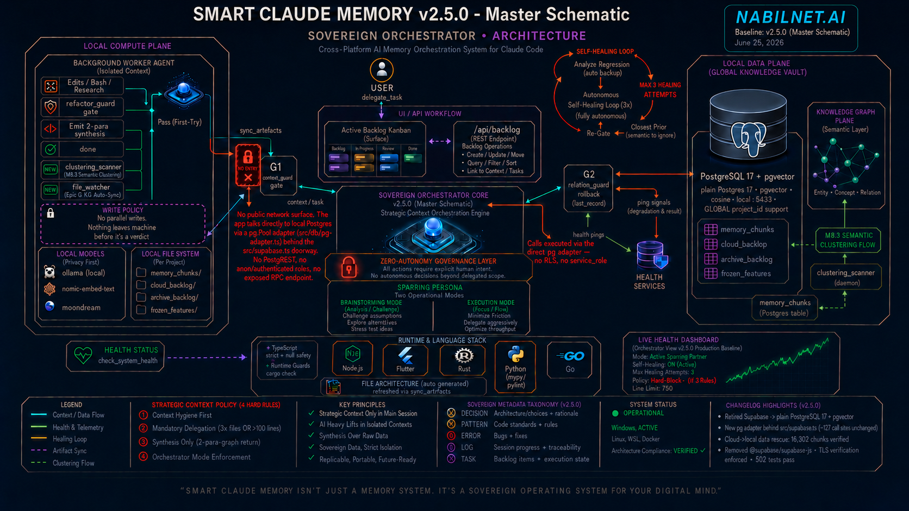
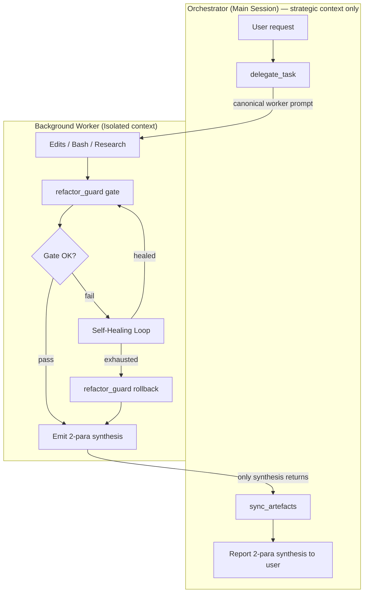
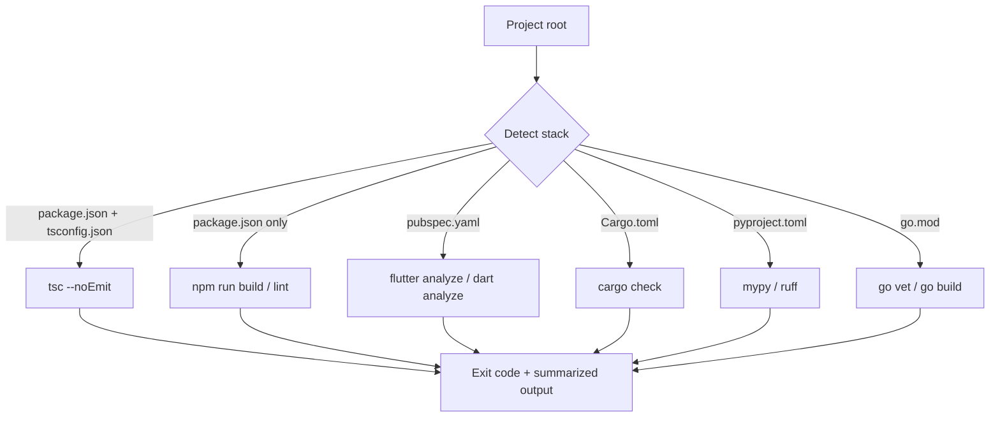

<div align="center">

# Smart Claude Memory



*Master schematic — the definitive visual reference for the Smart Claude Memory v2.5.x production baseline (v2.5.0 migrates the data layer off Supabase onto a self-hosted **plain PostgreSQL 17 + pgvector** database — a `pg.Pool`-backed adapter (`src/db/pg-adapter.ts`) now sits behind the unchanged `src/supabase.ts` doorway, so all ~127 call sites and the entire tool surface are byte-for-byte identical; only the backend changed. Prior baselines: v2.4.0 four Session-48 epics — Phase 1 drag-drop Backlog Kanban + `PATCH /api/backlog/:id`, Phase 2 GLOBAL vault export/import via `export_global_vault` / `import_global_vault`, and the Agentic Superpowers MVP `fetch_url` / `research_url` / `crawl_docs` (see [ARCHITECTURE.md §4.14](ARCHITECTURE.md#414-web-research-agentic-superpowers-mvp--scm-s48)); v2.3.0 M8.3 Semantic Clustering ([§4.13](ARCHITECTURE.md#413-m83-semantic-clustering-mission-10--scm-s41-d1d7)); v2.3.1 Active Backlog Kanban + `/api/backlog` + Epic G `file_watcher` daemon.)*

**Local-first persistent memory for Claude — semantic retrieval instead of context bloat.**

[](https://www.typescriptlang.org/)
[](https://nodejs.org/)
[](https://modelcontextprotocol.io/)
[](https://github.com/pgvector/pgvector)
[](https://ollama.com/)
[](#license)
[](#)
[](https://nabilnet.ai)

**Developed by [NABILNET.AI](https://nabilnet.ai)**

</div>

---

## The problem

Claude sessions load `memory.md`, `rules.md`, `cloud.md`, and a dozen other context files at startup. Every token you spend on "what does this project do" is a token you can't spend on the actual task. At scale, you end up burning budget re-reading the same notes hundreds of times per week.

## What this does

`smart-claude-memory` is a **Model Context Protocol server** that replaces "read every .md at startup" with "search them on demand." It chunks your markdown notes, embeds them with a local Ollama model, stores them in a plain PostgreSQL 17 + pgvector database (no Supabase — migrated in v2.5.0, see [ARCHITECTURE.md §7](ARCHITECTURE.md#7-plugin-distribution)), and exposes **sixty-three MCP tools** to Claude spanning memory, vision, backlog, hygiene, orchestration, system health, transactional checkpoints (M4), autonomous curriculum (M5), observability + telemetry pruning (M6), human-gated skill graduation to GLOBAL (M7), a Hybrid-RAG knowledge graph with a browser dashboard (M8.1/M8.2), on-disk → KG auto-sync (Epic G `file_watcher`), and bounded web research (`fetch_url` / `research_url` / `crawl_docs`). The elevator pitch:

| Tool | Purpose |
|---|---|
| `sync_local_memory` | Scan folders → **MD5 hash-gate** → chunk → embed → **bulk upsert**. Skips unchanged files. |
| `search_memory` | Semantic search + intent routing (archive / backlog / semantic) |
| `manage_backlog` | Per-project task handover with persistent archive |

See the [Toolbox](#toolbox) for the complete surface and [ARCHITECTURE.md](ARCHITECTURE.md) for the request-flow diagram.

Memory is strictly **per-project**: when you're in project A, Claude cannot see project B's notes. See [Multi-project isolation](#multi-project-isolation).

---

## Install

**Option A — Claude Code plugin (recommended for end users):**

```
/plugin install NABILNET-ORG/Smart-Claude-Memory
```

Auto-wires the MCP server and the `md-policy.py` PreToolUse hook via `.claude-plugin/plugin.json`. Zero manual `~/.claude.json` edits.

**Option B — npm (for direct use or programmatic embedding):**

```bash
npm install smart-claude-memory-mcp
```

Published as [`smart-claude-memory-mcp`](https://www.npmjs.com/package/smart-claude-memory-mcp) (MIT). Exposes a `smart-claude-memory-mcp` binary you can wire into any MCP-compatible client.

**Option C — Direct from GitHub (latest `main`):**

```bash
npm install git+https://github.com/NABILNET-ORG/Smart-Claude-Memory.git
```

Installs straight from the canonical repo without a registry round-trip. The `prepare` script declared in [package.json](package.json) auto-runs the full `npm run build` chain (`lint:boundaries` → `tsc` → `copy:gui`) on install, so the TypeScript sources compile to `dist/` and the `smart-claude-memory-mcp` binary lands fully resolved on the consumer's `node_modules/.bin/` — no `npm run build` follow-up needed. Pin a tag (`...Smart-Claude-Memory.git#v2.5.0`) or commit SHA for reproducible installs.

All three paths require a reachable PostgreSQL 17 + pgvector database (spin one up locally via `infra/plain-pg/docker-compose.yml`) + a local Ollama install with `moondream` and `nomic-embed-text` pulled. See [Bootstrap](#bootstrap-3-step-setup-5-minutes) for the three-step setup ritual.

---

## System Architecture

The system operates under the Sovereign Orchestrator pattern with Autonomous Self-Healing. The diagrams below are mirrored from [ARCHITECTURE.md](ARCHITECTURE.md), which remains the canonical source of truth.

**Two independent planes by design:**

- **Inference plane — Ollama.** Every byte of your notes is embedded on your own machine. Content never leaves your device in plaintext for vectorization. No per-token API fees, no third-party seeing your prompts.
- **Storage plane — plain PostgreSQL 17 + pgvector.** Durable storage with HNSW vector indexing. As of v2.5.0 this is a self-hosted Postgres (Docker, `infra/plain-pg/docker-compose.yml`) — Supabase (cloud and the local self-hosted stack) has been retired from the data path. Only the vectors + the source text live here — and only the text you explicitly choose to sync.

You get the privacy posture of local inference with the durability of a real Postgres you control end to end.

### Delegation Flow



### Autonomous Self-Healing Loop


### Multi-Stack Compiler Map



> See [ARCHITECTURE.md](ARCHITECTURE.md) for the full prose + §4 auto-generated file-tree + §5 version history.

---

## Multi-project isolation

Every chunk is tagged with a `project_id`. The MCP server auto-derives it from the **slugified basename of the current working directory** at startup:

```
C:\Users\you\repos\acme-api       → project_id = "acme-api"
~/code/side-projects/note-taker   → project_id = "note-taker"
```

The SQL function `match_memory_chunks` enforces the filter **at the database layer** — not just in application code:

```sql
where m.project_id = p_project_id
```

Concretely: when you `cd` into `acme-api/` and launch Claude, calls to `search_memory` **cannot** return rows tagged `note-taker`. This is verified by [scripts/e2e-isolation-test.ts](scripts/e2e-isolation-test.ts), which seeds both projects with the same file name and proves zero cross-talk.

Need to reach into another project on purpose? Pass `project_id` explicitly:

```
search_memory({ query: "auth flow", project_id: "acme-api" })
```

---

## Toolbox

| Tool | Category | Summary |
|---|---|---|
| `sync_local_memory` | Memory | Hash-gated incremental sync of `.md` files; bulk upsert in 100-chunk batches; `force` re-embed; `auto_purge` with dry-run + verify-before-delete |
| `prune_memory` | Memory | Delete `memory_chunks` rows for explicit on-disk paths whose source files are gone. `confirm:false` returns a dry-run; `inline:*` origins and `project_id='GLOBAL'` are hard-rejected; every delete writes a manifest to `~/.claude-memory/prune-backups/`. |
| `search_memory` | Memory | Intent routing — `archive` > `backlog` > `semantic`. Optional `metadata_filter` (e.g. `{ "type": "DECISION" }`) narrows via the GIN index before vector similarity. **Dual-scope by default (v2.0.0-rc1):** searches across the current project AND the reserved `'GLOBAL'` vault; pass `include_global: false` to restrict to the current project. Archive tasks never leak into vector results unless requested. |
| `list_global_patterns` | Memory | Browse-only enumeration of the reserved `'GLOBAL'` Knowledge Vault. Pure SQL — zero embedding cost. Filter by JSONB containment (same `metadata_filter` shape as `search_memory`). Pagination: `offset` + `limit` (default 10, max 50), sorted by `created_at DESC`. Tiered output: default returns a `content_preview` (≤120 chars); pass `include_content: true` for the full content. Distinct from `search_memory({ include_global: true })` — that's "find by meaning" (semantic), this is "enumerate by attribute" (deterministic). |
| `save_memory` | Memory | Save a typed memory chunk — embed via Ollama, upsert with `metadata.type` from the Sovereign Taxonomy (`DECISION` / `PATTERN` / `ERROR` / `LOG`). v2 canonical write path. **v2.0.0-rc1:** set `metadata.is_global: true` to route the row to the reserved `project_id: 'GLOBAL'` vault for cross-project visibility. **Sovereign Vetting:** when `is_global: true`, you MUST also supply `metadata.global_rationale` and the memory must pass the Cross-Project Test (Rule 10). |
| `summarize_memory_file` | Memory | LLM-driven compression of `CLAUDE.md` / `MEMORY.md` toward a token target (default 3000) |
| `manage_backlog` | Backlog | `add` / `list` / `update` / `prune_done` (archives) / `archive_list` / `session_end` with Progress Report + resume prompt |
| `index_image` | Vision | Moondream caption → `nomic-embed-text` embed → upsert. Auto-converts WebP/GIF/BMP via ffmpeg. |
| `check_code_hygiene` | Guardian | 750-line rule with auto-generated file exclusions; N-split refactor plan for oversized files |
| `check_rule_conflicts` | Guardian | Opt-in LLM-based intent conflict detection between a proposed change and retrieved rules |
| `raise_verification_gate` | Guardian | Arm the Hard Stop flag after a risky edit |
| `confirm_verification` | Guardian | Clear or reassert the Hard Stop gate — Claude must call this after manual verification |
| `check_system_health` | Ops | Postgres reachability (memory_chunks count) + Ollama reachability + required-model presence (moondream, nomic-embed-text) + background keep-alive state |
| `init_project` | Ops | Readiness report for a workspace: required env vars, md-policy.py hook, MCP registration in settings, compiled dist. Also runs a **smart-scout pass** over `.claude/rules/*.md` and emits a `recommendations.hydrate_policies` block with batch-hydration candidates when any are found (key omitted entirely otherwise). Returns `ready` / `partial` / `not_ready` with fix instructions per check. |
| `batch_freeze_patterns` | Guardian | Bulk-hydrate the frozen-pattern cache from globs or a `## Frozen Patterns` markdown section in a rule file. Strict line-by-line extraction, atomic writes, dedup with first-writer-wins, optional `dry_run`. |
| `list_frozen` | Guardian | List all frozen pattern entries for the current project (returns `pattern`, `source`, `added_at`). Use before touching any structural-looking file. |
| `freeze_file` | Guardian | Add a path or pattern to the frozen-pattern cache so future `Write` (full replacement) on matching files is hard-blocked by the hook. |
| `unfreeze_file` | Guardian | Remove a path or pattern from the frozen-pattern cache. |
| `sweep_legacy_backups` | Ops | Move stray `backup-*` / `*.bak` artefacts into a timestamped quarantine folder. Defaults to `dry_run`; HIGH-confidence files only unless `aggressive: true`. |
| `refactor_guard` | Guardian | Single source of compile truth — auto-detects stack and runs the native gate (`tsc --noEmit`, `flutter analyze`, `cargo check`, …). Also exposes `rollback` for last-resort recovery. |
| `analyze_regression` | Guardian | Diffs the current file against recent backups and surfaces the `closest_prior` snapshot to guide the minimal local fix during the self-healing loop. |
| `delegate_task` | Orchestrator | Emit a canonical worker sub-agent prompt — the worker does the edit → `refactor_guard` gate → up to 3 self-heal attempts → returns only a 2-paragraph synthesis. Backbone of the Sovereign Orchestrator pattern. |
| `sync_artefacts` | Orchestrator | Refresh `README.md` Recent Progress + the marker-bounded Mermaid block in `ARCHITECTURE.md` + `project_file_architecture.md` after a worker reports success. Doc-only subset of `manage_backlog({ action: "session_end" })`. |
| `list_graduation_candidates` | Graduation | M7 enumeration surface. SELECT from `skill_graduations` with optional `state ∈ {proposed, composed, approved, rejected}` and `project_id` filters. Default limit 10, hard cap 50. Read-only. Use to find graduations awaiting compose or human confirm. See ARCHITECTURE.md §4.9. |
| `compose_global_rationale` | Graduation | M7 race-safe persist of Orchestrator-LLM-drafted Cross-Project Test output to a `state='proposed'` graduation row. Server-side gates verdict ∈ {pass, fail}, evidence non-empty, model non-empty, and (when verdict='pass') `global_rationale.trim().length >= 10`. `verdict='fail'` coerces rationale to NULL. The handler NEVER itself calls an LLM — the Orchestrator passes its output in (mirrors S22-D1 `compose_skill_candidate`). |
| `confirm_promotion` | Graduation | **HUMAN-GATED PROMOTION TO GLOBAL** — the sole `is_global=true` mint path outside of `save_memory({is_global:true})`. Calls the `apply_graduation` SQL RPC: atomic INSERT of a GLOBAL `agent_skills` clone + UPDATE `state='approved'` in ONE transaction. PostgreSQL `now()` collapses `graduation.decided_at === new_skill.created_at` to the microsecond (C4 atomic-tx proof). Source skill UNTOUCHED. |
| `reject_graduation` | Graduation | M7 veto. TS-only UPDATE `WHERE state IN ('proposed','composed')`. Diverges from `reject_curriculum_task`: a second reject on an already-rejected row returns `ok:false` (reason='invalid_state_transition') instead of silently overwriting — GLOBAL rejection reasons carry audit weight. |

### Full tool roster — 63 MCP tools by domain (v2.5.0)

The table above documents the canonical headline surface. The complete roster, grouped by subsystem, follows. Each tool is registered in [src/index.ts](src/index.ts) and consumed via the MCP `tools/list` + `tools/call` protocol.

| Domain | Tools | Count |
|---|---|---|
| **Memory + Vision** | `sync_local_memory` · `search_memory` · `save_memory` · `prune_memory` · `summarize_memory_file` · `list_global_patterns` · `index_image` | 7 |
| **Backlog + Living Docs** | `manage_backlog` · `sync_artefacts` | 2 |
| **Guardian (hook-bound)** | `check_code_hygiene` · `check_rule_conflicts` · `raise_verification_gate` · `confirm_verification` · `refactor_guard` · `analyze_regression` · `batch_freeze_patterns` · `list_frozen` · `freeze_file` · `unfreeze_file` · `sweep_legacy_backups` | 11 |
| **Orchestrator (Sovereign)** | `delegate_task` · `upgrade_constitution` | 2 |
| **Ops + Health** | `init_project` · `check_system_health` · `system_dashboard` | 3 |
| **Trajectory (M2 Agent Diet)** | `compact_trajectory` · `get_trajectory_summary` | 2 |
| **Skill Vault (M3 Sleep Learning)** | `compose_skill_candidate` · `promote_skill_candidate` · `reject_skill_candidate` · `list_skill_candidates` · `package_skill` · `request_skill` | 6 |
| **Checkpoints (M4 Transactional Workflows)** | `checkpoint_create` · `checkpoint_commit` · `checkpoint_rollback` · `checkpoint_list` | 4 |
| **Curriculum (M5 Single-Brain Closure)** | `list_curriculum_tasks` · `pull_curriculum_task` · `apply_curriculum_task` · `reject_curriculum_task` | 4 |
| **Graduation to GLOBAL (M7)** | `list_graduation_candidates` · `compose_global_rationale` · `confirm_promotion` · `reject_graduation` | 4 |
| **Knowledge Graph (M8.1 Hybrid RAG)** | `kg_upsert_node` · `kg_upsert_edge` · `list_kg_nodes` · `list_kg_edges` · `kg_hybrid_search` | 5 |
| **Agentic Resource Manager (Mission 9, v2.2.2)** | `start_task` · `end_task` · `get_task_budget` · `get_daemon_budget` · `reset_daemon_budget` | 5 |
| **Semantic Clustering (M8.3, v2.3.0)** | `list_supernodes` · `list_cluster_members` · `trigger_clustering` | 3 |
| **GLOBAL Vault portability (Phase 2, v2.4.0)** | `export_global_vault` · `import_global_vault` | 2 |
| **Web Research (Agentic Superpowers MVP, v2.4.0)** | `fetch_url` · `research_url` · `crawl_docs` | 3 |
| **Total** | | **63** |

**New in v2.4.0 (Session 48).** `export_global_vault` serializes the entire reserved `GLOBAL` project_id (memories + skills) to a portable canonical-JSON document with a sha256 `content_digest` for tamper-evidence; `import_global_vault` ingests such a document under a **no-override** merge — existing GLOBAL rows are never clobbered, only genuinely new rows are added (see [ARCHITECTURE.md §4.3.1](ARCHITECTURE.md)). `fetch_url` performs an SSRF-guarded HTTP(S) fetch and returns clean text via `html-to-text`; `research_url` chains fetch → chunk → embed → persist so an external page becomes searchable project memory (see [ARCHITECTURE.md §4.14](ARCHITECTURE.md#414-web-research-agentic-superpowers-mvp--scm-s48)). **Added in Session 49:** `crawl_docs` composes that fetch engine into a bounded, same-origin BFS crawler — depth / `max_pages` / per-domain caps, `robots.txt` respect (Disallow/Allow longest-match + Crawl-delay), per-link SSRF re-validation, and budget-gated embeds — turning a whole docs site into searchable memory in one call.

The GUI surface (M8.2, v2.2.0) is **not** an MCP tool — it's an HTTP server (`src/gui/server.ts`, `npm run gui`) that reuses `list_kg_nodes`/`list_kg_edges`/`list_graduation_candidates` etc. as in-process handlers, then renders the SVG Knowledge Graph + M7 graduation curation UI from modular static assets in [src/gui/public/](src/gui/public/). See [ARCHITECTURE.md §4.10 / §4.11](ARCHITECTURE.md) for the subsystem design.

**Companion hook:** [hooks/md-policy.py](hooks/md-policy.py) enforces Zero-Local-MD allowlist, 750-line ceiling, frozen-feature patterns, and the Manual Test Gate from the Claude Code `PreToolUse` layer. Without it the Guardian tools are advisory; with it they are binding.

---

## Living Documentation

`manage_backlog({ action: "session_end" })` writes **two** artefacts into the project on every call, in parallel, so the repo self-documents without manual effort:

### 1. README progress log → `README.md`

1. Archives completed tasks (atomic PL/pgSQL transaction into `archive_backlog`).
2. Pulls the last 5 archived rows via `listArchive`.
3. Replaces the `### 🚀 Recent Progress

* [DONE] Epic: Re-evaluate graph-rerank under confidence-gating / non-demoting fusion. Make α dynamic so the graph only intervenes when pure-vector confidence is low. (archived at 2026-06-06).
* [DONE] Epic: Densify KG via historical re-extraction and build bridge-aware eval fixture to unlock SCM_GRAPH_RERANK_ENABLED (archived at 2026-06-06).
* [DONE] Fix browser-fatigue regression in init_project: stop launching new browser tabs if GUI TCP probe is already active (archived at 2026-06-05).
* [DONE] SCM-S50 ship-gate: populate eval fixture, run off/on eval, flip SCM_GRAPH_RERANK_ENABLED default (archived at 2026-06-05).
* [DONE] Foundation fix: flaky clustering smoke test C8 (tests/clustering-daemon.test.ts:195) times out in isolation (archived at 2026-06-05).
### 🚀 Recent Progress

* [DONE] Fix login form validation (archived at 2026-04-24).
* [DONE] Add cache invalidation hook (archived at 2026-04-23).
...
```

### 2. Architecture map → `project_file_architecture.md`

1. Walks the project tree (cwd), ignoring `node_modules`, `.git`, `dist`, `build`, `backups`, and friends.
2. Caps depth at 3 and children per folder at 25; overflows show as `… (N more)`.
3. Renders a Mermaid `flowchart TD` — GitHub renders it natively in the doc.
4. Replaces only the `mermaid` fenced block; any human prose in the file is left intact. Creates the file with a professional header on first run.

### Safety rails (shared)

- If the MCP server's `cwd` slug doesn't match the `session_end` `project_id`, **both syncs are skipped** with an explicit warning — neither artefact is written into the wrong repo.
- Failures surface as `warning` fields in `readme_sync` / `architecture_sync`; the archive + resume-prompt logic always completes.
- Hook allowlist includes `README.md`; `project_file_architecture.md` is not on it — make sure your Zero-Local-MD allowlist covers it too (`CLAUDE_MD_POLICY_ALLOW_ROOT_MD="CLAUDE.md,MEMORY.md,README.md,project_file_architecture.md"`).

Net effect: every session leaves a timestamped handover note and a current file-tree diagram in the repo.

---

## Incremental sync (v0.3.0)

For corpora with thousands of files, re-embedding on every call is wasteful. `sync_local_memory` now runs a **hash-gated** pipeline:

1. Snapshot `Map<file_origin, file_hash>` for the current `project_id` in one paginated SELECT.
2. For each local file, compute MD5 **before** chunking or embedding.
3. If the hash matches the DB, skip — zero Ollama calls, zero writes.
4. If it differs (or is new), chunk + embed and buffer the rows.
5. Flush in batches of 100 chunks per upsert to minimize round-trips.
6. If a file is gone locally but still in the DB, it's reported in `orphan_files` (not auto-pruned — clean it with `prune_memory({ explicit_paths: [...], confirm: true })`).

Measured on this repo's own README (28 chunks, single file):

| Run | Behavior | Time | Ollama calls |
|---|---|---|---|
| Cold sync | Embed + upsert | **~3.7 s** | 28 |
| Unchanged rerun | All skip | **~0.3 s** | **0** |
| One file modified | Skip N−1, re-embed 1 | proportional to the delta | 1 file's worth |

### Output shape

```json
{
  "project_id": "acme-api",
  "force": false,
  "scanned": 812,
  "skipped": 806,
  "added": 3,
  "updated": 3,
  "orphans": 1,
  "orphan_files": ["/abs/path/legacy.md"],
  "chunks_upserted": 47,
  "chunks_deleted": 21,
  "ms": 1840
}
```

### Force re-embed

Pass `force: true` to bypass the skip gate. Pre-existing files are still correctly classified as `updated` (not `added`) and their stale chunks are purged before re-insert — critical when a file shrinks.

```
sync_local_memory({ force: true })
```

Verified by [scripts/e2e-incremental-test.ts](scripts/e2e-incremental-test.ts), which walks five phases: cold, rerun, modify+add+delete, force, and row-shape integrity.

---

## Bootstrap (3-step setup, ~5 minutes)

> Resolves the `#bootstrap` anchor referenced from the [Install](#install) section above. This is the **post-install** setup ritual — apply once per machine.

### 1. Install the plugin from the marketplace

In Claude Code, open the plugin marketplace and install **smart-claude-memory** (or, while the marketplace listing is being prepared, clone this repo and `claude plugin add <path>` it locally). The plugin manifest at `.claude-plugin/plugin.json` auto-wires both the MCP server and the `md-policy.py` PreToolUse hook. **No `~/.claude.json` or `~/.claude/settings.json` edits required.**

### 2. Start the Postgres datastore + Ollama models

- Bring up the bundled **plain PostgreSQL 17 + pgvector** database (Docker, exposed on host port `5433`):

```bash
docker compose -f infra/plain-pg/docker-compose.yml up -d
```

> As of v2.5.0 the data layer is a self-hosted plain Postgres — Supabase (cloud and the local self-hosted stack) is no longer part of the data path.

- Install [Ollama](https://ollama.com/) and pull the two required models:

```bash
ollama pull moondream
ollama pull nomic-embed-text
```

### 3. Set the DB connection in your project's `.env`

```env
SUPABASE_DB_URL=postgres://postgres:<password>@localhost:5433/postgres
# Optional: a pooler/alternate URL (preferred when set). Either var satisfies the connection requirement.
SUPABASE_POOLER_URL=postgres://postgres:<password>@localhost:5433/postgres
```

> **Note on the `SUPABASE_` prefix.** These variable *names* retain the `SUPABASE_` prefix for now even though Supabase is retired — a rename is tracked as future work. Only the `*_DB_URL` / `*_POOLER_URL` connection strings are read; the old REST config (`SUPABASE_URL` / `SUPABASE_SECRET_KEY`) was removed in v2.5.0.

Then call `init_project()` from Claude Code. The plugin **auto-applies all 30 schema migrations** (through `scripts/030_grant_execute_to_service_role.sql`) to your empty DB on the first call, verifies your Ollama models are pulled, and reports `overall: pending → healthy` within a few minutes. Zero manual `npm run schema`, zero hand-edited settings.

### Optional env vars

| Name | Default | Purpose |
|---|---|---|
| `OLLAMA_HOST` | `http://localhost:11434` | Ollama endpoint |
| `OLLAMA_EMBED_MODEL` | `nomic-embed-text` | Embedding model |
| `EMBED_DIM` | `768` | Embedding vector dimension |
| `MEMORY_ROOTS` | (empty) | Semicolon-separated folders to sync |

> **Which URL is used?** The adapter prefers `SUPABASE_POOLER_URL` when set and otherwise falls back to `SUPABASE_DB_URL`; at least one must be present. Against the bundled local Postgres both point at `localhost:5433`, so a single `SUPABASE_DB_URL` line is enough. (The legacy Supabase-pooler/IPv6 guidance no longer applies — the datastore is a plain Postgres you run yourself.)

### First-run index your notes

From a Claude Code session inside the project whose notes you want to offload:

```
sync_local_memory()
```

Then free up context by archiving the originals:

```bash
npm run backup                                              # dry run
npx tsx scripts/backup-and-remove.ts --confirm-delete       # zip + delete
```

---

## Usage — every command you'll actually run

The plugin has **two surfaces**: MCP tools you invoke **inside a Claude Code session**, and CLI commands you run **from your shell**. Below is the canonical command cheat sheet, grouped by who you are and what you're doing.

### Quick command reference (CLI)

Every command runs from the repo root. None require sudo. None create permanent state outside `~/.claude-memory/` and your PostgreSQL database.

| Command | What it does | When you'd run it |
|---|---|---|
| `npm install` | Resolve dependencies | Once after clone / pull |
| `npm run build` | `lint:boundaries` → `tsc` → `copy:gui` chain — produces `dist/` (the artefact `npm publish` ships) | Before publishing or before running `npm start` |
| `npm run dev` | Run the MCP server via `tsx` (no compile step, fast iteration) | Editing TypeScript and want hot-feedback |
| `npm run start` | Run the **compiled** MCP server (`node dist/index.js`) | Reproducing what an npm consumer sees |
| `npm run gui` | Boot the Sovereign Command Center dashboard at `http://127.0.0.1:7788/` (loopback only) | Visual triage of M7 graduations + M8.1 knowledge graph |
| `npm run test` | Run the full 246-case hermetic suite (no live Postgres / Ollama required) | Before committing, before publishing |
| `npm run lint:boundaries` | Statically asserts `src/sleep/**`, `src/curriculum/**`, `src/graduation/**` contain NO LLM imports (Single Brain Boundary) | Runs automatically in `build`; useful standalone after touching those subsystems |
| `npm run copy:gui` | Mirror `src/gui/public/` → `dist/gui/public/` via `fs.cpSync` (zero-dep) | Runs automatically in `build`; useful if you edit GUI assets and want them in `dist/` without a full rebuild |
| `npm run schema` | Apply pending SQL migrations to your Postgres database (idempotent — re-runs are no-ops) | Manual recovery only — `init_project` does this automatically on first boot |
| `npm run backup` | Dry-run scan + zip of every `.md` file in `MEMORY_ROOTS`, written to `~/.claude-memory/backups/` | Before deleting any `.md` you've already indexed |
| `npm run smoke:m4` | End-to-end smoke for M4 transactional checkpoints | Sanity check after touching `src/transactions/` |
| `npm run smoke:m5-rollback` / `smoke:m5-stale` / `smoke:m5-consumer` | Smoke each M5 curriculum signal-source | After touching `src/curriculum/` |
| `npm run smoke:m7` | Smoke the full M7 skill graduation lifecycle (propose → compose → confirm/reject) | After touching `src/graduation/` |

### Quick command reference (MCP — inside Claude Code)

Every MCP tool is invoked the same way: type the tool name with arguments inside your Claude Code chat. Claude routes the call through the MCP server. **All 63 tools are documented in the [Toolbox](#toolbox).** The most-used invocations:

```text
init_project()                                          # boot — readiness + auto-migrate
check_system_health()                                   # Postgres + Ollama + 6 daemons status
search_memory({ query: "...", k: 10 })                  # dual-scope semantic search
search_memory({ query: "...", metadata_filter: { type: "DECISION" } })   # typed filter
save_memory({ content: "...", metadata: { type: "DECISION" } })          # project-scoped
save_memory({ content: "...", metadata: { type: "PATTERN", is_global: true, global_rationale: "..." } })   # GLOBAL vault
list_global_patterns({ metadata_filter: { type: "PATTERN" } })           # browse GLOBAL deterministically
manage_backlog({ action: "add", title: "..." })
manage_backlog({ action: "list" })
manage_backlog({ action: "session_end" })                                # wrap-up ritual
delegate_task({ ... })                                                   # offload research >100 lines
sync_artefacts()                                                         # regen README progress + ARCH file-tree
```

### Daily workflows — by what you're trying to do

**"Boot a new session in an existing project":**
1. Open Claude Code in the project directory.
2. Paste the [Golden Startup Prompt](#-the-golden-startup-prompt) as your first message.
3. Claude runs `init_project()` → `search_memory({ query: "Active Backlog" })` and reports state.

**"Index a new note I just wrote":**
1. Save the `.md` somewhere under `MEMORY_ROOTS`.
2. From Claude: `sync_local_memory()` (incremental — only changed files re-embed).
3. Verify: `search_memory({ query: "<a phrase from the note>" })`.

**"Capture an architectural decision":**
```
save_memory({
  content: "SCM-S<N>-D<i> — <decision> ... \n\nRationale: ...",
  metadata: { type: "DECISION" }
})
```
The `SCM-S<N>-D<i>` prefix is the project convention from [CLAUDE.md](CLAUDE.md). DECISIONs are project-scoped by default.

**"Promote a universal pattern to GLOBAL":**
1. Run the Cross-Project Test: *"if this project were deleted tomorrow, would this still be a gold-standard reference for others?"*
2. If yes:
   ```
   save_memory({
     content: "PATTERN: ...",
     metadata: {
       type: "PATTERN",
       is_global: true,
       global_rationale: "Universal because ... (one or two sentences)"
     },
     project_id: "GLOBAL"
   })
   ```
3. Verify it landed: `list_global_patterns({ limit: 5 })` — your row should be at the top.

**"Triage skill graduations in the browser":**
1. Terminal: `npm run gui` → opens `http://127.0.0.1:7788/`.
2. Browse `/api/graduations?state=proposed` for the queue, click a row to compose, approve/reject from the drawer.
3. The knowledge-graph panel below renders the typed nodes from `kg_nodes` + edges from `kg_edges` (60 nodes default, force-directed SVG).

**"End a session cleanly":**
```
manage_backlog({ action: "session_end" })
```
- Archives `done` tasks atomically.
- Regenerates README "Recent Progress" + ARCHITECTURE auto file-tree.
- Returns a `next_session_command_markdown` block — **paste it verbatim as your final chat message** so the operator can copy it into the next session.

### Knowledge Graph operations (M8.1, v2.2.0)

Read-only inspection from Claude Code:

```text
list_kg_nodes({ k: 60, type: "DECISION" })                          # latest 60 DECISION nodes
list_kg_nodes({ k: 60, label_prefix: "src/" })                      # prefix filter
list_kg_edges({ k: 120 })
kg_hybrid_search({ query: "GUI refactor", k: 10 })                  # vector + graph fusion
```

Curated upsert (manual, e.g., backfilling a typed node from an old chunk):

```text
kg_upsert_node({ type: "FILE", label: "src/gui/server.ts", properties: { ... }, source_chunk_id: 12901 })
kg_upsert_edge({ source_id: 42, target_id: 99, type: "DEPENDS_ON", confidence: 0.95 })
```

Both upserts are idempotent (UNIQUE on `(project_id, type, label)` for nodes; full key for edges).

### Environment variables (full reference)

Set in your project's `.env` file or your shell. Documented checks live in `src/tools/setup.ts` and surface in `init_project()`.

| Variable | Required | Default | Purpose |
|---|---|---|---|
| `SUPABASE_DB_URL` | ✅* | — | Postgres connection string, e.g. `postgres://postgres:<pw>@localhost:5433/postgres`. *At least one of `SUPABASE_DB_URL` / `SUPABASE_POOLER_URL` is required (name retains the `SUPABASE_` prefix; rename is future work) |
| `SUPABASE_POOLER_URL` | ✅* | — | Alternate/pooled Postgres URL — **preferred when set**; `init_project`'s auto-migration loop uses this. *See note above |
| `OLLAMA_HOST` | — | `http://localhost:11434` | Ollama endpoint |
| `OLLAMA_EMBED_MODEL` | — | `nomic-embed-text` | Embedding model |
| `EMBED_DIM` | — | `768` | Embedding vector dimension (must match the model) |
| `MEMORY_ROOTS` | — | (empty) | Semicolon-separated folders to sync |
| `SCM_DELEGATION_ENABLED` | — | `true` | Set `false` to unregister `delegate_task` + `sync_artefacts` so a native multi-agent model (e.g. Opus 4.8 Ultra Code) drives execution directly; `init_project` then advertises this via `capabilities.execution_mode_notice` (Dual Mode, SCM-S47-D2) |
| `SCM_GUI_PORT` | — | `7788` | GUI dashboard port (loopback only) |
| `SCM_GUI_HOST` | — | `127.0.0.1` | GUI host — change ONLY if you understand the threat model (service-role key lives in this process) |
| `SCM_GUI_TOKEN` | — | (none) | Optional bearer token gating `/api/*` mutation routes |
| `OBS_ERR_RATE_DEGRADED_DEFAULT` / `_DOWN_DEFAULT` / `OBS_STALENESS_MULTIPLIER_DEFAULT` | — | `0.20` / `0.50` / `2.0` | Per-daemon health-derivation thresholds |
| `TELEMETRY_PRUNER_INTERVAL_MS` / `_RETENTION_DAYS` | — | `21600000` (6h) / `30` | `telemetry_pruner` cadence + retention window |
| `GRAPH_EXTRACTOR_INTERVAL_MS` / `_BATCH` | — | `120000` (2m) / `10` | M8.1 knowledge-graph daemon cadence + per-tick batch |
| `SCM_LLM_RERANK_ENABLED` | — | `true` | LLM listwise reranker (SCM-S54): on low-confidence (flat-margin) `search_memory` queries, re-orders vector candidates via the server `chat()` LLM. Strict fallback to pure vector order on parse-fail/timeout/budget-block |
| `SCM_RERANK_MODEL` | — | `qwen3-coder:480b-cloud` | Model used by the listwise reranker (bake-off winner — clears the flip-rule, 0% parse-fail, ~1.5s/call) |
| `SCM_LLM_RERANK_PIN_TOP1` | — | `true` | Non-demoting top-1 pin — anchors the max-similarity candidate at rank 1; the LLM may only reorder ranks 2+ |
| `SCM_LLM_RERANK_POOL` | — | `12` | Max candidates sent to the reranker |
| `SCM_LLM_RERANK_SNIPPET` | — | `400` | Per-candidate snippet length (chars) included in the rerank prompt |
| `SCM_LLM_RERANK_TIMEOUT_MS` | — | `8000` | Rerank call timeout before strict vector-order fallback |

### Quick troubleshooting

| Symptom | First check |
|---|---|
| `init_project` returns `not_ready` with env miss | Set the listed variable; re-run |
| `npm run schema` fails to connect | Confirm the Postgres container is up (`docker compose -f infra/plain-pg/docker-compose.yml ps`) and `SUPABASE_DB_URL` points at the right host:port (default `localhost:5433`) |
| `npm run gui` fails `EADDRINUSE :7788` | Another GUI process is bound. Set `SCM_GUI_PORT=7789` or stop the holder |
| `check_system_health` shows daemon `pending` | Within 15-min grace window after MCP boot. Re-check after one daemon interval |
| Tests fail in `tests/migrations.test.ts` | A new SQL migration lacks an idempotency guard (`OR REPLACE` / `IF NOT EXISTS`) — fix the migration, not the test |

---

## ⚡ The Golden Startup Prompt

To ensure a seamless, context-efficient, and secure session in any project using this plugin, copy and paste the following prompt as your very first interaction with the agent.

```text
SYSTEM INITIALIZATION:
I am using the `smart-claude-memory` plugin. Follow these standards:
1. **Check Readiness:** Run `init_project` to verify the workspace and health.
2. **Sync State:** Run `sync_local_memory()` to ensure the vector database is up to date with my local notes.
3. **Operate via Tools:** From now on, do NOT read large `.md` files directly. Use `search_memory()` for context retrieval and respect the `md-policy.py` hook for all writes.
4. **Typed Retrieval (v2):** When saving memories use `save_memory` with `metadata.type` from the Sovereign Taxonomy — `DECISION` (architectural choices + rationale), `PATTERN` (code standards + Rule 5–8 enforcement), `ERROR` (bug post-mortems + fixes), or `LOG` (general session progress). When retrieving, narrow `search_memory` with `metadata_filter` (e.g. `{ "type": "DECISION" }`) so the GIN index pre-filters before vector similarity. After updates, run `sync_artefacts` to keep cloud + local aligned.
5. **MANDATORY DELEGATION:** Any read-heavy investigation touching > 3 files OR resulting in > 100 lines of raw output (Grep / Read / Logcat) MUST be delegated via `delegate_task` to a worker. Never flood the main context. Request only the 2-paragraph synthesis.
6. **Initial Sync (Core 3 Audit):** `init_project` (Rule 1) returns a `core3` block reporting on `CLAUDE.md`, `README.md`, and `ARCHITECTURE.md` — the project's three architectural sources of truth. If any is missing, or if `core3.in_sync` is `false`, immediately `delegate_task` a Core-3 audit BEFORE any other work. Request a 2-paragraph synthesis with the proposed reconciliation. The Architecture Guard treats these three files as load-bearing; nothing else proceeds until they agree.
7. **Modular Diagramming:** Mermaid diagrams in `ARCHITECTURE.md` and `README.md` MUST be split into small per-section blocks — one block per `##` subsystem, ≤ ~40 nodes each. GitHub silently fails to render oversized Mermaid graphs; a single monolithic flowchart will appear blank in the rendered view. Never emit one mega-graph. When `manage_backlog({ action: "session_end" })` regenerates the diagram, it produces one block per logical section, not one giant tree.
8. **Session-End Lock & Handoff:** Before ending the session, call `manage_backlog({ action: "session_end" })` to flush the backlog, regenerate the per-section Mermaid diagrams, and run `sync_artefacts` to push state to the cloud. The response includes a `next_session_command_markdown` field — **POST THAT MARKDOWN BLOCK VERBATIM as your final message to chat.** It is a copy-paste-ready boot command (`init_project` + `search_memory` for the Active Backlog + pointer to `docs/NEXT-SESSION-PROMPT.md`) that the user pastes into the next session. This locks a coherent baseline so the next session opens with the Core 3, the diagrams, and the cloud memory all aligned.
9. **Universal Patterns → GLOBAL (v2.0.0-rc1):** Any pattern, lesson-learned, or architectural decision deemed **universal** — applicable across projects, not just this one — MUST be saved with `metadata.is_global: true`. The row is stored under the reserved `project_id: 'GLOBAL'` and surfaces in dual-scope search across every project. Use this to **immunize future projects against known errors** (a bug fixed once never has to be re-discovered). Inverse: do NOT promote project-local context to GLOBAL — the vault loses signal if it becomes a dumping ground.
10. **Sovereign Vetting:** The GLOBAL vault is a high-signal environment. Every global save must pass the **Cross-Project Test**: *if the current project were deleted tomorrow, would this memory still be a gold-standard reference for others?* If no, keep it local. When `metadata.is_global: true`, you **MUST** also include `metadata.global_rationale` — a one- or two-sentence justification of why this memory is a universal truth (not project-specific). Saves that fail the Cross-Project Test pollute the vault and are forbidden. The agent is its own auditor: only Arch-Patterns that apply to ALL projects (universal architectural decisions, multi-project bug fixes) qualify.
```

---

## How `project_id` is derived

[src/project.ts](src/project.ts):

```ts
export function detectProjectId(cwd = process.cwd()): string {
  return slugify(basename(cwd) || "default");
}
```

Captured once at MCP server startup. Claude Code launches an MCP subprocess per session with `cwd` set to the workspace root, so `basename(cwd)` is a stable project identifier for the lifetime of that session.

Collisions are possible if two unrelated projects share a folder name (`utils/`, `backend/`, etc.). To harden, override explicitly:

```
sync_local_memory({ project_id: "acme-backend-prod" })
```

---

## Database schema

```sql
create table memory_chunks (
  id           bigserial primary key,
  content      text not null,
  embedding    vector(768) not null,
  file_origin  text not null,
  chunk_index  int not null default 0,
  content_hash text not null,                  -- MD5 of the chunk text
  file_hash    text,                           -- MD5 of the whole file at last sync (v0.3.0)
  metadata     jsonb not null default '{}'::jsonb,
  project_id   text not null default 'default',
  updated_at   timestamptz not null default now(),
  unique (project_id, file_origin, chunk_index)
);

create index on memory_chunks using hnsw (embedding vector_cosine_ops);
create index on memory_chunks (project_id);
create index on memory_chunks (project_id, file_origin);   -- powers the hash-gate lookup
```

The current 6-arg RPC `match_memory_chunks(query_embedding, p_project_id, match_count, min_similarity, p_metadata_filter, p_include_global)` (introduced by migration 008 and patched in 009 to use the planner-friendly IN-form `WHERE m.project_id IN (p_project_id, CASE WHEN p_include_global THEN 'GLOBAL' END)`) enforces tenancy + the typed-metadata filter + the optional `'GLOBAL'` fan-out, all in SQL — before pgvector ranks the candidate set. The legacy 4-arg form from migration 001 is superseded but left intact in the file for historical reference. All chunks from the same file share one `file_hash`, so the incremental-sync skip check is a single `SELECT file_origin, file_hash WHERE project_id = ?`. Full schema + RPC definitions in [scripts/001_schema.sql](scripts/001_schema.sql), [scripts/002_multi_project.sql](scripts/002_multi_project.sql), [scripts/003_file_hash.sql](scripts/003_file_hash.sql), [scripts/007_metadata_typed_retrieval.sql](scripts/007_metadata_typed_retrieval.sql), [scripts/008_global_scope.sql](scripts/008_global_scope.sql), and [scripts/009_fix_rpc_dual_scope.sql](scripts/009_fix_rpc_dual_scope.sql).

---

## Project layout

```
src/
├── index.ts              MCP server entry — registers all 63 tools
├── config.ts             Env loader (absolute .env path resolution)
├── project.ts            project_id detection + slugification
├── project-detect.ts     Multi-stack project root detection
├── ollama.ts             POST /api/embed client
├── supabase.ts           Unchanged data doorway — table + RPC wrappers + frozen-pattern cache (now backed by src/db/pg-adapter.ts)
├── db/
│   └── pg-adapter.ts     Plain-`pg` adapter — pg.Pool-backed, PostgREST-shaped query builder + .rpc (v2.5.0; replaces @supabase/supabase-js)
├── chunker.ts            Markdown-aware splitter
├── verification-gate.ts  Hard-stop verification flag (PreToolUse blocker)
├── version.ts            Version SSOT — re-exports from package.json
└── tools/
    ├── backlog.ts                manage_backlog (add / list / update / prune_done / archive_list / session_end)
    ├── batch-freeze-patterns.ts  batch_freeze_patterns (bulk-hydrate from globs or rule file)
    ├── conflict.ts               check_rule_conflicts
    ├── frozen-cache.ts           Shared loader for the frozen-pattern cache (atomic writes, dedup)
    ├── health.ts                 check_system_health (Postgres + Ollama + keep-alive + orchestrator)
    ├── hygiene.ts                check_code_hygiene (750-line ceiling, N-split refactor plans)
    ├── image.ts                  index_image (Moondream caption → embed → upsert)
    ├── orchestrator.ts           delegate_task + sync_artefacts (Sovereign Orchestrator pattern)
    ├── policy.ts                 list_frozen / freeze_file / unfreeze_file / sweep_legacy_backups
    ├── refactor.ts               refactor_guard (compile gate) + analyze_regression (backup diff)
    ├── save.ts                   save_memory (typed write path with Sovereign Vetting)
    ├── search.ts                 search_memory (intent routing + dual-scope semantic)
    ├── setup.ts                  init_project (readiness checks + smart-scout)
    ├── sovereign-constitution.ts CLAUDE.md Sovereign-binding template + helper
    ├── summarize.ts              summarize_memory_file
    ├── sync.ts                   sync_local_memory (hash-gated incremental)
    └── verification.ts           raise_verification_gate / confirm_verification

scripts/
├── 001_schema.sql                    base table + HNSW index + base RPCs
├── 002_multi_project.sql             project_id + per-project isolation
├── 003_file_hash.sql                 file_hash column for incremental sync
├── 004_backlog_frozen.sql            cloud_backlog + frozen_patterns tables
├── 005_archive_backlog.sql           archive_backlog history table
├── 006_security_hardening.sql        RLS deny-all + service-role-only access
├── 007_metadata_typed_retrieval.sql  GIN(jsonb_path_ops) + typed-filter match RPC
├── 008_global_scope.sql              'GLOBAL' project_id + 6-arg dual-scope match RPC
├── 009_fix_rpc_dual_scope.sql        IN-form WHERE planner fix (v2.0.0-rc1 hotfix)
├── apply-schema.ts                   `npm run schema` runner
├── backup-and-remove.ts              archive + delete .md files in MEMORY_ROOTS
├── e2e-test.ts                       end-to-end smoke
├── e2e-isolation-test.ts             multi-project isolation gate
├── e2e-incremental-test.ts           hash-gate / force / orphans
├── purge-samia-rules.ts              one-off scrub (legacy)
├── smoke-008.ts                      smoke for 008 dual-scope
├── verify-007.ts                     verifier for 007 typed retrieval
└── verify-008.ts                     verifier for 008 dual-scope
```

---


## 🗺️ File Architecture

_Auto-synced at 2026-05-23T06:03:21.927Z for `smart-claude-memory`._


## npm scripts

| Command | Purpose |
|---|---|
| `npm run build` | Three-step chain: `lint:boundaries` → `tsc` → `copy:gui`. Compiles TypeScript and mirrors `src/gui/public/` → `dist/gui/public/` for the modular dashboard (v2.2.0). |
| `npm run prepare` | npm lifecycle hook — wraps `npm run build`. Runs automatically on `npm install` from a git URL (Option C above) and before `npm pack` / `npm publish`, so git-based consumers and published tarballs both ship a freshly compiled `dist/` with zero manual build step. Added in v2.3.1 release-prep (Session 45). |
| `npm run lint:boundaries` | Boundary Invariant #1 fence — scans `src/sleep`, `src/curriculum`, `src/graduation` for forbidden LLM imports / endpoints. Runs first in `build`. |
| `npm run copy:gui` | Zero-dep mirror of `src/gui/public/` → `dist/gui/public/` via `fs.cpSync` (no `cpx` / `fs-extra` introduced). Idempotent. |
| `npm run dev` | Run the MCP server via `tsx` (no build step) |
| `npm run start` | Run the compiled MCP server (`node dist/index.js`) |
| `npm run gui` | Boot the Sovereign Command Center dashboard standalone on `127.0.0.1:7788` (`tsx src/gui/server.ts`). Cross-platform ESM entry-point guard (SCM-S37-P1). |
| `npm run test` | Full hermetic suite via `node --test` — 414 tests spanning M2…M8.3 + budget gate + Web Research + bounded crawler (stubbed DB + Ollama; no live infra needed); cluster Suites A–D land in v2.3.0 |
| `npm run test:integration` | Zero-infra DB-integration lane (gated by `RUN_DB_TESTS=1` via `.env.test`) — real-DB budget-gate + crawler coverage on a disposable namespace; teardown asserts 0 residual rows |
| `npm run schema` | Apply `001_schema.sql` (or pass `-- <file>` for another) |
| `npm run backup` | Dry-run backup of all `.md` in `MEMORY_ROOTS` |
| `npm run smoke:m4` / `smoke:m5-rollback` / `smoke:m5-stale` / `smoke:m5-consumer` / `smoke:m7` | End-to-end smoke flows per milestone — exercise checkpoints (M4), rollback signals + stale-candidate triage + curriculum consumer (M5), and human-gated graduation (M7). |

---

## Design decisions worth knowing

- **Embedding model is load-bearing.** `EMBED_DIM` must match the model's output. Swapping `nomic-embed-text` (768) for `mxbai-embed-large` (1024) means dropping and rebuilding the `embedding` column. Don't mix dimensions.
- **Single trusted DB role, no per-user context.** The MCP server runs locally and connects to PostgreSQL with one privileged role (the connection string in `SUPABASE_DB_URL` / `SUPABASE_POOLER_URL`); there is no end-user identity in the data path. If you expose this server to untrusted callers, add row-level security plus a `user_id` column.
- **Chunking is heading-aware, not token-aware.** Sections split on `##` / `###`; long sections slide-window at `CHUNK_SIZE` with `CHUNK_OVERLAP`. Good enough for most prose; swap in a tokenizer-driven chunker if you're indexing code.
- **Sync is incremental by default.** Unchanged files are skipped via `file_hash` comparison; no embedding calls, no writes. Pass `force: true` to re-embed everything. Chunks are flushed in 100-row batches to minimize database round-trips.
- **Orphans are reported by `sync_local_memory` and pruned by `prune_memory`.** Files removed from disk stay in the DB and show up in `orphan_files`. To clean them, call `prune_memory({ explicit_paths: [...], confirm: true })` — wildcards are rejected, `inline:*` synthetic origins from `save_memory` are always skipped, `project_id='GLOBAL'` is refused, and every confirmed delete writes a forensic manifest to `~/.claude-memory/prune-backups/<stamp>-<project>/manifest.json`. The manifest is the archive — reversal is a re-sync away. This reconciles with the "Archive, never delete" rule (SCM-S17-D1): that rule bans content mutation of immutable HNSW-indexed rows, not row-lifecycle reaping of confirmed orphans.
- **Version is a single source of truth.** [src/version.ts](src/version.ts) reads `version` from `package.json` via `createRequire(import.meta.url)` and re-exports it. The MCP server registration in [src/index.ts](src/index.ts), the `check_system_health` orchestrator block, and the `delegate_task` response envelope all import that one constant — no hard-coded literals anywhere. Bumping `package.json` propagates through the next build with zero drift between `npm view` and what the tool surface reports.
- **Policy hydration is bulk + idempotent.** [src/tools/batch-freeze-patterns.ts](src/tools/batch-freeze-patterns.ts) accepts globs or a markdown rule file, scans only the section under an exact `## Frozen Patterns` heading, strips backticks/list markers, and writes through the shared loader at [src/tools/frozen-cache.ts](src/tools/frozen-cache.ts). Cache entries are now `{ pattern, source, added_at }` objects (legacy strings are lazily migrated on read), all writes go through `<file>.tmp` + `rename`, and dedup is first-writer-wins on trimmed pattern equality — so re-running against the same rule file is a no-op. The `source` field is what powers smart-scout suppression.

---

## Security

- `.env` is git-ignored. Never commit it.
- Rotate your PostgreSQL database password (embedded in `SUPABASE_DB_URL` / `SUPABASE_POOLER_URL`) anytime it touches a log, a terminal history, or a chat transcript.
- The backup script writes unencrypted `.zip` files to `backups/` (also git-ignored). If your notes are sensitive, encrypt the archive before uploading anywhere.

---

## License

MIT. See [LICENSE](LICENSE).

---

## Developer

Built and maintained by **[NABILNET.AI](https://nabilnet.ai)**.

For inquiries, integrations, or sovereign-grade Claude Code tooling, visit [nabilnet.ai](https://nabilnet.ai).

### 🗺️ File Architecture

_Auto-synced at 2026-06-26T03:57:28.946Z for `smart-claude-memory`._

