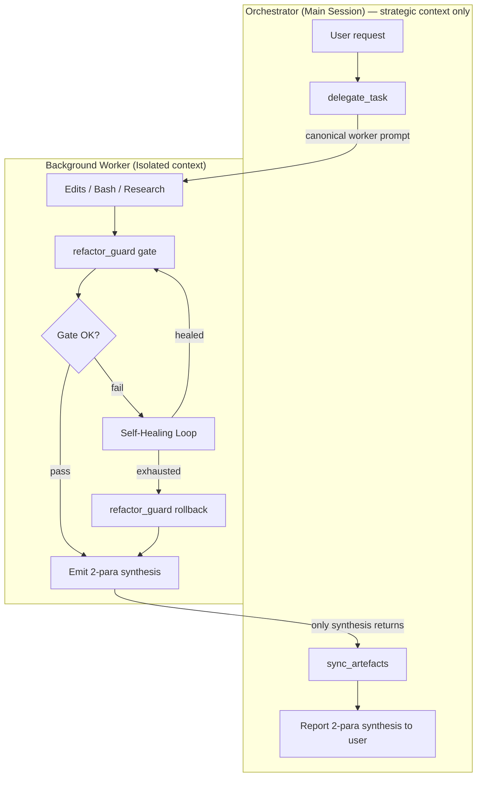
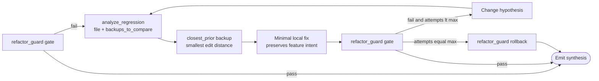
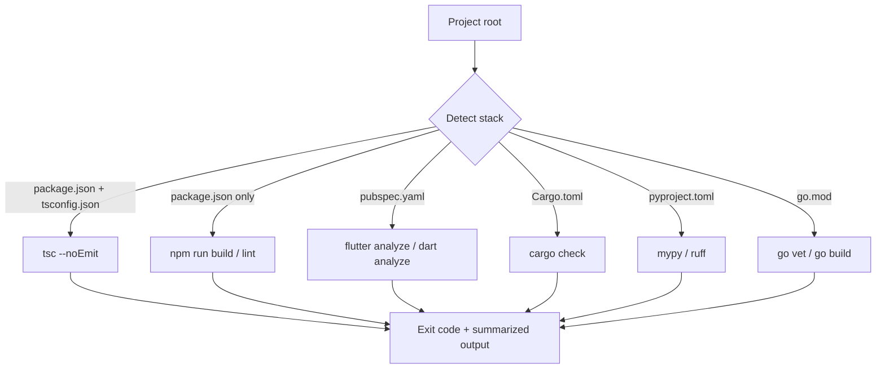

<div align="center">

# Smart Claude Memory

**Hybrid cloud-local memory for Claude — semantic retrieval instead of context bloat.**

[](https://www.typescriptlang.org/)
[](https://nodejs.org/)
[](https://modelcontextprotocol.io/)
[](https://github.com/pgvector/pgvector)
[](https://ollama.com/)
[](#license)
[](#)

</div>

---

## The problem

Claude sessions load `memory.md`, `rules.md`, `cloud.md`, and a dozen other context files at startup. Every token you spend on "what does this project do" is a token you can't spend on the actual task. At scale, you end up burning budget re-reading the same notes hundreds of times per week.

## What this does

`smart-claude-memory` is a **Model Context Protocol server** that replaces "read every .md at startup" with "search them on demand." It chunks your markdown notes, embeds them with a local Ollama model, stores them in Supabase (pgvector), and exposes **eleven tools** to Claude spanning memory, vision, backlog, hygiene, and system health. The elevator pitch:

| Tool | Purpose |
|---|---|
| `sync_local_memory` | Scan folders → **MD5 hash-gate** → chunk → embed → **bulk upsert**. Skips unchanged files. |
| `search_memory` | Semantic search + intent routing (archive / backlog / semantic) |
| `manage_backlog` | Per-project task handover with persistent archive |

See the [Toolbox](#toolbox) for the complete surface and [ARCHITECTURE.md](ARCHITECTURE.md) for the request-flow diagram.

Memory is strictly **per-project**: when you're in project A, Claude cannot see project B's notes. See [Multi-project isolation](#multi-project-isolation).

---

## System Architecture

The system operates under the Sovereign Orchestrator pattern with Autonomous Self-Healing. The diagrams below are mirrored from [ARCHITECTURE.md](ARCHITECTURE.md), which remains the canonical source of truth.

**Two independent planes by design:**

- **Local plane — Ollama.** Every byte of your notes is embedded on your own machine. Content never leaves your device in plaintext for vectorization. No per-token API fees, no third-party seeing your prompts.
- **Cloud plane — Supabase.** Durable storage, indexable across devices, cheap. Only the vectors + the source text live here — and only the text you explicitly choose to sync.

You get the privacy posture of local inference with the durability and cross-machine access of a managed Postgres.

### Delegation Flow



### Autonomous Self-Healing Loop



### Multi-Stack Compiler Map



> See [ARCHITECTURE.md](ARCHITECTURE.md) for the full prose + §4 auto-generated file-tree + §5 version history.

---

## Multi-project isolation

Every chunk is tagged with a `project_id`. The MCP server auto-derives it from the **slugified basename of the current working directory** at startup:

```
C:\Users\you\repos\acme-api       → project_id = "acme-api"
~/code/side-projects/note-taker   → project_id = "note-taker"
```

The SQL function `match_memory_chunks` enforces the filter **at the database layer** — not just in application code:

```sql
where m.project_id = p_project_id
```

Concretely: when you `cd` into `acme-api/` and launch Claude, calls to `search_memory` **cannot** return rows tagged `note-taker`. This is verified by [scripts/e2e-isolation-test.ts](scripts/e2e-isolation-test.ts), which seeds both projects with the same file name and proves zero cross-talk.

Need to reach into another project on purpose? Pass `project_id` explicitly:

```
search_memory({ query: "auth flow", project_id: "acme-api" })
```

---

## Toolbox

| Tool | Category | Summary |
|---|---|---|
| `sync_local_memory` | Memory | Hash-gated incremental sync of `.md` files; bulk upsert in 100-chunk batches; `force` re-embed; `auto_purge` with dry-run + verify-before-delete |
| `search_memory` | Memory | Intent routing — `archive` > `backlog` > `semantic`. Archive tasks never leak into vector results unless requested. |
| `update_rule` | Memory | Upsert a single rule/chunk without re-syncing files |
| `summarize_memory_file` | Memory | LLM-driven compression of `CLAUDE.md` / `MEMORY.md` toward a token target (default 3000) |
| `manage_backlog` | Backlog | `add` / `list` / `update` / `prune_done` (archives) / `archive_list` / `session_end` with Progress Report + resume prompt |
| `index_image` | Vision | Moondream caption → `nomic-embed-text` embed → upsert. Auto-converts WebP/GIF/BMP via ffmpeg. |
| `check_code_hygiene` | Guardian | 750-line rule with auto-generated file exclusions; N-split refactor plan for oversized files |
| `check_rule_conflicts` | Guardian | Opt-in LLM-based intent conflict detection between a proposed change and retrieved rules |
| `raise_verification_gate` | Guardian | Arm the Hard Stop flag after a risky edit |
| `confirm_verification` | Guardian | Clear or reassert the Hard Stop gate — Claude must call this after manual verification |
| `check_system_health` | Ops | Supabase reachability (memory_chunks count) + Ollama reachability + required-model presence (moondream, nomic-embed-text) + background keep-alive state |
| `init_project` | Ops | Readiness report for a workspace: required env vars, md-policy.py hook, MCP registration in settings, compiled dist. Returns `ready` / `partial` / `not_ready` with fix instructions per check. |

**Companion hook:** [hooks/md-policy.py](hooks/md-policy.py) enforces Zero-Local-MD allowlist, 750-line ceiling, frozen-feature patterns, and the Manual Test Gate from the Claude Code `PreToolUse` layer. Without it the Guardian tools are advisory; with it they are binding.

---

## Living Documentation

`manage_backlog({ action: "session_end" })` writes **two** artefacts into the project on every call, in parallel, so the repo self-documents without manual effort:

### 1. README progress log → `README.md`

1. Archives completed tasks (atomic PL/pgSQL transaction into `archive_backlog`).
2. Pulls the last 5 archived rows via `listArchive`.
3. Replaces the `### 🚀 Recent Progress

* [DONE] v0.8.0 — Production engine (ensureSchema, init_project, keep-alive, arch sync) (archived at 2026-04-24).
* [DONE] v0.9.0 — Ultra-Enforcer (frozen cache, auto-freeze, backups, NL triggers) (archived at 2026-04-24).
* [DONE] v0.9.1 — Legacy backup sweep + recovery discovery (archived at 2026-04-24).
* [DONE] v1.0.0 — God Mode (project detect, compiler gate, regression, binding session) (archived at 2026-04-24).
* [DONE] v1.1.0 — Sovereign Orchestrator (delegation pattern + Autonomous Self-Healing + cross-platform spawn fix + ARCHITECTURE.md consolidation) (archived at 2026-04-24).
### 🚀 Recent Progress

* [DONE] Fix login form validation (archived at 2026-04-24).
* [DONE] Add cache invalidation hook (archived at 2026-04-23).
...
```

### 2. Architecture map → `project_file_architecture.md`

1. Walks the project tree (cwd), ignoring `node_modules`, `.git`, `dist`, `build`, `backups`, and friends.
2. Caps depth at 3 and children per folder at 25; overflows show as `… (N more)`.
3. Renders a Mermaid `flowchart TD` — GitHub renders it natively in the doc.
4. Replaces only the `mermaid` fenced block; any human prose in the file is left intact. Creates the file with a professional header on first run.

### Safety rails (shared)

- If the MCP server's `cwd` slug doesn't match the `session_end` `project_id`, **both syncs are skipped** with an explicit warning — neither artefact is written into the wrong repo.
- Failures surface as `warning` fields in `readme_sync` / `architecture_sync`; the archive + resume-prompt logic always completes.
- Hook allowlist includes `README.md`; `project_file_architecture.md` is not on it — make sure your Zero-Local-MD allowlist covers it too (`CLAUDE_MD_POLICY_ALLOW_ROOT_MD="CLAUDE.md,MEMORY.md,README.md,project_file_architecture.md"`).

Net effect: every session leaves a timestamped handover note and a current file-tree diagram in the repo.

---

## Incremental sync (v0.3.0)

For corpora with thousands of files, re-embedding on every call is wasteful. `sync_local_memory` now runs a **hash-gated** pipeline:

1. Snapshot `Map<file_origin, file_hash>` for the current `project_id` in one paginated SELECT.
2. For each local file, compute MD5 **before** chunking or embedding.
3. If the hash matches the DB, skip — zero Ollama calls, zero writes.
4. If it differs (or is new), chunk + embed and buffer the rows.
5. Flush in batches of 100 chunks per upsert to minimize round-trips.
6. If a file is gone locally but still in the DB, it's reported in `orphan_files` (not auto-pruned).

Measured on this repo's own README (28 chunks, single file):

| Run | Behavior | Time | Ollama calls |
|---|---|---|---|
| Cold sync | Embed + upsert | **~3.7 s** | 28 |
| Unchanged rerun | All skip | **~0.3 s** | **0** |
| One file modified | Skip N−1, re-embed 1 | proportional to the delta | 1 file's worth |

### Output shape

```json
{
  "project_id": "acme-api",
  "force": false,
  "scanned": 812,
  "skipped": 806,
  "added": 3,
  "updated": 3,
  "orphans": 1,
  "orphan_files": ["/abs/path/legacy.md"],
  "chunks_upserted": 47,
  "chunks_deleted": 21,
  "ms": 1840
}
```

### Force re-embed

Pass `force: true` to bypass the skip gate. Pre-existing files are still correctly classified as `updated` (not `added`) and their stale chunks are purged before re-insert — critical when a file shrinks.

```
sync_local_memory({ force: true })
```

Verified by [scripts/e2e-incremental-test.ts](scripts/e2e-incremental-test.ts), which walks five phases: cold, rerun, modify+add+delete, force, and row-shape integrity.

---

## Getting started

### Prerequisites

- Node.js 20+
- [Ollama](https://ollama.com/) running locally, with an embedding model pulled:
  ```bash
  ollama pull nomic-embed-text
  ```
- A [Supabase](https://supabase.com/) project (free tier is fine)

### 1. Clone and install

```bash
git clone https://github.com/NABILNET-ORG/Claude-Memory.git
cd Claude-Memory  # clone dir is preserved so existing Supabase project_id slug keeps working
npm install
```

### 2. Configure `.env`

Copy [.env.example](.env.example) to `.env` and fill it in:

```env
SUPABASE_URL=https://<project-ref>.supabase.co
SUPABASE_PUBLISHABLE_KEY=sb_publishable_xxx
SUPABASE_SECRET_KEY=sb_secret_xxx

# Direct connection — IPv6-only on newer projects; keep for reference.
SUPABASE_DB_URL=postgresql://postgres:<password>@db.<project-ref>.supabase.co:5432/postgres

# Transaction pooler — IPv4-reachable. Required if your network has no IPv6 route.
# Dashboard: Project Settings → Database → Connection pooler.
SUPABASE_POOLER_URL=postgresql://postgres.<project-ref>:<password>@aws-1-<region>.pooler.supabase.com:6543/postgres

OLLAMA_HOST=http://localhost:11434
OLLAMA_EMBED_MODEL=nomic-embed-text
EMBED_DIM=768

MEMORY_ROOTS=/abs/path/to/notes;/another/path
CHUNK_SIZE=800
CHUNK_OVERLAP=100
```

> **Why two connection strings?** Supabase's `db.<ref>.supabase.co` endpoint is **IPv6-only** on projects created after early 2024. If your network doesn't route public IPv6 (most home/office Windows boxes don't), direct connects fail with `ENETUNREACH`. The **transaction pooler** at `aws-1-<region>.pooler.supabase.com:6543` is IPv4-reachable and is what `scripts/apply-schema.ts` uses by preference.

### 3. Apply the schema

Migrations are cumulative and idempotent. Run them in order:

```bash
npm run schema                              # 001_schema.sql — base table + HNSW index + RPCs
npm run schema -- 002_multi_project.sql     # adds project_id + per-project isolation
npm run schema -- 003_file_hash.sql         # adds file_hash for incremental sync
```

Or paste the SQL manually in [Supabase SQL Editor](https://supabase.com/dashboard): [scripts/001_schema.sql](scripts/001_schema.sql) → [scripts/002_multi_project.sql](scripts/002_multi_project.sql) → [scripts/003_file_hash.sql](scripts/003_file_hash.sql).

### 4. Build

```bash
npm run build
```

### 5. Register with Claude Code

**User scope** (available in every project you open) — add to `~/.claude.json`:

```json
{
  "mcpServers": {
    "smart-claude-memory": {
      "type": "stdio",
      "command": "node",
      "args": ["/abs/path/to/Claude-Memory/dist/index.js"],
      "env": {}
    }
  }
}
```

**Project scope** (only this repo) — create `.mcp.json` in the target project's root with the same block.

Restart Claude Code. Run `/mcp`. You should see `smart-claude-memory` connected with three tools.

### 6. Index your notes

From a Claude Code session inside the project whose notes you want to offload:

```
sync_local_memory()
```

Then free up context by archiving the originals:

```bash
npm run backup                                              # dry run
npx tsx scripts/backup-and-remove.ts --confirm-delete       # zip + delete
```

---

## How `project_id` is derived

[src/project.ts](src/project.ts):

```ts
export function detectProjectId(cwd = process.cwd()): string {
  return slugify(basename(cwd) || "default");
}
```

Captured once at MCP server startup. Claude Code launches an MCP subprocess per session with `cwd` set to the workspace root, so `basename(cwd)` is a stable project identifier for the lifetime of that session.

Collisions are possible if two unrelated projects share a folder name (`utils/`, `backend/`, etc.). To harden, override explicitly:

```
sync_local_memory({ project_id: "acme-backend-prod" })
```

---

## Database schema

```sql
create table memory_chunks (
  id           bigserial primary key,
  content      text not null,
  embedding    vector(768) not null,
  file_origin  text not null,
  chunk_index  int not null default 0,
  content_hash text not null,                  -- MD5 of the chunk text
  file_hash    text,                           -- MD5 of the whole file at last sync (v0.3.0)
  metadata     jsonb not null default '{}'::jsonb,
  project_id   text not null default 'default',
  updated_at   timestamptz not null default now(),
  unique (project_id, file_origin, chunk_index)
);

create index on memory_chunks using hnsw (embedding vector_cosine_ops);
create index on memory_chunks (project_id);
create index on memory_chunks (project_id, file_origin);   -- powers the hash-gate lookup
```

The RPC `match_memory_chunks(query_embedding, p_project_id, match_count, min_similarity)` enforces the isolation filter in SQL. All chunks from the same file share one `file_hash`, so the incremental-sync skip check is a single `SELECT file_origin, file_hash WHERE project_id = ?`. Full schema + RPC definitions in [scripts/001_schema.sql](scripts/001_schema.sql), [scripts/002_multi_project.sql](scripts/002_multi_project.sql), and [scripts/003_file_hash.sql](scripts/003_file_hash.sql).

---

## Project layout

```
src/
├── index.ts        MCP server entry — tool registration
├── config.ts       Env loader (absolute .env path resolution)
├── project.ts      project_id detection + slugification
├── ollama.ts       POST /api/embed client
├── supabase.ts     Table + RPC wrappers
├── chunker.ts      Markdown-aware splitter
└── tools/
    ├── sync.ts     sync_local_memory handler
    ├── search.ts   search_memory handler
    └── update-rule.ts

scripts/
├── 001_schema.sql
├── 002_multi_project.sql
├── 003_file_hash.sql
├── apply-schema.ts
├── backup-and-remove.ts
├── e2e-test.ts
├── e2e-isolation-test.ts
└── e2e-incremental-test.ts
```

---

## npm scripts

| Command | Purpose |
|---|---|
| `npm run build` | Compile TypeScript → `dist/` |
| `npm run dev` | Run the server via `tsx` (no build step) |
| `npm run start` | Run the compiled server |
| `npm run schema` | Apply `001_schema.sql` (or pass `-- <file>` for another) |
| `npm run backup` | Dry-run backup of all `.md` in `MEMORY_ROOTS` |

---

## Design decisions worth knowing

- **Embedding model is load-bearing.** `EMBED_DIM` must match the model's output. Swapping `nomic-embed-text` (768) for `mxbai-embed-large` (1024) means dropping and rebuilding the `embedding` column. Don't mix dimensions.
- **Service-role key, no RLS.** The MCP server runs locally with no user context; it uses `sb_secret_*` which bypasses RLS. If you expose this server to untrusted callers, add RLS plus a `user_id` column.
- **Chunking is heading-aware, not token-aware.** Sections split on `##` / `###`; long sections slide-window at `CHUNK_SIZE` with `CHUNK_OVERLAP`. Good enough for most prose; swap in a tokenizer-driven chunker if you're indexing code.
- **Sync is incremental by default.** Unchanged files are skipped via `file_hash` comparison; no embedding calls, no writes. Pass `force: true` to re-embed everything. Chunks are flushed in 100-row batches to minimize Supabase round-trips.
- **Orphans are reported, not pruned.** Files removed from disk stay in the DB and show up in `orphan_files`. A dedicated `prune_memory` tool is deferred to a later release so deletions are never silent.

---

## Security

- `.env` is git-ignored. Never commit it.
- Rotate `SUPABASE_SECRET_KEY` and your database password anytime they touch a log, a terminal history, or a chat transcript.
- The backup script writes unencrypted `.zip` files to `backups/` (also git-ignored). If your notes are sensitive, encrypt the archive before uploading anywhere.

---

## License

MIT. See [LICENSE](LICENSE).

### 🗺️ File Architecture

_Auto-synced at 2026-04-24T18:54:38.804Z for `claude-memory`._

```mermaid
flowchart TD
  n0["Claude-Memory/"]
  n1["hooks/"]
  n0 --> n1
  n2["md-policy.py"]
  n1 --> n2
  n3["README.md"]
  n1 --> n3
  n4["scripts/"]
  n0 --> n4
  n5["001_schema.sql"]
  n4 --> n5
  n6["002_multi_project.sql"]
  n4 --> n6
  n7["003_file_hash.sql"]
  n4 --> n7
  n8["004_backlog_frozen.sql"]
  n4 --> n8
  n9["005_archive_backlog.sql"]
  n4 --> n9
  n10["apply-schema.ts"]
  n4 --> n10
  n11["backup-and-remove.ts"]
  n4 --> n11
  n12["e2e-incremental-test.ts"]
  n4 --> n12
  n13["e2e-isolation-test.ts"]
  n4 --> n13
  n14["e2e-test.ts"]
  n4 --> n14
  n15["purge-samia-rules.ts"]
  n4 --> n15
  n16["src/"]
  n0 --> n16
  n17["tools/"]
  n16 --> n17
  n18["backlog.ts"]
  n17 --> n18
  n19["conflict.ts"]
  n17 --> n19
  n20["health.ts"]
  n17 --> n20
  n21["hygiene.ts"]
  n17 --> n21
  n22["image.ts"]
  n17 --> n22
  n23["orchestrator.ts"]
  n17 --> n23
  n24["policy.ts"]
  n17 --> n24
  n25["refactor.ts"]
  n17 --> n25
  n26["search.ts"]
  n17 --> n26
  n27["setup.ts"]
  n17 --> n27
  n28["summarize.ts"]
  n17 --> n28
  n29["sync.ts"]
  n17 --> n29
  n30["update-rule.ts"]
  n17 --> n30
  n31["verification.ts"]
  n17 --> n31
  n32["chunker.ts"]
  n16 --> n32
  n33["config.ts"]
  n16 --> n33
  n34["index.ts"]
  n16 --> n34
  n35["ollama.ts"]
  n16 --> n35
  n36["project-detect.ts"]
  n16 --> n36
  n37["project.ts"]
  n16 --> n37
  n38["supabase.ts"]
  n16 --> n38
  n39["verification-gate.ts"]
  n16 --> n39
  n40[".env.example"]
  n0 --> n40
  n41[".gitignore"]
  n0 --> n41
  n42["ARCHITECTURE.md"]
  n0 --> n42
  n43["LICENSE"]
  n0 --> n43
  n44["package-lock.json"]
  n0 --> n44
  n45["package.json"]
  n0 --> n45
  n46["README.md"]
  n0 --> n46
  n47["tsconfig.json"]
  n0 --> n47
```

