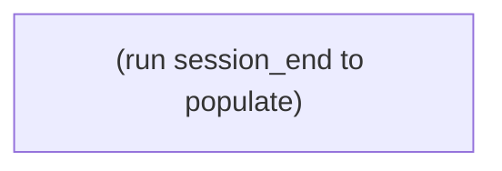

# Project File Architecture

> Auto-created by smart-claude-memory init_project. The Mermaid block is 
> populated by manage_backlog({ action: "session_end" }).

## Tree

```mermaid
flowchart TD
  n0["(run session_end to populate)"]
```